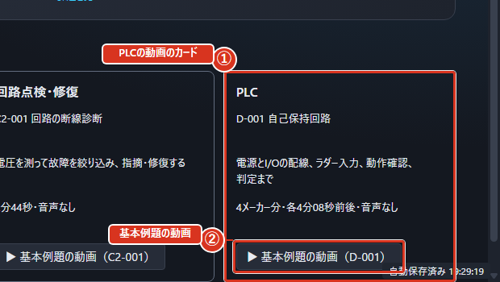
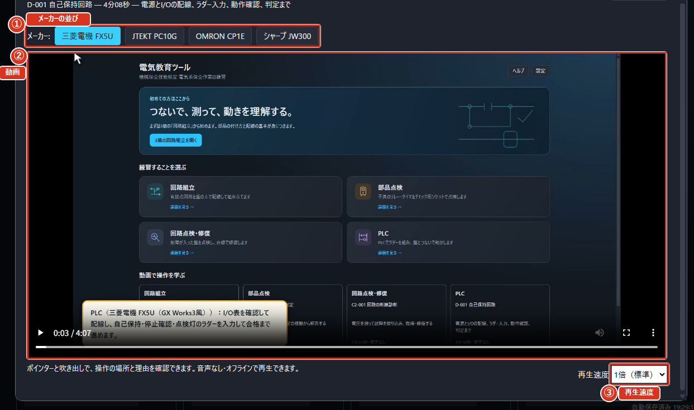

# 画面の見方

## ホームの画面

アプリを起動すると最初に出るのがホームの画面です。中央に4つの大きなカードが並んでいて、どの練習をするかをここで選びます。右上の「設定」で、音や自分で作った課題の読み込みを変えられます。

4枚のカードは「回路組立」「部品点検」「回路点検・修復」「PLC」です。それぞれ順に、モードB（回路を組み立てる）・モードC1（部品を点検する）・モードC2（回路を点検して直す）・モードD（PLCでプログラムを作る）の入り口になります。

画面の下半分には2つの案内が並びます。左は「初めての方はここから」で、「3級の回路組立を開く」を押すと、一番やさしい3級の回路組立の一覧が開きます。右は「続きから」で、前に開いた課題があると「最近の課題」としてモード・課題名・かかった時間が出ます。「続きから始める」を押すと、その続きがそのまま開きます。前回の続きが無いときは「前回の続きはありません。上のモードから課題を選んでください。」と出ます。

右上には「ヘルプ」ボタンもあり、いつでも `F1` でも開けます。

図では、①が「回路組立」のカード、②が右上の「設定」、③が右上の「ヘルプ」です。

## 課題を選ぶ

カードを押すと、その練習の課題が一覧の表に並びます。表の「課題名」の列に題名が、その他の列に級とだいたいの時間が出ます。行の右にある「開く」を押すと、その課題が始まります。

上にある「すべて」から練習の種類で絞り込めます。級でも絞り込めて、初めての人には「3級（おすすめ）」が最初から選ばれています。「すべて」を押すと、他の級も出ます。その下の「課題を探す」に言葉を入れると、課題名・課題文・課題IDのどれかにその言葉がある課題だけが残ります。「難しさ」は同じ級の中でのやさしさ（1が一番やさしく、5が一番難しい）、「学習テーマ」は自己保持・タイマなどの題材で絞り込めます。当たる課題が無いときは「入力した言葉に当たる課題がありません。別の言葉で探してください。」と出ます。

表の行はどこを押しても、その課題が始まります。キーボードで選んでいるときは `Enter` か `Space` でも始まります。行には題名の下に課題文の先頭の1文が薄い字で出て、右端に課題IDが出ます。自分で作った課題は「利用者」と出て、内蔵の課題とまとめて並びます。読み込めなかった課題ファイルがあるときは、その理由が表の下に出ます。

左上の「ホームへ戻る」を押すと、ホームの画面に戻ります。

### 作業の続きへ戻る・別の課題へ移る

ホームと一覧の「作業中」に、現在取り組んでいる課題を表示します。「続きから再開」、または同じ課題の行にある「再開」を押すと、配線・解答・測定記録・編集履歴を保持したまま戻ります。一覧へ移動しただけでは初期化しません。

別の課題へ移るとき、現在の作業に変更がある場合は確認が出ます。「保存して進む」は作業ファイルを保存してから切り替えます。保存を取り消した場合や保存に失敗した場合は、現在の作業が残ります。「保存せず進む」は現在の作業と自動保存を新しい課題に置き換えます。「取消」は現在の作業を続けます。

同じ課題をやり直す場合は「最初からやり直す…」を押し、確認してから進んでください。一覧の検索語・級・難しさ・テーマは、アプリを閉じるまで練習の種類ごとに保持します。「絞り込みをリセット」で、その種類の初期表示に戻せます。

図では、①が「すべて」などの絞り込みの欄、②が「課題名」の列、③が「ホームへ戻る」です。

## 練習中の画面の並び

組立・PLCの課題は、利用者が接続する電線が**0本**の状態から始まります。部品点検用のチェック回路3本は自動追加しません。表示灯・押ボタンの下に見える短い線は機器本体と端子台を結ぶハーネスです。部品点検では専用のチェック回路、故障修復では点検対象の回路が用意されています。

**作業順は自由です。** 手順帯の項目を押すと、部品・配線・電源・判定など必要な道具へ移動できます。途中でも戻れ、作業内容は保持します。「済」はその操作を行った目印で、回路の正しさを保証するものではありません。

組立中も「測定」を押すとテスターを使えます。レンジを選び、盤の端子を黒・赤の順にクリックしてください。画面下部にも測定値と次のプローブを表示します。「黒」「赤」で付け替える側を選び、「両方外す」で解除できます。空白のクリックや盤面の移動ではプローブを外しません。「配線」に戻るには線色または手順帯の「配線」を押します。配線の始点を選んでいる間は、盤面下部の「取消」でも選び直せます。

DC24V出力部は **P＋（24V）／N−（0V）** の印字を確認してください。電線はネジから左側へ引き出されるので、P端子の接続元も見えます。ブレーカーはレバー、電源スイッチは「I／O」のあるロッカーをクリックします。名札に「入 ON」「切 OFF」を併記しています。

課題が始まると、画面は4つに分かれます。一番上が「上の帯」、そのすぐ下に「手順」という案内が1行で出て、次に何をすればよいかを教えてくれます。中央の広いところが3Dの画面、右の欄が部品や道具の欄、下の欄がタイムチャートなどの欄です。

「手順」の案内は、いまの段階にあわせて変わります。たとえば回路を組み立てる練習では、「部品装着」の次は配線の段階に進み、案内には「3D盤の端子を2つクリックして配線します。」と出ます。済んだ段階には「済」の印が、いまの段階には「いまここ」の印が付きます。

3Dの画面の右上には、いまの状態が出ます。電気が流れていれば「通電中」と出ます。下の欄には「経過時間」が出て、その下に「標準時間」の線が引かれているので、時間内に終わりそうかが分かります。画面の下のほうには「操作ログ」があり、直近30件の操作が時刻順に並び、下ほど新しい操作です。

図では、①が上の帯、②が「手順」の案内、③が3Dの画面、④が右の欄、⑤が下の欄です。呼び名は「はじめに」の「画面の呼び名」で決めたとおりです。

## 画面の上の帯

保存・読込・視点などの「その他の操作」は、狭い画面では「…」の中にあります。項目を選ぶとメニューは閉じます。続けて操作するときは、もう一度「…」を開いてください。

上の帯には、いまの課題ですぐ使うボタンだけが並びます。左端の「課題一覧へ戻る」で課題一覧へ帰れます。右端の「判定」で、組んだ回路が正しいかどうかを見てもらえます。「ヘルプ」はこの説明書を画面の右から開きます。`F1` を押しても同じように開き、もう一度押すと閉じます。`Esc` を押すと、開いている窓を閉じたり、つなぎかけの電線をやめたりできます。`Tab` を押していくと、マウスを使わなくても順番に操作先が移ります。

上の帯には次のボタンがあります。

| ボタン | すること |
|---|---|
| 「課題一覧へ戻る」 | 課題一覧の画面に戻ります |
| 「元に戻す」「やり直し」 | 直前の操作を戻す・やり直します。戻せる操作が無いときは「元に戻せる操作がありません」と出ます |
| 「表示」 | 盤・並べて・回路図など、画面の見せ方を切り替えます |
| 「その他の操作」（⋯） | 押すと「視点」と「作業ファイル」の項目が出ます |
| 「ヒント」 | ヒントを開閉します |
| 「判定」 | 組んだ回路を判定します |

「その他の操作」の「作業ファイル」からは、作業の保存・読み込みができます。

上の帯の「ヒント」でヒントを開閉します。内容は「次のヒント」を押すたびに1段ずつ増えます。第1段は現在の操作、第2段は課題の考え方、第3段はモードに合った確認手順です。1級形式は第2段までです。「ヒントを閉じる」、Esc、ヒントの外側のクリックでも閉じられます。開き直しても利用回数は増えず、既に開いた段から確認できます。結果の「ヒントを使った回数」には、開いた段数を記録します。最後まで開くと「ヒントはここまでです」と表示されます。「考え方と確認手順を読む」から詳しい解説へ進めます。

押せないボタンにマウスを乗せると、押せない理由が出ます。

「ヘルプ」を押すと、画面の右から**取扱説明書**が出ます。左側の「目次」から読みたいところを選べます。上の「言葉で探す」に言葉を入れると、その言葉が出てくるところが一覧になり、「3 件見つかりました」のように件数が出ます。一覧を押すと、そのところが開きます。どこにも無いときは「見つかりませんでした。別の言葉で探してください。」と出ます。

検索欄には「配線 保存」のように空白で複数の語を入れられます。すべての語を含む節を探し、見出しと練習中のモードに合う内容を優先します。全角・半角や大文字・小文字を変えても同じ語を探せます。結果が多いときは「続きを表示」で残りを確認できます。

「説明書全体をPDFで開く」を押すと、同じ内容の説明書がパソコンの決まったソフトで開きます。読み終わったら「閉じる」を押します。`Esc` を押しても、引き出しの外側を押しても閉じます。

ヘルプの中の図を押すか `Enter` を押すと大きく出せます。`Esc` でもとに戻ります。大きくした図は「図を閉じる」でも閉じられます。図の上にマウスを乗せると「図を大きく見る」と出ます。

図では、①が「言葉で探す」の欄、②が「目次」、③が「説明書全体をPDFで開く」、④が「閉じる」です。

## 3Dの見方と動かし方

中央の3Dの画面（「3Dの盤」）では、練習盤を好きな向きから見られます。キューブ以外を左・中・右ボタンでドラッグすると、角度を保ったまま画面に平行に移動します。端子や部品の上から始めても同じです。ホイールを回すと、ポインタの位置へ拡大・縮小します。配線は始点と終点の端子を順にクリックするか、`Alt` を押しながら端子間をドラッグします。

左上には立方体（ビューキューブ）があります。ビューキューブをドラッグすると、指についてくるように盤が回ります。ビューキューブの面をクリックするとその向きから、ビューキューブの辺や角をクリックすると斜めから見られます。ビューキューブの「⌂」を押すと盤全体が入る見え方へ戻り（「全体表示」）、ビューキューブの「⟳」を押すといまの向きのまま傾きだけをまっすぐに戻します（「傾きを戻す」）。

キーボードでは `1` で正面から、`2` で上から、`3` でソケットを大きく、`Home` で盤全体を見られます。テンキーの1・3・7でも正面・右・上から見られ、`Ctrl` を足すと反対側から見られます。ビューキューブのドラッグでは、真上・真下・裏面も含めて360°回転できます。

右の欄の「視点操作の早見表」を開くと、いま使える操作の一覧（「キューブをドラッグ＝回転」など）がいつでも読めます。PLCを使う練習では「盤＋PLC」を選ぶと、PLC本体まで含めて見られます。

図では、①がビューキューブ、②が「全体表示」の丸ボタン、③が「傾きを戻す」の丸ボタン、④が右の欄の「視点操作の早見表」です。

## 端子に触れると出る札

ねじ端子にマウスを乗せると、端子の名前と役割の札が出ます。札には「CR1 の ⑨（COM）」のように、どの部品のどの番号で、何のための端子かが書いてあります。

端子の番号の読み方は次のとおりです。①〜④が**b接点**（通常つながっていて、動くと切れる接点）、⑤〜⑧が**a接点**（通常は切れていて、動くとつながる接点）、⑨〜⑫がCOM（共通端子）、⑬と⑭が**コイル**（電気を流すと磁石になって接点を動かす部品）です。

コイルの2本は、どちらの**母線**（電源のプラスとマイナスから全部の部品へ電気を配る大元の線）につなぐかが決まっています。この盤の母線は2本で、プラス24Vの側を「P」、0Vの側を「N」と呼びます。⑭がP側、⑬がN側です。ソケットの面には⑭の脇に「P(+)」、⑬の脇に「N(−)」と書いてあり、札にも「コイル P(+)側」「コイル N(−)側」と出ます。部品のカードの図でも、⑭の下が「P(+)」、⑬の下が「N(−)」で、図の下に「コイル: 14 = P(+) / 13 = N(−)」の一行が出ます。

ランプ用端子台も同じ読み方です。「PL1+」がP側、「PL1-」がN側で、名前の上に「P(+)」「N(−)」と書いてあります。札には「TB_PL PL1+: 白ランプ PL1 の P(+)側」のように、どのランプのどちら側かが出ます。

部品点検用に用意された固定電線は外せません。外そうとすると「チェック用回路の既設配線（青）は変更できません」と出ます。

図では、①が出てきた札、②が札に書かれた端子の番号です。

## 部品を入れ替える

ソケットをクリックすると、そのソケットのカードが出ます。3D盤のソケット、または装着済みの部品をクリックすると、そのカードで装着・取り外し・交換ができます。

別の部品を装着するときは「ソケット一覧へ」で一覧に戻り、次のソケットを選べます。

カードには「ソケット」の名前と、いま乗っている部品（たとえば「リレー MY4N」）が出ます。何も乗っていないソケットでは、載せたい部品を選んで「装着」を押します。「取り外す」で部品を外し、「交換…」を押すと入れ替える部品を「選択」してから「これに交換」を押すと入れ替わります。やめたいときは「交換をやめる」を押します。選んでいるソケットのカードには「選択中」と出ます。

部品にはリレーとタイマの2種類があります。リレーは電気を流すとすぐに接点が切り替わり、タイマは決めた時間が経ってから切り替わります。

電気を流したまま部品を入れ替えようとすると、「通電中です。実機ではブレーカを切ってから部品を抜き差しします」という注意が出ます。

> **注意** 実機では必ずブレーカを切ってから抜き差ししてください。

図は部品が乗っているソケットのカードです。①が「選択中」の控え、②が「取り外す」、③が「交換…」です。まだ何も乗っていないソケットでは、②③のかわりに「装着」が並びます。

## 結果の画面

「作業へ戻る」は、配線・部品・解答・危険操作の記録を残して、いまの課題を続ける操作です。4つのモードで使えます。「もう一度」は盤と解答を最初から作り直します（PLCのラダーは残ります）。結果を見て一部を直すときは「作業へ戻る」を選びます。

「判定」を押すと結果の画面に変わります。一番上に「合格」か不合格かが大きく出ます。動きが模範回路と同じなら「動作は模範回路と一致しました。」と出ます。

その下に、次の欄が並びます。

| 欄 | 読み方 |
|---|---|
| 差分一覧 | 期待した動きと実際の動きが異なった箇所の一覧 |
| 静的チェック | 線色ルールなど、配線の決まりを守っているかの一覧 |
| 危険操作 | 危険な操作をした回数 |
| 所要時間 | かかった時間 |

合否のすぐ下に「まず直すところ」の1行が出ます。何がうまくいかなかったのかと、最初に直す1か所が1行にまとまっているので、ここから読み始めてください。

不合格のときは「疑わしい配線」の欄と「盤で見る」ボタンが出ます。一番上の1件には「最初に直す」と出ます。接点の組が異なるだけでも、ここに出ることがあります。

下の帯の「盤で直す」を押すと、その1件を光らせた状態で盤の画面に戻ります。練習中に「ヒント」を使っていると「ヒントを使った回数」も出ます。

「もう一度」で同じ課題をやり直せます。「課題一覧へ」で一覧に戻ります。

図では、①が「差分一覧」、②が「静的チェック」、③が「危険操作」、④が「所要時間」、⑤が合否（「合格」または「不合格」）です。

## タイムチャートの読み方

下の欄には**タイムチャート**（どの信号がいつオンになったかを横に並べた図）が出ます。左に信号の名前、右に時間が流れていき、色が濃くなっているところがオンになっている時間です。練習中は「タイムチャート（仕様）」という名前で出ます。

図をクリックする（または Enter を押す）と、タイムチャートや回路図を大きく開けます。「拡大」ボタンでも同じように開き、開くと「拡大表示」になります。大きくした図では、マウスを動かすと縦の合わせ線が付いてきて、どの時刻かを読み取れます。窓の外をクリックすると閉じます（「図の外をクリックすると閉じます」）。

判定のあとは、お手本の波形と自分の波形が重なって出ます（「チャート重ね表示」）。開いた窓には「期待（模範）」と実際の2段が並び、凡例には「模範（細い薄色）」と濃い線（訓練者）が示されます。

「ライブ記録」は最初は閉じています。見出しを押すと開き、もう一度押すと閉じます。通電して操作すると記録が増えます。「タイムチャート（仕様）」も見出しから開閉できます。

図は「拡大表示」を開いたところで撮っています。①が左に並ぶ信号の名前、②が縦の合わせ線、③が「期待（模範）」の段です。

## 動きを見直す

結果画面の「動きを見直す」を押すと、提出した盤を使って採点と同じ操作を1歩ずつ確かめられます。組立・点検修復・PLCの課題で使えます。部品点検と、変換エラーがあるラダーでは使えません。

「前へ」「次へ」で区間を移り、「最初から」で最初へ戻ります。押ボタンの操作、期待する動き、区間の時刻が上に並びます。盤やラダーのモニタは、その区間の終了時の状態です。同時刻の操作は1歩にまとめ、最初の操作まで待つ時間も含めて見せます。

「▲ この区間」の行は、その区間で採点上の違いが出たことを示します。採点の許容差はそのままなので、結果の差分一覧と同じ箇所を確認できます。「結果へ戻る」で見直しを終了します。見直し中は配線・部品・電源・ラダーを編集できません。元の作業や所要時間、危険操作の回数は変わりません。

## 模範と見くらべる

結果画面の「模範と見くらべる」で、信号ごとに上が模範（破線）・下が自分（実線）の波形を並べられます。同じ時間軸なので、いつ点き、いつ消えたかを上下で見比べてください。採点と同じ許容差を使うため、許容範囲内のずれには帯を付けません。

帯のある区間には採点上の違いがあります。図の下の「▲ 違いが出た時刻」で、時刻・部品名・理由を確かめられます。図をクリックするか「拡大」を押すと大きくなり、マウスを動かすと縦の案内線で時刻を読めます。「閉じる」または Esc で結果へ戻ります。拡大中の Esc は比較画面へ戻ります。

組立3級と点検修復2級で回路図が公開されている課題だけ、「模範の回路図と自分の配線」を開けます。割り当てられた接点や端子のつながりから差を求め、不足・余分の代表を最大5件示します。接点の組の選び方による違いもあるため、すべてが配線ミスとは限りません。

他の級とPLCでは「この課題では模範回路図・模範ラダーを表示しません。波形の違いから考えてください。」と出ます。変換エラーで判定できなかったラダーは、先に直してから比較します。

## この結果を書き出す

結果画面の「この結果を書き出す」で、今回の判定をA4用紙のPDFか、ブラウザで読めるHTMLへ保存できます。アプリは成績の履歴や前回の保存先を記録しません。

1. 判定したあと、結果画面の「この結果を書き出す」を押します。
2. 保存先とファイル名を選びます。種類は「PDF文書」か「HTML文書」を選んでください。名前の末尾も .pdf または .html にします。
3. 保存すると「結果を書き出しました」と出ます。取り消した場合は何も保存しません。

課題・級・難易度・合否・所要時間・配線のチェック・動作の差・危険操作とヒントの回数を載せます。差分は代表5件、疑わしい配線は代表3件と全件数を載せる要約です。詳細はアプリの結果画面を見てください。部品点検では正解数、回路点検・修復では故障の指摘数も載ります。

「開始（今回）」は今回その課題を開いた日時です。所要時間には復元した作業の時間を含みます。動きを見直している時間は加算しません。利用者名や保存先のパスはレポートに載せません。

書き出せないときは、次の表示を確認してください。

| 表示 | 対処 |
|---|---|
| 結果の書き出し内容を読み取れませんでした。判定し直してください。 | 作業に戻り、判定し直します。 |
| 結果を書き出しています。完了するまでお待ちください。 | 開いている保存画面で保存するか取り消します。 |
| 保存するファイル名の末尾を .pdf または .html にしてください。 | 名前を直して、もう一度書き出します。 |

## 動画で操作を学ぶ

ホームの「動画で操作を学ぶ」には、課題を解く動画を用意しています。

図では、①がPLCの動画のカード（4メーカー分）、②が「基本例題の動画」です。
回路組立・部品点検・回路点検・修復・PLCから選べます。練習画面の「基本例題の動画」には題材の課題番号を表示します。B-001・C1-001・C2-001・D-001を使った操作例で、現在選んでいる課題と異なる場合があります。

PLCの動画はメーカーごとに1本ずつ、4本あります。端子の名前・デバイスの書き方・記号の置き方がメーカーで違うためです。練習画面から開くといま使っているメーカーの動画が、ホームから開くと設定の既定メーカーの動画が出ます。

1. 「基本例題の動画」（ホームでは各カードのボタン）を押します。
2. PLCの動画では、窓の上の「メーカー:」の並びから見たいメーカー（「三菱電機 FX5U」「JTEKT PC10G」「OMRON CP1E」「シャープ JW300」）を押すと、そのメーカーの動画に替わります。
3. 下部で再生・一時停止・再生位置を操作します。
4. 「動画を閉じる」か `Esc` で閉じます。

回路点検・修復の動画では、故障した電線を3D図で押して指摘する方法と、右の欄の電線一覧から指摘する方法の両方を見られます。

図では、①がメーカーの並び、②が動画、③が「再生速度」です。

動画は実際のアプリで課題を選び、配線や測定を行い、間違いを修正して合格するまでの流れです。ポインターが操作箇所を示し、吹き出しで今の目的と判断を説明します。音声はありません。下部で再生・一時停止・再生位置を操作でき、「再生速度」で0.75倍から1.5倍まで選べます。日本語の字幕も切り替えられます。通信は不要です。例題の解答を示すため、自力で考えたいときは必要な場面だけ確認してください。
