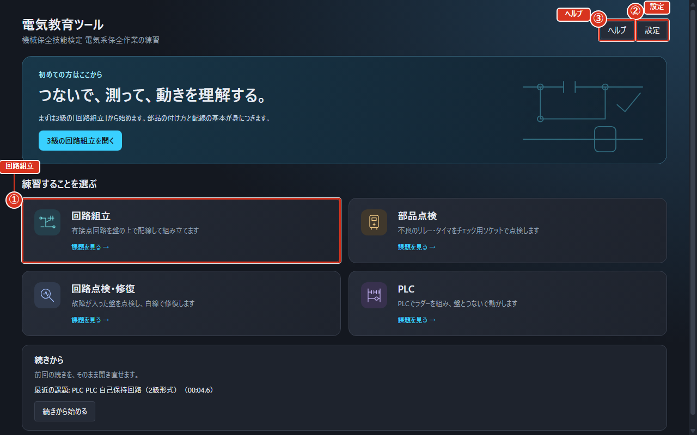
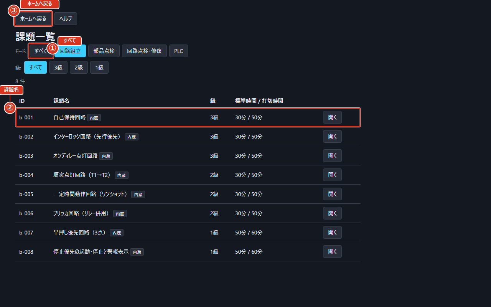
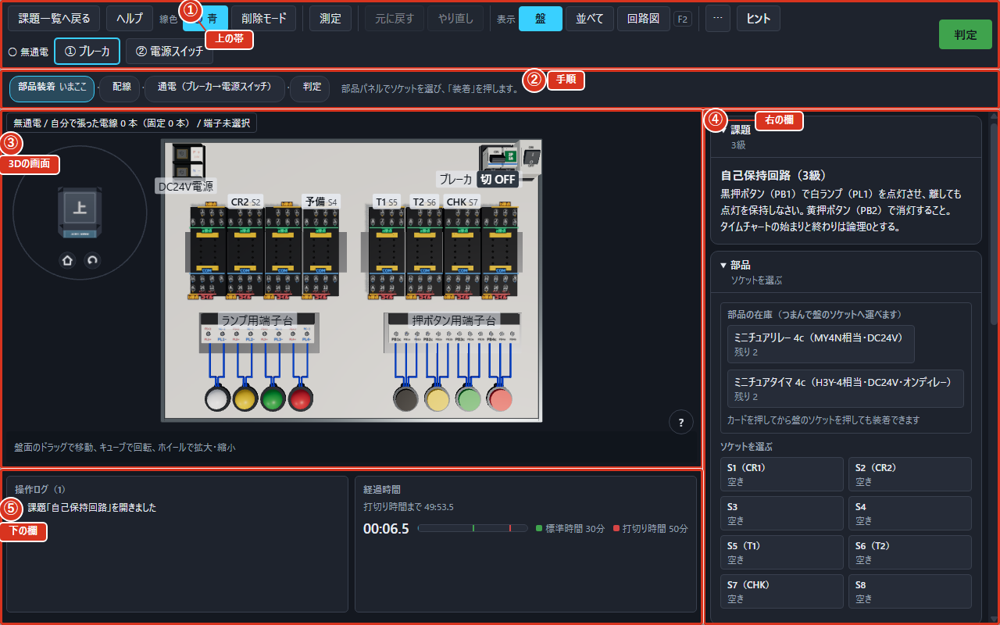
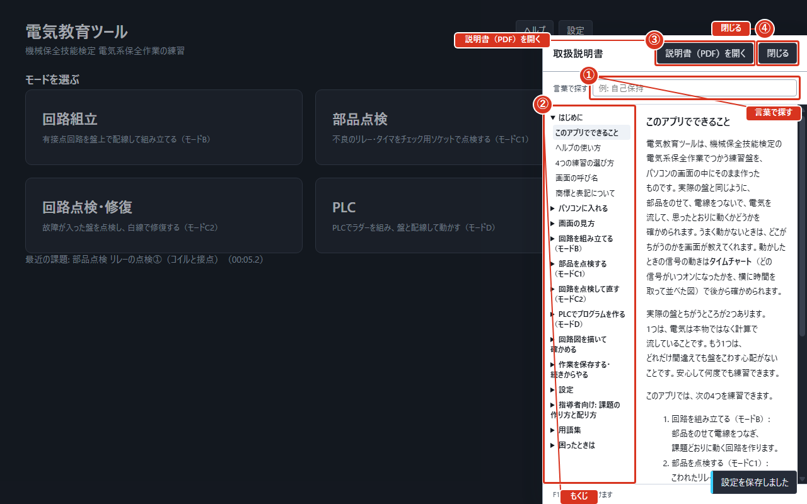
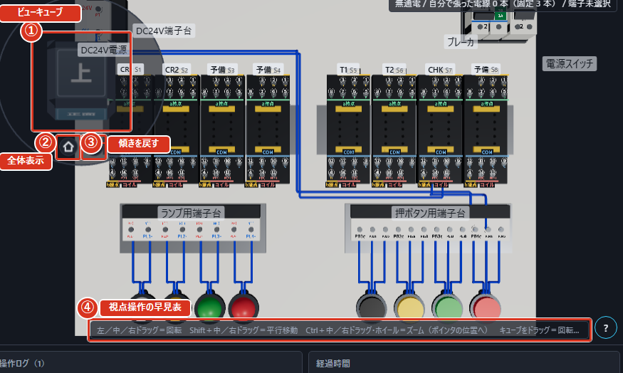
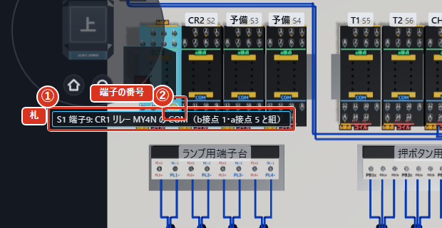
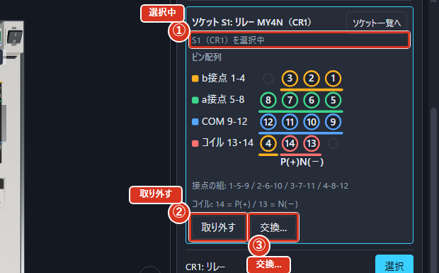
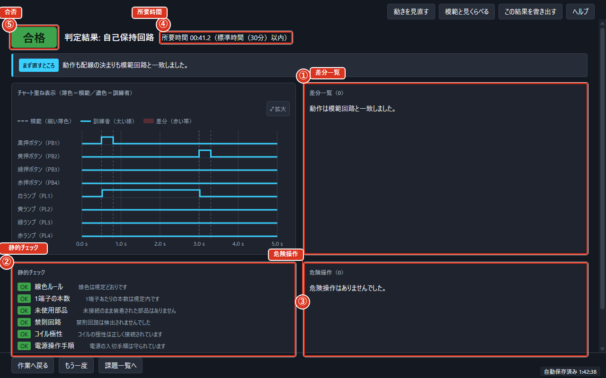
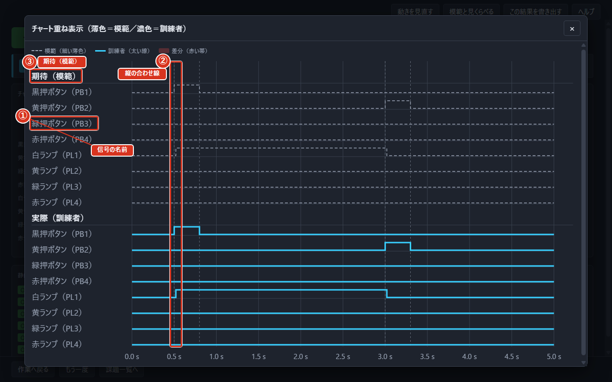

# 画面の見方

## ホームの画面

アプリを起動すると最初に出るのがホームの画面です。まん中に4つの大きなカードが並んでいて、どの練習をするかをここで選びます。右上の「設定」で、音や自分で作った課題の読み込みを変えられます。

4枚のカードは「回路組立」「部品点検」「回路点検・修復」「PLC」です。それぞれ順に、モードB（回路を組み立てる）・モードC1（部品を点検する）・モードC2（回路を点検して直す）・モードD（PLCでプログラムを作る）の入り口になります。

前に開いた課題があると「最近の課題」が出て、すぐに開き直せます。

右上には「ヘルプ」ボタンもあり、いつでも `F1` でも開けます。

図では、①が「回路組立」のカード、②が右上の「設定」、③が右上の「ヘルプ」です。

## 課題をえらぶ

カードを押すと、その練習の課題が一覧の表に並びます。表の「課題名」の列に題名が、そのほかの列に級とだいたいの時間が出ます。行の右にある「開く」を押すと、その課題が始まります。

上にある「すべて」から練習の種類で絞り込めます。級でも絞り込めて、初めての人には「3級」がおすすめです。自分で作った課題は「利用者」と出て、内蔵の課題とまとめて並びます。読み込めなかった課題ファイルがあるときは、その理由が表の下に出ます。

左上の「ホームへ戻る」を押すと、ホームの画面に戻ります。

図では、①が「すべて」などの絞り込みの欄、②が「課題名」の列、③が「ホームへ戻る」です。

## 練習中の画面の並び

課題が始まると、画面は4つに分かれます。いちばん上が「上の帯」、そのすぐ下に「手順」という案内が1行で出て、次に何をすればよいかを教えてくれます。まん中の広いところが3Dの画面、右の欄が部品や道具の欄、下の欄がタイムチャートなどの欄です。

「手順」の案内は、いまの段階にあわせて変わります。たとえば回路を組み立てる練習では、「部品装着」の次は配線の段階に進み、案内には「3D盤の端子を2つクリックして配線します。」と出ます。済んだ段階には「済」の印が、いまの段階には「いまここ」の印が付きます。

3Dの画面の左上には、いまの状態が出ます。電気が流れていれば「通電中」と出ます。下の欄には「経過時間」が出て、その下に「標準時間」の線が引かれているので、時間内に終わりそうかが分かります。画面の下のほうには「操作ログ」があり、これまでの操作が新しい順に並びます。

図では、①が上の帯、②が「手順」の案内、③が3Dの画面、④が右の欄、⑤が下の欄です。呼び名は「はじめに」の「画面の呼び名」で決めたとおりです。

## 画面の上の帯

上の帯には、いまの課題ですぐ使うボタンだけが並びます。左端の「課題一覧へ戻る」で課題一覧へ帰れます。右端の「判定」で、組んだ回路が正しいかどうかを見てもらえます。「ヘルプ」はこの説明書を画面の右から開きます。`F1` を押しても同じように開き、もう一度押すと閉じます。`Esc` を押すと、開いている窓を閉じたり、つなぎかけの電線をやめたりできます。`Tab` を押していくと、マウスを使わなくても順番に操作先が移ります。

上の帯には次のボタンがあります。

| ボタン | すること |
|---|---|
| 「課題一覧へ戻る」 | 課題一覧の画面に戻ります |
| 「元に戻す」「やり直し」 | 直前の操作を戻す・やり直します。戻せる操作が無いときは「元に戻せる操作がありません」と出ます |
| 「表示」 | 盤・並べて・回路図など、画面の見せ方を切り替えます |
| 「その他の操作」（⋯） | 押すと「視点」と「作業ファイル」の項目が出ます |
| 「判定」 | 組んだ回路を判定します |

「その他の操作」の「作業ファイル」からは、作業の保存・読み込みができます。

押せないボタンにマウスを乗せると、押せない理由が出ます。

「ヘルプ」を押すと、画面の右から**取扱説明書**が出ます。左側の「もくじ」から読みたいところを選べます。上の「言葉で探す」に言葉を入れると、その言葉が出てくるところが一覧になり、「3 件見つかりました」のように件数が出ます。一覧を押すと、そのところが開きます。どこにも無いときは「見つかりませんでした。別の言葉で探してください。」と出ます。

「説明書（PDF）を開く」を押すと、同じ内容の説明書がパソコンの決まったソフトで開きます。読み終わったら「閉じる」を押します。`Esc` を押しても、引き出しの外側を押しても閉じます。

ヘルプの中の図を押すか `Enter` を押すと大きく出せます。`Esc` でもとに戻ります。大きくした図は「図を閉じる」でも閉じられます。図の上にマウスを乗せると「図を大きく見る」と出ます。

図では、①が「言葉で探す」の欄、②が「もくじ」、③が「説明書（PDF）を開く」、④が「閉じる」です。

## 3Dの見かたと動かしかた

まん中の3Dの画面（「3Dの盤」）では、練習盤を好きな向きから見られます。左ボタンでドラッグすると盤が回ります。中ボタン・右ボタンでドラッグしても同じように回ります。`Shift` を押しながら中ボタン・右ボタンでドラッグすると、盤が平行に動きます。`Ctrl` を押しながら中ボタン・右ボタンでドラッグするか、ホイールを回すと、ポインタの位置へ近づいたり遠ざかったりします。

左上には立方体（ビューキューブ）があります。ビューキューブをドラッグすると、指についてくるように盤が回ります。ビューキューブの面をクリックするとその向きから、ビューキューブの辺や角をクリックするとななめから見られます。ビューキューブの「⌂」を押すと盤ぜんたいが入る見え方へ戻り（「全体表示」）、ビューキューブの「⟳」を押すといまの向きのまま傾きだけをまっすぐに戻します（「傾きを戻す」）。

キーボードでは `1` で正面から、`2` で上から、`3` でソケットを大きく、`Home` で盤ぜんたいを見られます。テンキーの1・3・7でも正面・右・上から見られ、`Ctrl` を足すと反対側から見られます。盤の裏側や真下には回り込めません。

右の欄の「視点操作の早見表」を開くと、いま使える操作の一覧（「キューブをドラッグ＝回転」など）がいつでも読めます。PLCを使う練習では「盤＋PLC」を選ぶと、PLC本体まで含めて見られます。

図では、①がビューキューブ、②が「全体表示」の丸ボタン、③が「傾きを戻す」の丸ボタン、④が右の欄の「視点操作の早見表」です。

## 端子にさわると出る札

ねじ端子にマウスを乗せると、端子の名前と役割の札が出ます。札には「CR1 の ⑨（COM）」のように、どの部品のどの番号で、何のための端子かが書いてあります。

端子の番号の読み方は次のとおりです。①〜④が**b接点**（ふだんつながっていて、動くと切れる接点）、⑤〜⑧が**a接点**（ふだんは切れていて、動くとつながる接点）、⑨〜⑫がCOM（共通端子）、⑬と⑭が**コイル**（電気を流すと磁石になって接点を動かす部品）です。

コイルの2本は、どちらの**母線**（電源のプラスとマイナスから全部の部品へ電気を配るおおもとの線）につなぐかが決まっています。この盤の母線は2本で、プラス24Vの側を「P」、0Vの側を「N」と呼びます。⑭がP側、⑬がN側です。ソケットの面には⑭の脇に「P(+)」、⑬の脇に「N(−)」と書いてあり、札にも「コイル P(+)側」「コイル N(−)側」と出ます。部品のカードの図でも、⑭の下が「P(+)」、⑬の下が「N(−)」で、図の下に「コイル: 14 = P(+) / 13 = N(−)」の一行が出ます。

ランプ用端子台も同じ読み方です。「PL1+」がP側、「PL1-」がN側で、名前の上に「P(+)」「N(−)」と書いてあります。札には「TB_PL PL1+: 白ランプ PL1 の P(+)側」のように、どのランプのどちら側かが出ます。

もとからつないである電線は外せません。外そうとすると「チェック用回路の既設配線（青）は変更できません」と出ます。

図では、①が出てきた札、②が札に書かれた端子の番号です。

## 部品を入れかえる

ソケットをクリックすると、そのソケットのカードが出ます。3D盤のソケット、または装着済みの部品をクリックすると、そのカードで装着・取り外し・交換ができます。

カードには「ソケット」の名前と、いま乗っている部品（たとえば「リレー MY4N」）が出ます。何も乗っていないソケットでは、のせたい部品を選んで「装着」を押します。「取り外す」で部品を外し、「交換…」を押すと入れ替える部品を「選択」してから「これに交換」を押すと入れ替わります。やめたいときは「交換をやめる」を押します。選んでいるソケットのカードには「選択中」と出ます。

部品にはリレーとタイマの2種類があります。リレーは電気を流すとすぐに接点が切り替わり、タイマは決めた時間が経ってから切り替わります。

電気を流したまま部品を入れかえようとすると、「通電中です。実機ではブレーカを切ってから部品を抜き差しします」という注意が出ます。実機では必ずブレーカを切ってから抜き差ししてください。

図では、①が「装着」、②が「取り外す」、③が「交換…」です。

## 結果の画面

「判定」を押すと結果の画面に変わります。いちばん上に「合格」か不合格かが大きく出ます。動きが模範回路と同じなら「動作は模範回路と一致しました。」と出ます。

その下に、次の欄が並びます。

| 欄 | 読み方 |
|---|---|
| 差分一覧 | 期待した動きと実際の動きがちがった箇所の一覧 |
| 静的チェック | 線色ルールなど、配線の決まりを守っているかの一覧 |
| 危険操作 | あぶない操作をした回数 |
| 所要時間 | かかった時間 |

不合格のときは「疑わしい配線」の欄と「盤で見る」ボタンが出ます。接点の組がちがうだけでも、ここに出ることがあります。

「もう一度」で同じ課題をやり直せます。「課題一覧へ」で一覧に戻ります。

図では、①が「差分一覧」、②が「静的チェック」、③が「危険操作」、④が「所要時間」、⑤が合否（「合格」または「不合格」）です。

## タイムチャートの読み方

下の欄には**タイムチャート**（どの信号がいつオンになったかを横に並べた図）が出ます。左に信号の名前、右に時間が流れていき、色が濃くなっているところがオンになっている時間です。練習中は「タイムチャート（仕様）」という名前で出ます。

図をクリックする（または Enter を押す）と、タイムチャートや回路図を大きく開けます。「拡大」ボタンでも同じように開き、開くと「拡大表示」になります。大きくした図では、マウスを動かすと縦の合わせ線が付いてきて、どの時刻かを読み取れます。窓の外をクリックすると閉じます（「図の外をクリックすると閉じます」）。

判定のあとは、お手本の波形と自分の波形が重なって出ます（「チャート重ね表示」）。開いた窓には「期待（模範）」と実際の2段が並び、凡例には「模範（細い薄色）」と濃い線（訓練者）が示されます。

通電して操作するまでは「ライブ記録」は空で、「まだ記録がありません」と案内が出ます。「折りたたむ」を押すと畳めます。

図は「拡大表示」を開いたところで撮っています。①が左に並ぶ信号の名前、②が縦の合わせ線、③が「期待（模範）」の段です。

