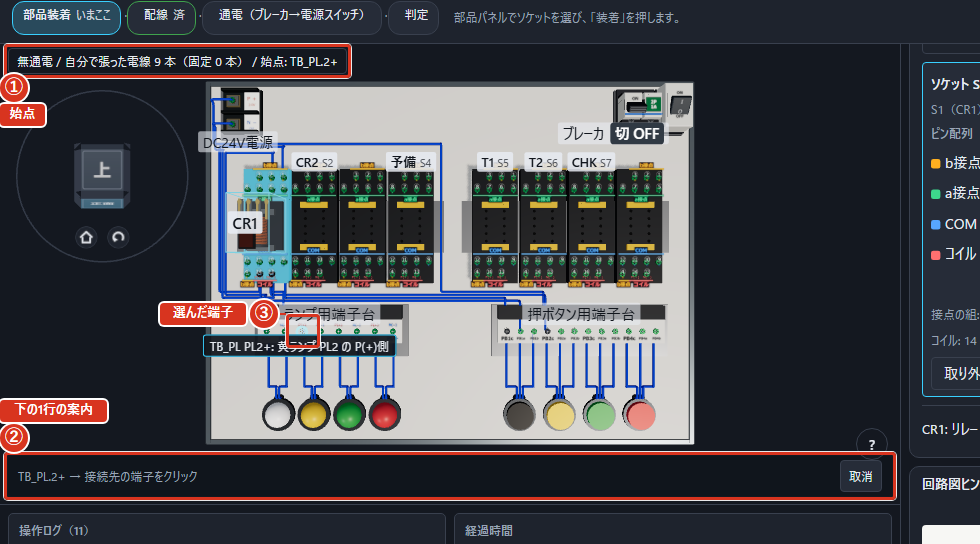
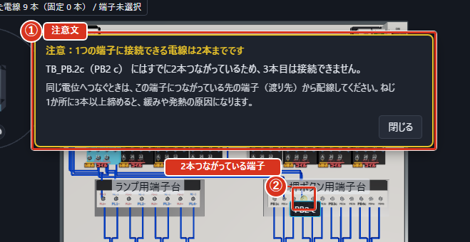
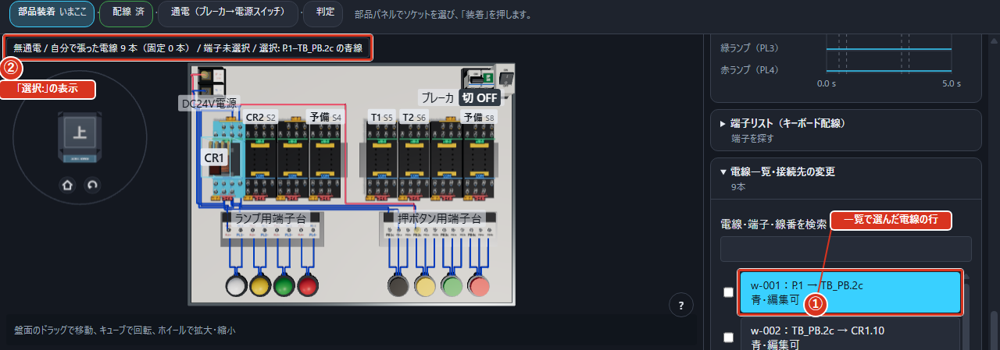
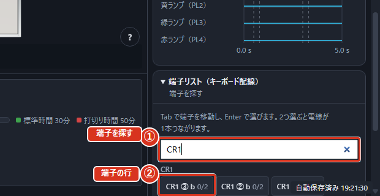
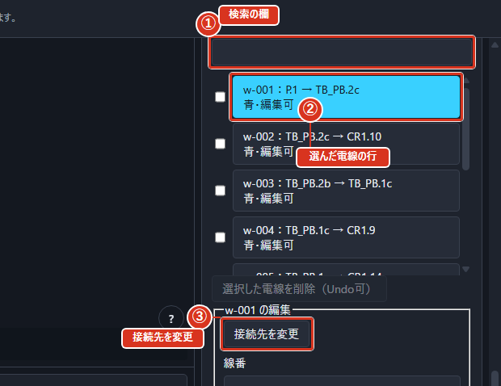

# 回路を組み立てる（モードB）

## このモードでやること

課題の文を読んで、そのとおりに動く回路を練習盤の上に作ります。部品を載せて、電線をつないで、電気を流して、押しボタンを押して、思ったとおりに動いたら「判定」を押します。

進め方は次の6段階です。上の帯のすぐ下に出る「手順」の案内が、この順番を1段ずつ教えてくれます。

1. 課題の文を読む
2. 部品を載せる
3. 電線をつなぐ
4. 電気を流す
5. 押しボタンで動きを確かめる
6. 「判定」を押す

級によって回路図の扱いが違います。3級は回路図が初めから見えたままで、隠せません。2級は回路図ヒントを開いたり閉じたりでき、開いた回数が結果の画面に出ます。1級には回路図ヒントが出ません。

## 3分操作ガイド

初めて回路組立の課題を開くと「3分操作ガイド」が始まります。明るくなった場所を実際に操作すると、盤の回転、部品の装着、配線、通電、判定の順に進みます。回転は「向きを変える」でも試せます。

「あとで」「次回から表示しない」、または `Esc` で閉じると、次回から自動では開きません。設定または `F1` のヘルプにある「案内をもう一度見る」で再開できます。設定からは回路組立の課題を選びます。ヘルプからは作業を保ったまま再開し、他のモードにいる場合は次に回路組立の課題を開いたときに始まります。

3D表示の準備ができない環境や、3D表示が中断している間は案内を表示しません。案内を閉じる際に「案内を閉じましたが、表示設定を保存できませんでした。次回起動時に再び表示されることがあります。」と出た場合も、現在の作業はそのまま続けられます。

## 回路を組み立てる

1. 課題の文を読みます。画面の右の欄の一番上に出ています。
2. 使う部品をソケットに載せます。
3. 電線をつなぎます。
4. 「① ブレーカ」と「② 電源スイッチ」を順番に入れて電気を流します。
5. 押しボタンを押して、思ったとおりに動くか見ます。
6. 上の帯の右端の「判定」を押します。

それぞれの段階は、この章のあとの節で詳しく説明します。部品を載せる方法は「部品を載せる」、電線のつなぎ方は「電線をつなぐ・外す」、電気の流し方は「電気を流す」、押しボタンの使い方は「押しボタンを押す」、判定の方法は「「判定」を押す」を見てください。画面の並びは「画面の見方」の「練習中の画面の並び」に図で出ています。

## 電線をつなぐ・外す

**つなぐ**

電線は、端子をクリックしてから別の端子をクリックすると1本つながります。

1. 上の帯の色ボタンで電線の色を選びます（色の決まりは課題の指示にしたがいます）。
2. 3D盤で、つなぎたい1つ目の端子をクリックします。盤の左上の表示に「始点: P.1」のように出ます。
3. 3D図の下の1行（いま指している物の案内）に「P.1 → 接続先の端子をクリック」と出ます。
4. 2つ目の端子をクリックします。電線が1本つながり、左上の「自分で張った電線」の本数が1つ増えます。
5. つなぐのをやめたいときは `Esc` を押すか、下の1行の「取消」を押します。

図では、①が左上の表示（「始点」）、②が下の1行の案内、③が選んだ端子です。

端子の上にマウスを乗せると、押す前に「押すと何が起きるか」が下の1行に出ます。読み方は「画面の見方」の「端子に触れると出る札」にあります。

母線（P と N の2本）は、端子から端子へ渡してつないでいきます。

**1つの端子は2本まで**

1つの端子につなげる電線は2本までです。2本つながった端子を押すと、3D図の上に「注意：1つの端子に接続できる電線は2本までです」という注意文が出て、3本目はつながりません（危険操作としては数えません）。

1. 注意文で、どの端子が2本になっているかを確かめます。
2. 同じ電位へつなぐときは、その端子の先（渡り先）の端子から配線します。
3. 注意文は「閉じる」で消えます。次の配線をしても消えます。

2本つながった端子にマウスを乗せると、押す前から「この端子にはすでに2本つながっています。3本目は接続できません」と出ます。ねじ1か所に3本以上締めると、実物では緩みや発熱の原因になります。

図では、①が注意文、②が2本つながっている端子です。

**外す**

1. 外したい電線の途中（端子から離れたところ）をクリックします。端子の上を押すと配線の始点になります。
2. 選んだ電線は色が変わり、盤の左上の表示に「選択:」と出ます。
3. `Delete` を押すと外れます。
4. 選ぶのをやめるときは `Esc` を押すか、盤の何もない所をクリックします。

電線をクリックする代わりに、右の欄の「電線一覧・接続先の変更」で行を押して選んでも、`Delete` で外せます。上の帯の「削除モード」を押してから電線をクリックしても選べます。固定電線は外せません。

図では、①が一覧で選んだ電線の行、②が左上の「選択:」の表示です。

**キーボードでつなぐ**

マウスを使わずにつなぐこともできます。右の欄の「端子リスト（キーボード配線）」を開き、「端子を探す」欄で絞り込みながら、「`Tab` で端子を移動し、`Enter` で選びます。2つ選ぶと電線が1本つながります。」という案内のとおりに進めます。選んだ1つ目は「取り消す」で選び直せます。一覧の1行が「端子」です。2本つながった端子は、一覧の本数が「2/2」になり、「この端子には既に2本つながっています」と出ます。

図では、①が「端子を探す」、②が端子の行（右端はつながっている本数）です。

**やり直す**

つなぎ間違えたときは、上の帯の「元に戻す」を押すと1つ前の状態に戻せます。戻しすぎたときは「やり直し」でやり直せます。どちらも配線だけでなく、部品を載せる・外すなどの操作にも効きます。これより前の操作が無いときは「元に戻せる操作がありません」と出ます。

## 部品を載せる

右の欄の「部品」で載せたい部品を選び、対応するソケットをクリックします。部品をソケットまでドラッグしても装着できます。ソケットそのものをクリックして開くカードでは、部品を選んで「装着」を押す方法も使えます。課題で決まっている役割（CR1、T1 など）はソケットの上に書いてあります。

部品にはリレーと**コイル**（電気を流すと磁石になって接点を動かす部品）で動くタイマの2種類があります。リレーはコイルに電気を流すとすぐに接点が切り替わり、タイマは決めた時間が経ってから切り替わります。

載せられる数は課題で決まっています。外すときは同じカードの「取り外す」を、別の部品にしたいときは「交換…」を押します。カードの図は「画面の見方」の「部品を入れ替える」にあります。

## タイマの時間を決める

タイマを載せると、つまみが出ます。タイマのつまみをドラッグすると時間を決めることができます。数字の欄に打ち込んでも決められます。

設定できる範囲は、0.1〜10秒は0.1秒きざみ、0.5〜60秒は0.5秒きざみです。決めた時間は結果の画面でも確かめられます。

## 電気を流す

上の帯の「① ブレーカ」を入れてから「② 電源スイッチ」を入れます。3D盤のブレーカと電源スイッチをクリックしても同じ操作になります。この順番が大切で、逆にすると危険操作として数えられます。

切るときは逆の順番（「② 電源スイッチ」→「① ブレーカ」）です。短絡（ショート）したまま電気を流すと、警告の帯が出ます。

> **やってはいけない** つないでいる途中で電気を流したままにしないでください。

## 押しボタンを押す

3Dの画面の押しボタンをクリックすると押せます。3Dの押しボタンを押したままにすると、押しているあいだだけ接点が変わります。マウスのボタンを離すと戻ります。

黒（PB1）・黄（PB2）・緑（PB3）・赤（PB4）の役割は課題の指示にしたがいます。ランプが点いたか、リレーが動いたかは、3Dの画面と下の欄のタイムチャートの両方で見られます。

## 「判定」を押す

上の帯の右端の「判定」を押すと、課題が決めた順番で押しボタンが自動で押され、お手本の回路と同じ動きになったかどうかが比べられます。

合格の条件は、動きが同じであることと、自動で見つかる間違いが無いことの2つです。判定には数秒かかり、そのあいだはボタンが押せません。結果の画面の読み方は「画面の見方」の章にあります。

## うまくいかないとき

練習中にも、結果の画面にも、うまくいかない手がかりが出ます。

**練習中に出るもの**

危険な操作をすると、上の帯の下に赤い「警告」の帯（危険操作の警告）が出ます。「閉じる」を押すとその場では消せますが、回数は数えられていて、結果の画面の「危険操作」に回数として残ります。このアプリでは数値の減点は行わず、回数を表示します。電源手順などは、課題で指定された静的チェックにより合否にも反映されます。たとえば、タイマの接点で自分のコイルを切る回路を組むと「タイマの接点で自分のコイルを切る回路」は実機では動作が不安定になる、という警告が出ます。

よくある間違い:

| 間違い | 気をつけること |
|---|---|
| 電線が1本足りない | 課題の指示どおりに全部つないだか確かめる |
| b接点とa接点を取り違えた | ソケットの端子番号（①〜④がb接点、⑤〜⑧がa接点）を確かめる |
| コイルの向き（PとN）が逆 | ⑭が「P(+)」でプラス24Vの母線側、⑬が「N(−)」で0Vの母線側であることを確かめる |
| ランプの向き（PとN）が逆 | 「PL1+」がプラス24Vの母線側、「PL1-」が0Vの母線側であることを確かめる |
| 1つの端子に3本差そうとした | 1つの端子には電線を2本までしかつなげない |
| 電源を入れる順番が逆 | 「① ブレーカ」→「② 電源スイッチ」の順に入れる |

**結果の画面に出るもの**

配線が模範回路と違うと、結果の画面に「疑わしい配線」の欄が出ます。「盤で見る」を押すと「結果から」という印が付いた状態で3Dの画面に戻り、疑わしい端子が光ります。直したら上の帯の「結果へ戻る」で結果の画面に戻れます。「同じ機器の接点の組」が違うだけのときも、ここに「不足」「余分」として出ることがあります。表示しきれない疑いがあるときは「まず上の指摘から直してください」と出ます。配線に違いが見つからないときは「模範回路との配線の違いは見つかりませんでした」と出るので、部品の設定や操作の順序を見直します。

## 電線一覧で接続を探す・直す

「電線一覧・接続先の変更」で検索、選択、接続の編集ができます。

右の「電線一覧・接続先の変更」で、電線ID・端子名・線番を検索できます。行を押すと両端と電線が盤で光ります。3Dで線を選んだ場合も一覧の編集対象になります。

図では、①が検索の欄、②が選んだ電線の行、③が「接続先を変更」です。

1. 盤電源をOFF、PLCを使う場合はSTOPにします。
2. 対象の行を選び、「接続先を変更」を押します。
3. 始点・終点・線色を選び、表示された接続を確認して「変更を確定」を押します。「取消」では元の配線を残します。
4. 「線番」「注記」を入力し、「線番・注記を保存」で用途を残します。
5. 複数の不要な線はチェックして「選択した電線を削除（Undo可）」を押します。

これらの編集は「元に戻す」で戻せます。固定電線は編集できません。「接続済み／経路要調整」は電気的な接続は存在するものの、線を盤上に描く経路を決められない状態です。「通す配線帯」で自動または別の帯を選びます。経路を変えても接続先は変わりません。机上PLCのケーブルは自動経路です。

## 自由練習用の拡張盤

拡張盤の課題では、中継端子台を最大8対、PB5〜PB8とPL5〜PL8を各最大4個使えます。中継端子台の同じ番号のaとbは内部でつながっています。たとえば1aへ来た電源を1bから次の回路へ渡せます。

標準課題は青線・1端子2本のルールです。自由盤の既定の線色は青／白／黄で、課題作成者が線色を指定できます。1端子の本数はどの盤でも2本までです。対象は回路組立モードの拡張盤課題です。B087〜B090では追加押ボタンと表示灯の配線を練習します。
