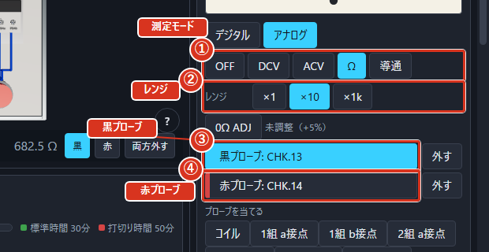
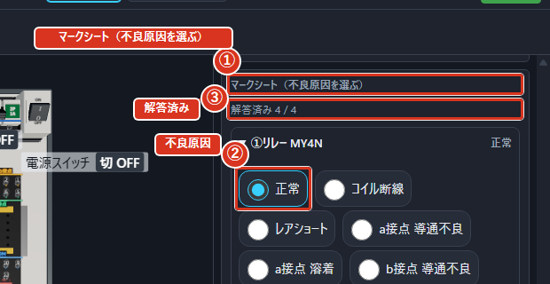

# 部品を点検する（モードC1）

## このモードでやること

トレイに並んだリレーとタイマの中から、壊れているものを見つけて、どう壊れているかを答えます。見た目では分からないので、実際に動かして、テスターで測って調べます。

壊れ方は、正常も含めて7種類あります。詳しい見分け方は「不良の見分け方」で説明します。

動かしてみるだけでは見つからない壊れ方があります。正常に見えても、コイルの中の抵抗を測らないと見分けられないものもあります。

## 部品を点検する

1. 「部品トレイ」から部品を1つ選び、「チェック用ソケットに挿す」を押します。
2. 赤い押しボタン（PB4）を押して、部品が動くか（カチッと**励磁**（部品に電気を流して、内部を磁石にして動かすこと）するか）を見ます。
3. テスターで接点がつながるかを測ります。
4. 赤い押しボタンから指を離して、コイルの抵抗を測ります。
5. 「外す」を押して部品を外し、次の部品へ進みます。

チェック用ソケットでは、コイルは⑬（−）と⑭（＋）、1組目のa接点は⑨（COM）と⑤の間で測ります。全部の部品について、最後の「コイルの抵抗を測る」まで必ずおこなってください。テスターそのものの使い方は、次の「テスターの使い方」に図で出ています。

## テスターの使い方

3D盤のブレーカと電源スイッチをクリックして入切できます。上の帯の電源ボタンも同じ動きです。

右の欄に「テスター」があります。「測定モード」のつまみで測り方（電圧・抵抗・導通）を選び、「黒プローブ」と「赤プローブ」を測りたい端子に当てると、測定値が単位つきで大きく出ます。3D盤の端子をクリックすると、テスターの棒を置けます（黒 → 赤 の順）。

デジタルとアナログを切り替えられます。アナログのときは「アナログテスターの目盛」で針の位置から読み取ります。「レンジ」は自分で選べるほか、「オートレンジ」にすると自動で選ばれます。レンジを超えると「レンジを超えています」と出ます。

抵抗を測る前には、0オーム調整が必要です。調整が終わると「調整済」と出ます。「アナログテスターのΩ／導通レンジのときだけ 0Ω 調整ができます」（デジタルは自動で補正するので調整の必要がありません。それ以外のときに調整しようとすると、その理由が出ます）。

導通しているときはブザーが鳴り、「ブザー鳴動中」と出ます。「通電中はΩ／導通を測れません」（無通電にしてから測ります）。

キーだけでも操作できます。`b` で黒い棒を、`r` で赤い棒を次の端子へ進め、`0` で0オーム調整をします。「プローブを当てる」から、測りたい接点の組（「1組 a接点」など）を選んでも置けます。棒を外すときは「外す」を押します。

電気が流れているところに抵抗のレンジを当てると、危険操作になります。

図では、①が「測定モード」のつまみ、②が「レンジ」、③が「黒プローブ」、④が「赤プローブ」です。

## 不良の見分け方

**コイル断線**（コイルの中の電線が切れてしまった壊れ方）はコイル抵抗が測定できません（OL）。

**溶着**（接点がくっついたまま離れなくなった壊れ方）は、同じ組のもう一方の接点を機械的に開いたままにします。たとえばa接点が溶着すると、b接点はON/OFFのどちらでも導通しなくなります。

**レアショート**（コイルの中で電線どうしが少しだけ触れてしまい、抵抗が下がった壊れ方）のコイルは、通常どおり励磁・復帰し、接点も通常に開閉します。動きを見るだけでは正常品と区別できないため、正常に見えた部品も必ずコイル抵抗を測ります。正常なコイルの抵抗は約650Ωで、その85%にあたる約552Ω以下ならレアショートと見ます。内蔵課題では複数の劣化度を扱います。約420Ωの部品を含め、正常値と比べて抵抗が低いことを実測で確認してください。

測った結果と壊れ方の対応は次の表のとおりです。この表は画面の中でも「判定表（切り分けの手順）」として開けます。「チェック状況」に、いま分かっていることが出ます。画面と同じく、紛らわしい行には「備考」がついています。

| 測った結果 | 壊れ方 | 備考 |
|---|---|---|
| 赤PBを押してもコイルが吸引しない ＋ コイル抵抗が OL（測定不能） | コイル断線 | — |
| ON時に a接点 導通なし | a接点 導通不良 | 【溶着が優先】同じ組のb接点がON/OFFとも導通しているなら、a接点が開いているのは b接点の溶着によるもの。答えは「b接点 溶着」。 |
| OFF時に a接点 導通あり | a接点 溶着 | 【溶着が優先】溶着は同じ組のもう一方の接点を機械的に開くので、b接点はON/OFFとも導通しなくなる。「b接点 導通不良」に見えても答えは「a接点 溶着」。 |
| ON時に b接点 導通あり | b接点 溶着 | 【溶着が優先】溶着は同じ組のもう一方の接点を機械的に開くので、a接点はON/OFFとも導通しなくなる。「a接点 導通不良」に見えても答えは「b接点 溶着」。 |
| OFF時に b接点 導通なし | b接点 導通不良 | 【溶着が優先】OFF時に同じ組のa接点が導通しているなら、b接点が開いているのは a接点の溶着によるもの。答えは「a接点 溶着」。 |
| 動作も接点も正常 ＋ コイル抵抗が約650Ω（正常の85%超） | 正常 | 【必ずコイル抵抗を測る】レアショートのコイルは通常どおり励磁・復帰し、接点も正常に開閉する。動作を見るだけでは正常品と区別できないので、正常に見えた部品も必ずコイル抵抗を測ること。 |
| 動作も接点も正常 ＋ コイル抵抗が正常の85%以下（本アプリの既定は約420Ω） | レアショート | 【必ずコイル抵抗を測る】しきい値は正常値650Ωの85%（＝約552Ω）。これ以下をレアショートとする（本アプリの判定基準）。 |

赤PB（PB4）を離していれば、通電したままでもコイル抵抗を安全に測れます。

## 答えを書き込む

右の欄の「マークシート（不良原因を選ぶ）」に、部品ごとに1つだけ丸を付けます。列には「不良原因」が並び、正常だと思ったら「正常」を選びます。

選べるのは7つの名前（正常・コイル断線・レアショート・a接点 導通不良・a接点 溶着・b接点 導通不良・b接点 溶着）です。いくつ答えたかは「解答済み」に出ます。

全部答えなくても「判定」は押せますが、答えていないものは不正解になります。

図では、①が「マークシート（不良原因を選ぶ）」の欄、②が「不良原因」の列、③が「解答済み」の数です。

## 「判定」を押す

全部の部品に答えを付けたら「判定」を押します。結果の画面に「マークシート採点」の表が出て、部品ごとの正解・不正解と、何問「正解」だったかが「n/m 正解」の形で出ます。

結果の「見分け方」は不良種別ごとの解説です。自分が測った値を見直すには、測定中に「今の測定値を記録」を押してください。記録した値は結果の「測定記録」に並び、作業ファイルと結果レポートにも保存されます。記録していない測定は結果には追加されません。
