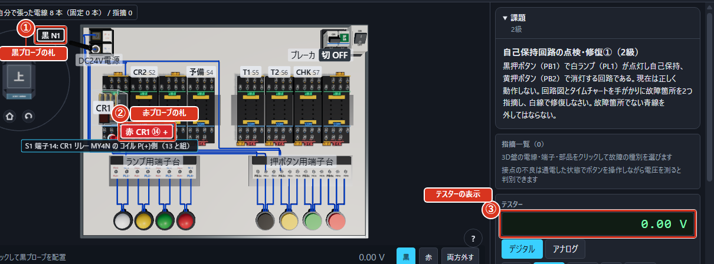
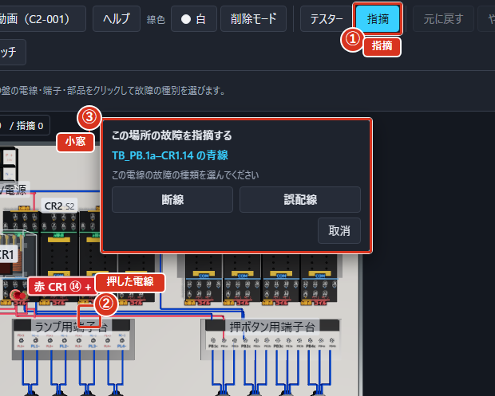
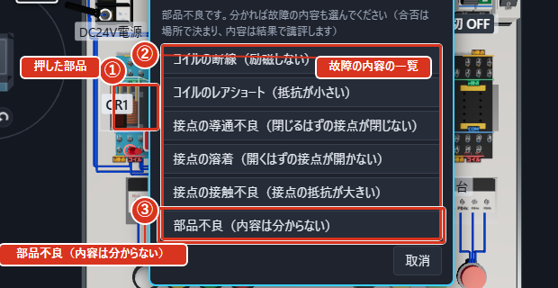
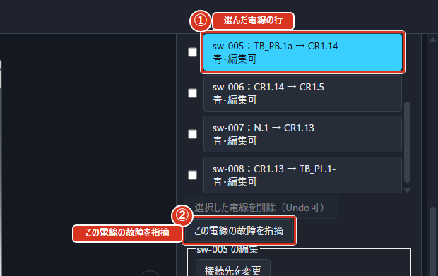
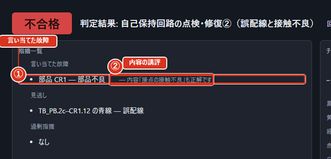
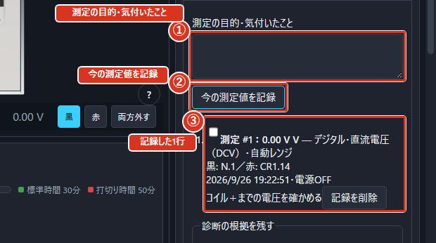

# 回路を点検して直す（モードC2）

## このモードでやること

できあがった回路のどこかに、わざと間違いが入れてあります。思ったとおりに動かない理由を探して、見つけたところを書き出し、正しくつなぎ直します。

間違いは、電線のつなぎ間違い・部品の壊れ・接触不良の3種類です。故障箇所の数や種類は課題ごとに異なります。一か所を修復した後も、全ての動作条件を確認してください。

## 回路を点検して直す

1. 課題の文と回路図を読んで、どう動くはずかをつかみます。
2. 3D盤のブレーカ、電源スイッチの順にクリックして電気を流し、実際の動きを見ます。上の帯の電源ボタンでも操作できます。
3. 思ったとおりに動かないところから、疑わしいところを絞ります。
4. テスターで測って確かめます。当てた場所は3D図の棒と札で確かめられます。
5. 見つけたところを「指摘」として書き出します。3D図で故障した物を押すか、右の欄の一覧から選びます。
6. 白い電線でつなぎ直す、または部品を良品と取り替えます。
7. 「判定」を押します。

上の帯のすぐ下の「手順」の案内が、この順番を1行ずつ出します。

## 回路図と盤を行き来する

画面には「回路図ヒント」も出せます。上の帯の「その他の操作」（⋯）から「回路図を表示」を選ぶと出ます。回路図の記号をクリックすると、盤の対応する端子が光ります。

回路図ヒントは押すと大きく開きます。開いた窓には「拡大」「縮小」「等倍」のボタンがあり、「表示倍率」がパーセントで出ます。窓の外をクリックすると閉じます（「図の外をクリックすると閉じます」と案内が出ます）。回路図ヒントを拡大するボタンを押しても同じように開きます。

2級の課題では、回路図を開いた回数が結果の画面の「回路図を開いた回数」に出ます。

## 疑わしい電線の見つけ方

ランプがうすく点いている（暗点灯）ときは、どこかで接触が悪くなっています。動くはずのリレーが動かないときは、コイルまで電気が来ているかを電圧で測ります。

測る手順:

1. テスターを「DCV」に合わせます。
2. 黒プローブをコイルの⑬（−）、赤プローブを⑭（＋）に当てます。正常に電源が来ていれば、約＋24Vが表示されます。
3. 電圧が来ているのに動かないなら部品の不良、電圧が来ていないなら配線の不良を疑います。

接点の不良は通電した状態でボタンを操作しながら電圧を測ると判別できます。

電気が流れているところに抵抗のレンジを当ててはいけません。

## テスターを当てた場所を3D図で確かめる

テスターのプローブ（棒）を当てると、3D図の端子に黒と赤の棒が立ち、先の上に「黒 TB_PB.1a」のような端子名の札が出ます。棒の根元には色の輪が付くので、盤を回したり遠くから見たりしても、どこを測っているかが分かります。右の欄のテスターにも、当てている端子名が同じ言い方で出ます。

1. 上の帯の「テスター」を押します。
2. 測定モード（DCV・Ω など）を選びます。
3. 黒プローブ、赤プローブの順に、3D図の端子を押します。
4. 3D図の札と、テスターの表示（測った値）を見比べます。

図では、①が黒プローブの札、②が赤プローブの札、③がテスターの表示です。

## 見つけたところを書き出す

測って見つけた故障の場所と種類を「指摘」として登録します。**3D図の上からでも、右の欄の一覧からでも**指摘できます。どちらで指摘しても、登録される中身は同じです。

**3D図から指摘する**

1. 上の帯の「指摘」を押します。
2. 故障していると思う物そのものを押します（3D盤の電線・端子・部品をクリックする）。
3. 押した場所の横に「この場所の故障を指摘する」という小窓が出ます。2行目に、押した物の名前（「TB_PB.1a–S1.14 の青線」など）が出るので、押したかった物か確かめます。
4. 種類のボタンを1つ押します（例: 「断線」）。
5. 右の欄の「指摘一覧」に1行増え、上の帯の「指摘」の数が1つ増えます。

選べる種類は、押した物で決まります。**線が無いところ（未配線）は、電線そのものが3D盤に無いので、電線が来るはずの端子を押して指摘します**。小窓には「端子には『未配線』だけを出しています。断線・誤配線は電線を、部品不良は部品をクリックしてください」と案内が出ています。

| 押した物 | 選べる種類 |
|---|---|
| 電線 | 断線／誤配線 |
| 端子 | 未配線 |
| 部品（リレー・タイマ） | 部品不良（分かれば故障の内容も選ぶ） |

図では、①が上の帯の「指摘」、②が押した電線、③が小窓です。

**部品の故障の内容を選ぶ**

部品を押すと、小窓に故障の内容の一覧が出ます。

1. 測定で内容が分かっていれば、「コイルの断線（励磁しない）」「接点の溶着（開くはずの接点が開かない）」などから1つ押します。
2. 内容まで分からないときは「部品不良（内容は分からない）」を押します。

合否は**場所**（どの部品か）で決まります。選んだ内容は、結果の画面で講評として出ます。同じ部品をもう一度押して別の内容を選ぶと、内容だけが選び直され、「部品不良の内容を選び直しました」と出ます。

図では、①が押した部品、②が故障の内容の一覧、③が「部品不良（内容は分からない）」です。

**一覧から指摘する**

電線が重なっていて3D図で押しにくいときは、右の欄から同じ小窓を開けます。

1. 右の欄の「電線一覧・接続先の変更」を開き、電線の行を押して選びます。3D図でもその電線が光ります。
2. 「この電線の故障を指摘」を押します。3D図の上に同じ小窓が開きます。
3. 部品のときは、右の欄の「修復」の「装着部品」で「この部品の故障を指摘」を押します。
4. 小窓で種類を選びます。

図では、①が選んだ電線の行、②が「この電線の故障を指摘」です。

**取り消す・確かめる**

- 小窓を閉じるときは「取消」を押します。
- 登録した指摘を消すときは、「指摘一覧」のその行の「取消」を押します。
- 同じ場所・同じ種類をもう一度指摘すると「同じ指摘が既に登録されています」と出て、増えません。
- 「指摘一覧」の「登録した指摘」には、場所と種類（部品不良は「部品不良（コイル断線）」のように内容も）が並びます。

図では、①が上の帯の「指摘」、②が「この場所の故障を指摘する」小窓、③が右の欄の「指摘一覧」、④が光っている端子（押した電線・端子・部品に対応する場所）です。

## 直す

つなぎ間違いは、白い電線でつなぎ直します。壊れた部品は、右の欄の「修復」にある「装着部品」から対象を選び、「交換」で良品と取り替えます。

右の欄の「修復」に、直した内容が一覧で残ります。「追加した白線」には新しくつないだ電線が、「外した青線」には取り除いた電線が並びます。

故障回路にもとからある青線は、点検・修復のために外せます。外し方は回路組立と同じで、電線の途中をクリックして選び、`Delete` を押します。ただし、固定されたチェック用配線は変更できません。正常な青線を外すと「改造」として記録されるので、測定で原因を確かめてから外してください。

## 「判定」を押す

指摘と修理が終わったら「判定」を押します。指摘したところが合っているか、直したあとに思ったとおり動くかの両方が見られます。

結果の画面には次の一覧が出ます。

| 欄 | 読み方 |
|---|---|
| 言い当てた故障 | 正しく見つけて指摘できた故障 |
| 見逃し | 見つけられなかった故障 |
| 過剰指摘 | 実際には壊れていないのに指摘してしまったところ |
| 追加した白線 | つなぎ直すために新しく足した電線 |
| 改造（故障箇所でない青線の削除） | 故障箇所ではない青い電線を外してしまった操作 |

合格の条件は、全部の間違いを指摘し、直したあとの動きがお手本と同じであることです。

部品不良を指摘したときは、「言い当てた故障」の行に、選んだ故障の内容の講評が添えられます。

| 講評 | 意味 |
|---|---|
| 内容「…」も正解です | 場所も内容も合っていた |
| 選んだ内容は「…」でしたが、実際は「…」です | 場所は合っていたが、内容が違った（合否には影響しません） |
| 実際の故障の内容は「…」です | 「部品不良（内容は分からない）」で指摘した |

図では、①が「言い当てた故障」、②が内容の講評です。

## 測定値と判断を残す

「測定記録・診断メモ」の「今の測定値を記録」を押して保存します。

テスターの下の「測定記録・診断メモ」を開きます。黒・赤プローブを当て、値が表示されてから目的を入力して「今の測定値を記録」を押します。時刻、プローブ、レンジ、値、電源状態が固定され、後からプローブを動かしても記録は変わりません。OLは0Ωに変換せずOLのまま残します。

1. テスターの下の「測定記録・診断メモ」を開きます。
2. 黒・赤プローブを当て、値が出るのを待ちます。
3. 「測定の目的・気付いたこと」に目的を書きます。
4. 「今の測定値を記録」を押します。下に1行増えます。

図では、①が「測定の目的・気付いたこと」、②が「今の測定値を記録」、③が記録した1行です。

修復前後の値を並べて確認し、関連する測定にチェックを付けます。「対象の線・端子・部品」「予測」「測定から分かったこと・次に調べること」を記入し、「選んだ測定記録とメモを保存」を押します。測定とメモはそれぞれ最大200件で、作業ファイルと結果レポートにも含まれます。回路組立・部品点検・PLCでも利用できます。

「指摘一覧」「修復」の対象リンクや判定結果の「盤で確認」を押すと、対応する端子と電線を表示します。削除済みの電線は、分かる場合に元の両端を表示します。測った事実を確認してから交換や再配線へ進めてください。
