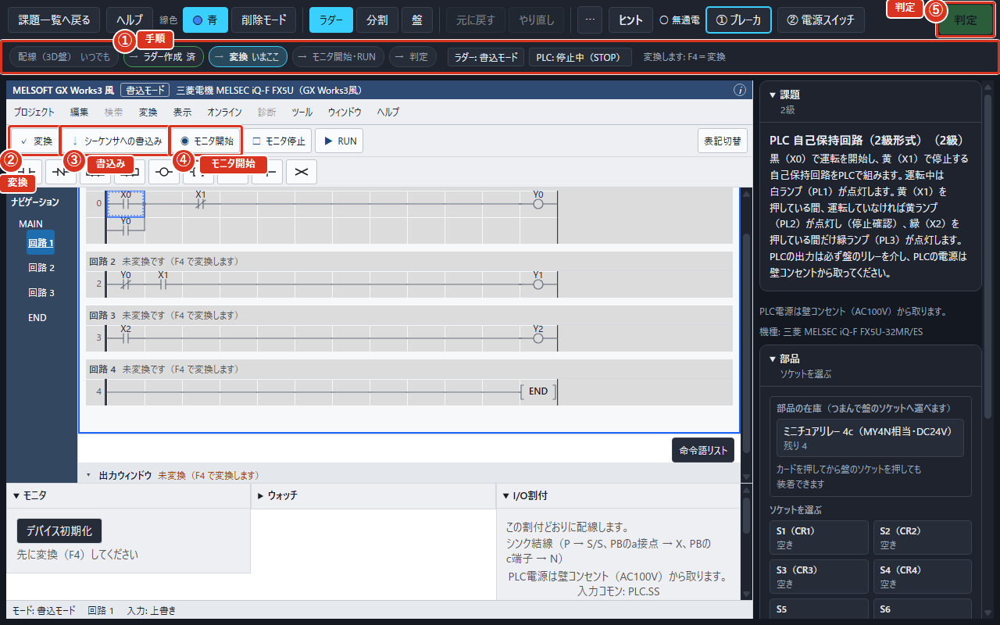
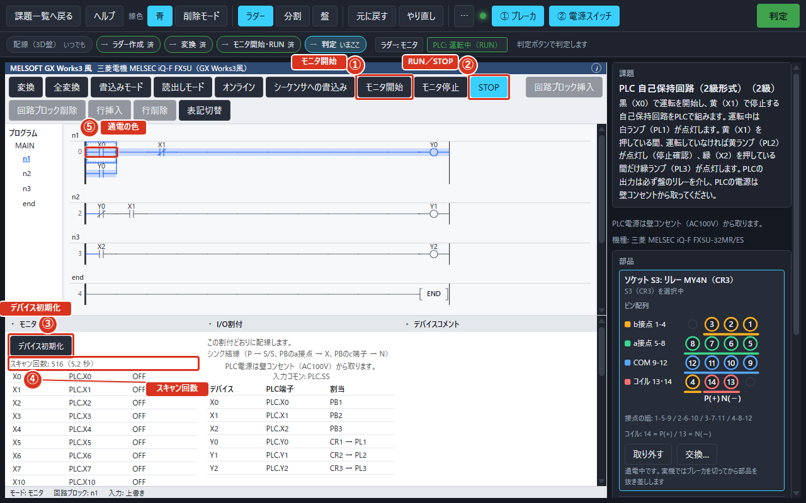
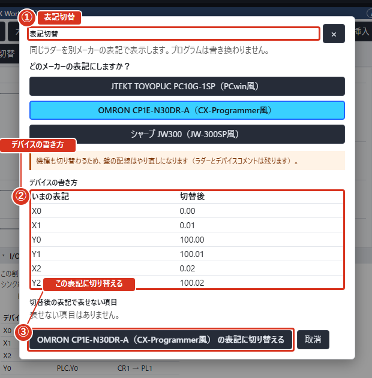

# PLCでプログラムを作る（モードD）

## このモードでやること

机の上に置いた PLC（プログラムで動く小さな制御装置）に **ラダー図**（電気の回路図に似た形で書くプログラム）を書き、盤の押しボタンやランプとつないで、思ったとおりに動くようにします。

使えるメーカーは三菱・オムロン・ジェイテクト・シャープの4社です。設定でどのメーカーを使うか選ぶと、画面の見た目や、ボタン・欄の言葉がそのメーカーに合わせて変わります。

電線をつないで動く回路（モードB）とはちがい、モードDでは電線のかわりにラダー図を書いて、PLCにその動きをさせます。それでも盤の押しボタンやランプは、PLCの入力・出力へ実際に電線でつなぎます。配線そのものが要らなくなるわけではありません。

## PLCの課題を進める

1. 課題の文を読みます。
2. 「ラダー」を選び、ラダー図を書きます。
3. 盤の押しボタンを PLC の入力へ、PLC の出力をリレーへ、3Dの画面でつなぎます。
4. PLC の電源をかべのコンセントからとります。
5. 「変換」を押します（メーカーによっては要りません）。
6. 「書込み」を押して PLC に入れます。
7. 「モニタ開始」で動きを見ます。
8. 「判定」を押します。

画面の上の帯のすぐ下には「手順」という案内が出て、いまどの段階かを教えてくれます。案内は配線（3D盤）・ラダー作成・変換・モニタ開始・RUN・判定の5つに分かれています。配線はいつでも行えるので「済」の印は付かず、ラダー作成→変換→モニタ開始・RUN→判定の順に「いまここ」が進みます。「変換」の操作が無いメーカーでは、この段は出ません。案内のすぐ下には、いま何をすればよいかのヒントが1行で出ます（最初は「まずラダーを作ります」）。

ラダーと盤の並びは、ツールバーの「表示」で「ラダー」「分割」「盤」の3つから選べます。「分割」では左上に3D盤、その下に課題・部品、右にラダーを表示します。狭い画面では上からラダー・盤・課題の順に並び、縦にスクロールできます。各欄は見出しを押すと畳めます。

3D盤のブレーカと電源スイッチもクリックで入切できます。部品パレットのカードをソケットへドラッグすると装着され、装着した部品を盤の外へドラッグすると取り外せます。「元に戻す」で取り消せます。

PLC電源は壁コンセント（AC100V）から取ります。試験用盤のAC100V・DC24Vの電源をPLCの電源として使うことはできません。

判定のあと、結果の画面には「この判定になった理由」が最初に出ます。模範回路と同じ動きになっていれば「模範回路と同じ動作で、配線の検査もすべて通りました。」と出ます。見比べた信号の一覧や、「PLC電源の独立」のような自動チェックの結果もここで見られます。

図では、①が「手順」の案内、②が「変換」、③が「書込み」、④が「モニタ開始」、⑤が「判定」です。

## ラダー図を描く

上端の「PLCソフトのメニュー」は各社の並びです。回路や行を追加・削除するときは「編集」を開きます。出力・ウォッチなどの欄は「表示」から開きます。左右キーで移り、下キーで開き、Escで戻れます。書込み・モニタ・RUN/STOPなど頻繁に使う操作は道具列にもあります。読み取り専用やモニタ中は「編集」メニューの「編集」で書込みモードに戻れます。

左半分の格子の上で、矢印キーで書き込む場所を動かし、キーで記号を置きます。置いた記号には、どのスイッチやランプかを表す名前（デバイス）を打ち込みます。

この左半分の欄全体がラダーの画面で、格子そのものが「ラダー図」、格子のまわりを含めた欄がラダーエディタです。左には「プログラム」という一覧があり、課題の「回路ブロック」（ラダー図のひとまとまり）が並びます。ラダーの格子をクリックすると場所を選べます。ダブルクリックまたはEnterでデバイス入力欄を開きます。

置ける記号は、a接点・b接点・コイル・横線・縦線の5つです（キーの割り当ては次の節）。記号を置くと「デバイスの入力」という小さな欄が出て、そこに使う機器の名前（「デバイス」）を打ち込みます。接点を置いたときは「接点の種別」（a接点かb接点か）、コイルを置いたときは「出力の種別」（ふつうのコイルか、セット・リセットか）も選びます。タイマやカウンタには「設定値」の欄が、カウンタのリセットには「リセットデバイス」の欄も出ます。入力できない名前を打ち込むと、入力できない値ですという知らせが欄の下に出て、確定できません。刻みに合わない設定値を打つと「刻みに丸めますか？」とたずねられ、「はい」で丸めた値に、「いいえ」でそのまま手直しできます。入れ終えたら「確定」で決め、「取消」でやめます。

デバイスには「デバイスコメント」（そのデバイスがどういう役割かのメモ）も付けられます。右の「コメント」欄に打ち込むと、同じ名前を使っているすべての場所に反映されます。付けられる数には上限があり、上限に達すると「新しい欄は入力できません」と出ます。

記号を置く入口は3つあり、キー・記号ボタン・格子から入力できます。SHARPは記号を置いてからEnterで「デバイスの入力」を開きます。ひとつめはキー（`F5` で a接点、など。割り当ては次の節）。ふたつめは上の帯に並ぶ**記号のボタン**で、「記号」という並びに a接点・b接点・OR a接点・OR b接点・コイル・応用命令・横線・縦線・削除が入っています。記号にポインタを合わせると名前とキーが出ます（「a接点 (F5)」）。シャープの書き方では、このボタンを格子へドラッグしても置けます。みっつめは格子そのもので、空いているマスを**ダブルクリック**すると欄が開き、**右クリック**すると「記号メニュー」が出て、その中から置きたい記号を選べます。マスを1回押しただけでは、書き込む場所が移るだけです。

欄のいちばん上には「記号とデバイス」という1行の入力があります。ここには `LD X0` や `OUT Y0` や `T0 K30` のように、命令とデバイス（と設定値）を空白で区切って書けます。命令の書き方はメーカーごとに変わります（シャープでは `LD` のかわりに `STR` です）。空白を含めずにデバイスだけを書いたときは、押したキーの記号がそのまま使われます。下の「記号」「デバイス」「設定値」「リセットデバイス」の欄はそのまま残っているので、打つのが苦手なときは今までどおり選んで入れられます。

「応用命令」の欄（三菱は `F8`、オムロンは `I`、シャープは `B`。ジェイテクトは記号ボタンから開きます）には、`SET Y0` のように命令とデバイスを書きます。本アプリが扱えるのは `SET` / `RST` / `MC` / `MCR` / `T` / `C` の6つだけで、それ以外を書くと「このアプリでは扱えない命令です（扱えるのは SET / RST / MC / MCR / T / C）」と断られ、マスは変わりません。

オムロンの書き方では、デバイスを決めたあとに続けて「コメント」の欄が開きます。そのデバイスの役割を書いて、もう一度 `Enter` を押すと確定します。何も書かずに `Enter` を押しても確定できます。またオムロンとジェイテクトの書き方では、出力（コイル）の無い回路ブロックの右端に**赤い縦線**が出て、「出力がありません」と知らせます。三菱の書き方では、まだ変換していない回路ブロックの背景が灰色になり、「変換」が通ると白に戻ります。

画面のいちばん上の帯（タイトル帯）にも、いまが「書込モード」「読出モード」「モニタ」のどれなのかが出ます。下の状態欄と同じ内容を上にも出しているので、格子を見ているあいだも目を下まで落とさずに読めます。帯の札にマウスを合わせると、切り替えるキー（三菱なら書込みが `F2`、モニタが `F3`）が読めます。

段（行）や回路ブロックを足す・消すのはツールバーのボタンです。「行挿入」でいまの行の下に1行足し、「行削除」でいまの行を消し、「回路ブロック挿入」で新しい回路ブロックを足し、「回路ブロック削除」でいまの回路ブロックを消します。

画面の下の状態欄には、いまの「書込モード」（書込・読出・モニタ）や、使っているメーカーの「デバイス点数」、「スキャン」の状態などが出ます。

## キーの割り当て

メーカーの既定キーを示します。キー割当の変更機能は本アプリにはありません。

**三菱 GX Works3**

記号キーを押してデバイスを入力し、Enterで確定します。F4で変換します。

| キー | 操作 | 備考 |
|---|---|---|
| F5 | a接点 | 確認済み。出典 S1。 |
| F6 | b接点 | 確認済み。出典 S1。 |
| Shift+F5 | OR a接点 | 確認済み。出典 S1。 |
| Shift+F6 | OR b接点 | 確認済み。出典 S1。 |
| F7 | コイル | 確認済み。出典 S1。 |
| F8 | 応用命令 | 確認済み。出典 S1。本アプリが扱えるのは SET / RST / MC / MCR / T / C です |
| F9 | 横線 | 確認済み。出典 S1。 |
| Shift+F9 | 縦線 | 確認済み。出典 S1。 |
| Ctrl+F9 | 横線の削除 | 確認済み。出典 S1。 |
| Ctrl+F10 | 縦線の削除 | 確認済み。出典 S1。 |
| Shift+F7 | 立上り微分接点 | 本アプリの割当。出典 S2。 |
| Shift+F8 | 立下り微分接点 | 本アプリの割当。出典 S2。 |
| Ctrl+←↑↓→ | 罫線（縦線・横線の作図） | 確認済み。押した向きへ罫線を引きます |
| F4 | 変換 | 確認済み。出典 S3。 |
| / | a接点・b接点の切換 | 確認済み。 |
| Alt+/ | 微分・SET/RST の切換 | 確認済み。 |
| F2 | 書込みモード | 確認済み。出典 S3。 |
| Shift+F2 | 読出しモード | 確認済み。出典 S3。 |
| F3 | モニタ | 確認済み。出典 S3。 |
| Shift+F3 | モニタ（書込み） | 確認済み。 |
| Ins | 挿入・上書きの切換 | 確認済み。 |
| Tab | 次の回路記号 | 確認済み。 |
| F1 | ヘルプ | 確認済み。 |

**オムロン CX-Programmer（Classic モード）**

Wが並列a接点、Xが並列b接点です。Ctrlと上下左右の矢印は、押した方向へ罫線を描きます。Ctrl+Mでモニタを切り替え、F2で編集へ戻ります。Ctrl+EとCtrl+Shift+Eは実機へのオンライン編集のため、本アプリでは使えません。

| キー | 操作 | 備考 |
|---|---|---|
| C | a接点 | 確認済み。出典 S4。 |
| / | b接点／接点反転 | 確認済み。出典 S4。 |
| W | OR a接点 | 確認済み。出典 S4。 |
| X | OR b接点 | 確認済み。出典 S4。 |
| O | コイル | 確認済み。出典 S4。 |
| I | 命令入力 | 確認済み。出典 S4。 |
| H,- | 横線 | 確認済み。出典 S4。 |
| V,\| | 縦線（下） | 確認済み。出典 S4。 |
| U | 縦線（上） | 確認済み。出典 S4。 |
| Ctrl+←↑↓→ | 罫線を引く | 確認済み。出典 S4。 |
| R | 下にラングを挿入 | 確認済み。出典 S4。 |
| Shift+R | 上にラングを挿入 | 確認済み。出典 S4。 |
| Ctrl+Alt+↓ | 行を挿入 | 確認済み。出典 S4。 |
| Ctrl+Alt+↑ | 行を削除 | 確認済み。出典 S4。 |
| F7,Ctrl+F7 | プログラムチェック | 確認済み。出典 S4。 |
| Ctrl+M | モニタ切替 | 確認済み。出典 S4。 |
| F2 | 読取専用モードの編集開始 | 確認済み。出典 S4。 |
| Shift+F2 | 読取専用モードで格納 | 確認済み。出典 S4。 |
| Ctrl+1 | プログラムモード | 確認済み。出典 S4。 |
| Ctrl+4 | 運転モード | 確認済み。出典 S4。 |
| Ctrl+T | 転送［PC → PLC］ | 確認済み。出典 S4。 |
| Ctrl+E | オンライン編集開始 | 確認済み。出典 S4。本アプリは実機へのオンライン編集を行いません |
| Ctrl+Shift+E | オンライン編集の転送 | 確認済み。出典 S4。本アプリは実機へのオンライン編集を行いません |

**ジェイテクト PCwin**

編集キーの公式マニュアルは認証が必要で未確認のため、専用キーは割り当てていません。記号ボタン、右クリックの記号メニュー、ダブルクリックから入力します。

| キー | 操作 | 備考 |
|---|---|---|

**シャープ JW-300SP**

S / D / Xでa接点・b接点・コイルの記号を先に置きます。続けて複数の記号を置けます。記号を選んでEnterを押し、アドレスを入力します。未入力記号の保存・元に戻す操作も可能です。アドレス未入力のまま実行はできません。Lは回路追加です。「編集」→「プログラムチェック」で確認します。F4は変換キーではありません。

| キー | 操作 | 備考 |
|---|---|---|
| S | A接点 | 確認済み。出典 S8。 |
| D | B接点 | 確認済み。出典 S8。 |
| X | コイル | 確認済み。出典 S8。 |
| P | P接点 | 確認済み。出典 S8。 |
| N | N接点 | 確認済み。出典 S8。 |
| E | セットコイル | 確認済み。出典 S8。 |
| R | リセットコイル | 確認済み。出典 S8。 |
| V | TMR | 確認済み。出典 S8。 |
| C | CNT | 確認済み。出典 S8。 |
| B | 応用命令 | 確認済み。出典 S8。 |
| G | OR＋ | 確認済み。出典 S8。 |
| L | 回路追加 | 確認済み。出典 S8。 |
| F11 | 元に戻す | 確認済み。出典 S8。 |
| F1 | ヘルプ | 確認済み。出典 S8。 |

「キー割当」の欄、または「ツール」→「キー操作一覧」で「キーの早見表」を開けます。Shift + ? でも開き、Escまたは「閉じる」で編集位置へ戻ります。

キー割当には「メーカーごとに切り替わります」「Shift + ? でキーの早見表を開きます」と表示します。PCwinには「PCwinの編集キーは資料未確認のため割り当てていません。記号ボタンから入力してください。」と案内します。

## 入出力の割り付け

右の欄に、どの押しボタンが PLC のどの入力になり、どのランプがどの出力になるかの表が出ます。課題によっては決まっていて変えられません。

この表は「I/O割付」という名前で出ます。表の上には「この割付どおりに配線します。」（決まっている課題）か「推奨の割付です（変更できます）。」（自由な課題）のどちらかが出て、どちらの種類かが分かります。表の列は、ラダーで使うデバイスの名前・PLC本体の端子名・つなぐ押しボタンやランプの3つです。端子名がこの機種の点数を超えていて表示できないときは「この機種の割付範囲を超えています」と出ます。

キャプションには「PLC電源は壁コンセント（AC100V）から取ります。」という断りと、「入力コモン」（入力をまとめてPLCに戻す共通の端子）の名前が出ます。結線の向きは「シンク結線」か「ソース結線」のどちらかで、課題によって決まっています。右の欄には「入力回路」として、入力の電気的な目安（抵抗・電流）も出ます。

## 変換する

三菱の書き方では、書いたラダー図をそのままでは PLC に入れられません。「変換」を押して、まちがいが無いかを調べてもらいます。まちがいがあると、下の欄に場所と理由が出ます。

オムロン・ジェイテクト・シャープの書き方には「変換」のボタンがありません。編集するとそのまま反映されます（下の帯には「「変換」の操作はありません（編集すると自動で変換されます）」と出ます）。キー割当の欄にも「このメーカーのツールには「変換」操作がありません。編集するとそのまま反映されます。」と添えられます。まだ反映しきれていないときは、モニタや判定のボタンに「ラダーに直すところがあります（出力ウィンドウを確認してください）」と出ます。変換がまだのうちにモニタを押そうとすると、「先に変換（F4）してください」と理由が出ます。

三菱の書き方では、まだ変換していない回路ブロックの地が灰色になり、見出しの脇に「未変換です（F4 で変換します）」と出ます。「変換」が通ると地は白に戻ります。

変換がうまくいくと「出力ウィンドウ」に「変換に成功しました」と出ます。まちがいは「構造エラー」（回路の組み方そのものの問題）とメーカーごとのまちがい（デバイス名や設定値の書き方の問題）に分かれ、それぞれ「どのネットワーク（回路ブロック）の何行目・何列目か」が添えられます（「回路 1 / 3 行 / 2 列」のような形）。出力ウィンドウにはこのほか、変換したラダーが「読み出しているデバイス」「書き込んでいるデバイス」「使われていないデバイス（表示のみ・合否には影響しません）」の一覧も出ます。

「出力ウィンドウ」は見出しを押すと畳めます。判定のあとの結果の画面では、同じ内容が「ラダーの変換エラー」と「ラダーの警告」の2つの欄に分かれて並びます。

設定で「メーカーの既定に従う」以外を選んでいても、自動で変換する設定はありません。編集のたびに毎回「変換」を押すか、変換が要らないメーカーを使ってください。

## PLCに書き込む

「書込み」を押すと、変換したプログラムが机の上の PLC に入ります。入ったら「運転」にして動かします。

書き込む・運転するボタンの名前はメーカーごとにちがい、画面のボタンにはそのメーカーの実機の操作パネルの項目がそのまま出ます。たとえば三菱の書き方では「シーケンサへの書込み」、オムロンの書き方では「転送［PC → PLC］」、シャープの書き方では「PLCへの書込み」です。ジェイテクトの書き方には、状態を表す表示（JP1・DGR・MOB・STP・RDY・RUN・RES）と「モニタ開始」「モニタ停止」が並びます。

書き込む前に、盤の配線（押しボタンをPLCの入力へ、PLCの出力をリレーへ）を終えておいてください。配線が終わっていないと、書き込んでも思ったとおりには動きません。

## 動きを見る

「モニタ開始」を押すと、いま電気が通っているところに色が付きます。色はメーカーごとにちがい、設定で変えられます。

運転と停止を切り替えるボタンは、ラダーの上の帯にあります。止まっているときは「RUN」と出ていて、押すと運転になり、運転中は「STOP」と出ます。「モニタ」の欄には「デバイス初期化」（内部のデバイスを最初の状態に戻す）ボタンがあります。PLCが停止中のときは「PLCが停止中です。RUN にすると動きます。」と出ます。動かし始めると「運転中（RUN）」に変わり、「スキャン回数」（プログラムを何回まわしたか）が経過秒数とともに増えていきます。まだ動かしていないときは「RUN にすると動きます」とだけ出ます。

通電しているマスには、色だけでなく**細い枠**も重ねて出ます。色が見分けにくいときや白黒で印刷したときでも、枠のある・なしで電気が通っているかが読めます。

「モニタ」の欄に出る表は「デバイス一覧」で、この課題で使えるデバイスを全部並べます。値の欄には ON のとき `■`、OFF のとき `□` の印が付くので、こちらも色だけに頼らずに読めます。

見たいデバイスだけを並べたいときは「監視」の欄を使います（メーカーによって呼び名が変わり、三菱では「ウォッチ」、オムロンでは「ウォッチウィンドウ」、シャープでは「モニタ登録」です。ジェイテクトの書き方にはこの欄がありません）。「監視するデバイス」の欄に名前を打ち込んで「監視に追加」を押すと、その行だけが表に並びます。まだ何も足していないときは「まだ何も登録していません。見たいデバイスを足すと、ここだけに並びます。」と出ます。いらなくなった行は「監視から外す」で消せます。欄を畳んでいても、「表示」メニューから同じ名前を選ぶと開きます。読めない名前を打ち込むと、その場で理由が出て行は増えません。

通電している回路の線や接点には色が付きます（「通電」の状態です）。この色は設定の「ラダーの見た目」で変えられます。

図では、①が「モニタ開始」、②が「RUN／STOP」（運転と停止を切り替えるボタン。図は運転中なので「STOP」と出ています）、③が「デバイス初期化」、④が「スキャン回数」、⑤が通電の色（電気が通っている線に付く色）です。

## 別のメーカーの書き方に変える

上の帯の「表記切替」を押すと、いま書いたプログラムを別のメーカーの書き方で表示できます。プログラムそのものは書き換わりません。

窓には「どのメーカーの表記にしますか？」と出て、いまと別の3社（たとえば「オムロン」）から選びます。課題の入出力の割り付けが、その機種に収まらないメーカーは選べず、「このメーカーには切り替えられません」と理由が添えられます。切り替え先を選ぶと「機種も切り替わるため、盤の配線はやり直しになります」という注意と、「デバイスの書き方」の一覧（`X0` が `0.00` になるなど、いまの表記と切替後の表記の対応）が出ます。タイマ・カウンタの設定値の書き方が変わる場合も同じように一覧になります。「切替後の表記で表せない項目」があれば、それも一覧で出ます。よければ「この表記に切り替える」を押して確定し、「取消」でやめます。窓は「閉じる」でも閉じられます。切り替えると、画面いちばん上のタイトル帯のメーカー名も変わり、上の帯のボタンの名前も、そのメーカーの実機の操作パネルの項目に変わります。

図では、①が「表記切替」、②が「デバイスの書き方」の一覧、③が切り替えを確かめるボタンです（メーカーを選ぶ前は「この表記に切り替える」、選んだあとは図のようにそのメーカーの名前が入ります）。

## 命令の一覧を書き出す

書いたラダー図を、文字で並べた一覧（命令語リスト）として保存できます。下の欄の「命令語リスト」を押すと、保存する場所を選ぶ窓が出ます。

書き出される形は「1行1命令」です。回路を直列・並列に分解できないなど、書き出せない場合は「書き出せなかった指摘」として理由が一覧に出ます（たとえば「コイルが左母線に繋がっていません」）。書き出せたときは、課題名を付けた文字のファイル（拡張子は `.txt`）として保存でき、印刷にも使えます。

## 機種を変える

設定でメーカーを変えると、机の上の PLC の見た目と端子の並びも変わります。ラックの形の機種では、電源・CPU・入出力のモジュールが並びます。

機種の名前は、三菱が「MELSEC iQ-F FX5U-32MR/ES」、オムロンが「CP1E-N30DR-A」で、どちらも1つの箱にまとまった機種です。ジェイテクトの「TOYOPUC PC10G-1SP」とシャープの「JW300」はラックの形の機種で、電源のモジュール・CPUのモジュール・入力のモジュール・出力のモジュールが横に並びます。いま使っている機種の名前は、練習中の画面にも「機種」として出ます。

端子の名前は機種によって変わるので、機種を変えると盤とPLCの配線もやり直しになります。
