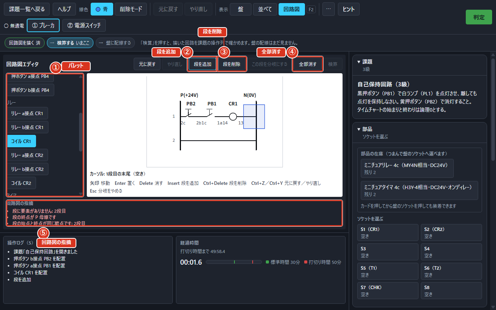

# 回路図を描いて確かめる

## この機能でやること

盤に電線をつなぐ前に、机の上で回路図を描いて、その回路が正しいかどうかを確かめられます。実際につなぐ前に間違いに気づけるので、やり直しが減ります。

モードBの練習中に使え、`F2` で「盤」「並べて」「回路図」を切り替えられます。「並べて」を選ぶと、3Dの盤と回路図エディタが画面の左右に並びます（回路図エディタの欄）。「回路図」だけにすると、画面いっぱいに回路図エディタが出ます。エディタの上には「手順」という案内が出て、「回路図を描く」「検算する」「盤に配線する」の順に、いまどこまで進んだかを教えてくれます。

描いた図は作業ファイルに一緒に残ります。作業を保存して後で読み込んでも、描きかけの回路図はそのまま残っています。

## 回路図を描く

左に電源の＋、右に電源の−があり、そのあいだに横向きの段を並べていきます。矢印キーで置く場所を動かし、左のパレットから置きたい記号を選んで `Enter` を押すと置けます。`Delete` で消し、`Insert` で段を1本ふやし、`Ctrl+Z` でひとつ前に戻し、`Ctrl+Y` でやり直せます。

段そのものを消したいときは `Ctrl+Delete` を押します。いまの書き込み場所（カーソル）は、画面のどこにあるかが常に分かるように示されます。書き込む場所（図の桁）は矢印キーで動かします。

パレット（「置ける要素」）には、押ボタンのa接点・b接点、リレーのa接点・b接点、タイマのa接点・b接点、コイル、ランプ、ブザー（課題にブザーがあるときだけ）が並びます。盤に無い部品はパレットに出ません。

描いている途中のまま置いておけて、足りないところは下に指摘として出続けます。描いた回路図をぜんぶ消したいときはツールバーの「全部消す」を押します。「描いた回路図をすべて消します。よろしいですか？」とたずねられるので、「はい、全部消す」で消し、「やめる」でやめます。段を足すときは「段を追加」、消すときは「段を削除」を押します。

図では、①が左のパレット、②が「段を追加」、③が「段を削除」、④が「全部消す」、⑤が「回路図の指摘」です。「検算」を押すと、⑤のさらに下に検算の結果（「検算 合格」または「検算 不合格」）が出ます。エディタの欄は縦が短いので、結果を読むときはエディタの欄をすこし下へ送ってください。

## 分岐を作る

自己保持の回路のように、段のとちゅうから枝分かれさせたいときは「この段を分岐にする」を押します。押したあと、枝の始まりと終わりを順にクリックします。やめたいときは `Esc` を押します。

始点を選ぶときには「分岐の始点をクリックしてください（他の段の、要素と要素のあいだを選びます）。」と案内が出ます。始点と終点はどちらも、いま選んでいる段とは別の段の節点（要素と要素のあいだ）から選びます。同じ節点を終点には選べません。

押せないときは理由が出ます。コイル・ランプ・ブザーのような負荷のある段は分岐にできません。段が1本しかないときも「分岐先になる段がありません。先に「段を追加」で段を増やしてください。」と出ます。キーだけでも同じ手順で分岐を作れます。

## 設定時間を決める

タイマの接点を置くと、その下に「設定時間」の欄が出ます。上下のボタン（「設定時間を0.1秒ふやす」「設定時間を0.1秒へらす」）か、数字の打ち込みで時間を決めます。単位は秒です。

決められる範囲は `0.1〜10.0秒` を0.1秒きざみです。上限・下限に達すると「これ以上は長くできません（10.0秒まで）。」「これ以上は短くできません（0.1秒から）。」と出ます。決めた時間は検算にも使われます。

## 「検算」で確かめる

「検算」を押すと、描いた回路図をそのまま盤につないだものとみなして、課題の順番で押しボタンを押したときの動きを確かめます。合格・不合格は「判定」と同じ基準です。

検算の欄には「机上の検算です。盤の配線は「判定」で別に確かめます。」という断りが出ます。指摘（描いた回路図の問題点）が1つも無いときは「回路図の指摘」の欄に「指摘はありません。検算できます。」と出て、検算が押せるようになります。指摘が残っていたり、検算の最中だったりすると押せません。結果は「検算 合格」または「検算 不合格」で出て、食い違いの表と波形も一緒に表示されます。

## 図のとおりに盤へつなぐ

回路図の記号をクリックすると、盤のどの端子につなげばよいかが3Dの画面で光ります。光ったところを順につないでいけば、図のとおりの回路ができます。

自動ではつながりません。つなぐ練習そのものが大事だからです。逆に、盤の端子にマウスを乗せると、回路図のどの記号に当たるかが光ります。
