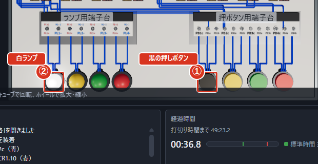
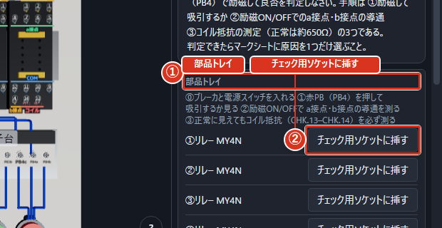
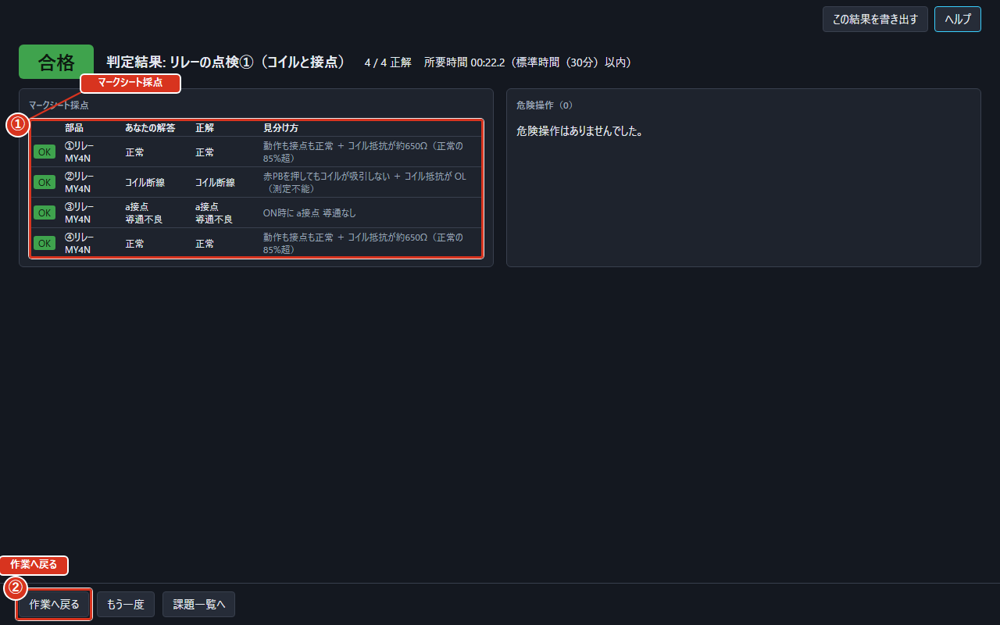
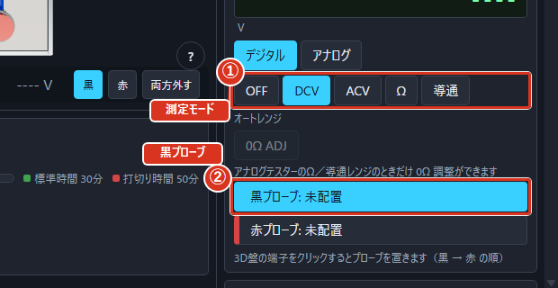
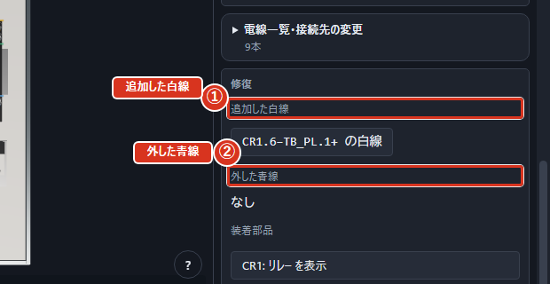
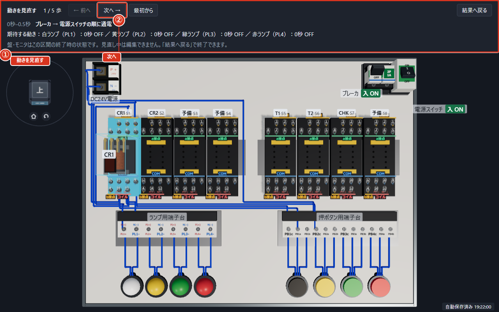
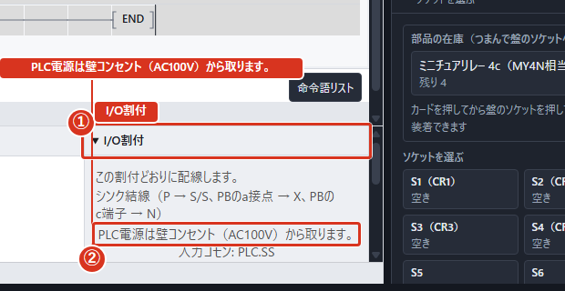

# はじめてのれんしゅう（モード別の通し）

## この章の使い方

1. やりたい練習の節を1つ選びます。1つの課題を最初から最後まで、画面のどこを押すかまで書いてあります。
2. 1手順ずつ操作し、図の丸数字で場所を確かめます。図は押すと大きくなります。
3. 途中で迷ったらF1を押します。いまの画面に合うヘルプから、この章へ戻れます。

> **ヒント** 図は操作場所を示しています。測定値や電線の本数は、自分が進めたところまでの表示になります。

## 回路を組み立てる（モードB）

課題は **b-001「自己保持回路」**（3級）。黒を押すと白ランプが点き、離しても点いたまま、黄を押すと消える回路を作ります。

1. **課題を開く**　ホームの「回路組立」を押し、一覧の「すべて」を選びます。検索に b-001 と入力し、課題名を押します。初回ガイドが出たときは、実操作に沿って進められます。

①「すべて」、②「課題名」、③「ホームへ戻る」を図で確認します。

2. **盤を回して見る**　盤の空白を左ドラッグして回転します。ビューキューブの面で向きをそろえ、「全体表示」で盤を収めます。端子の上から引くと配線になるので、視点を動かすときは空白から始めます。

①「ビューキューブ」、②「全体表示」、③「傾きを戻す」、④「視点操作の早見表」を図で確認します。

3. **リレーを置く**　「部品」を開き、ミニチュアリレーのカードを CR1 の空きソケットへ運んで放します。カードを押してからソケットを押す方法でも置けます。ソケットの札が CR1 であることを確かめます。

①「部品」、②「CR1」を図で確認します。

4. **電線をつなぐ**　下の表の始点から終点へ、1本ずつドラッグします。端子を順番に2回クリックしても同じです。番号が見えないときはホイールで拡大します。間違えた直後は「元に戻す」で取り消します。

| 始点 | 終点 |
| --- | --- |
| Pの1番 | 黄PBのc端子 |
| 黄PBのc端子 | CR1の⑩ |
| 黄PBのb端子 | 黒PBのc端子 |
| 黒PBのc端子 | CR1の⑨ |
| 黒PBのa端子 | CR1の⑭ |
| CR1の⑭ | CR1の⑤ |
| Nの1番 | CR1の⑬ |
| CR1の⑬ | 白ランプの−端子 |
| CR1の⑥ | 白ランプの＋端子 |

黄PBの停止接点と、黒PBに並列のCR1接点が自己保持の要点です。

①「始点の端子」、②「終点の端子」を図で確認します。

5. **タイマが必要か確かめる**　b-001は時間で切り替える課題ではないため、タイマは置かずに次へ進みます。タイマも練習するときは、この課題を終えてから b-003 を開き、「機能べつの操作」の「タイマの設定」を使います。

①「上の帯」、②「手順」、③「3Dの画面」、④「右の欄」、⑤「下の欄」を図で確認します。

6. **電気を流す**　3D盤の「ブレーカ」を先に入れ、次に「電源スイッチ」を入れます。上の帯の①・②のボタンでも同じ操作ができます。通電表示を確認します。

①「ブレーカ」、②「電源スイッチ」を図で確認します。

7. **押しボタンを試す**　黒の押しボタンを押して離します。白ランプが点いたままなら自己保持できています。続いて黄を押し、白ランプが消えることを確認します。部品の札も確かめます。

①「黒の押しボタン」、②「白ランプ」を図で確認します。

8. **判定する**　右上の「判定」を押します。課題で決められた操作が自動で行われ、結果が出ます。途中で手動の押しボタンを操作する必要はありません。

①「差分一覧」、②「静的チェック」、③「危険操作」、④「所要時間」、⑤「合否」を図で確認します。

9. **結果を読む**　最初に合否と理由を読み、静的チェック・差分一覧・危険操作を確かめます。不合格なら「作業へ戻る」で直します。「動きを見直す」は区間ごとの観察、「模範と見くらべる」は波形の比較に使えます。

①「模範（破線）」、②「自分（実線）」を図で確認します。

## 部品を点検する（モードC1）

課題は **c1-001「リレーの点検①（コイルと接点）」**。4個のリレーを1個ずつ測り、不良原因を選びます。見た目と動作だけで正常と決めないことが大切です。

1. **課題を開く**　ホームの「部品点検」から c1-001 を検索して開きます。課題文で点検する個数を確認します。

①「すべて」、②「課題名」、③「ホームへ戻る」を図で確認します。

2. **最初の部品を挿す**　「部品トレイ」で1個を選び、「チェック用ソケットに挿す」を押します。チェック用ソケットは CHK です。通常の組立用ソケットへ置きません。

①「部品トレイ」、②「チェック用ソケットに挿す」を図で確認します。

3. **測り方を選ぶ**　テスターの「測定モード」を選びます。最初は数字を読みやすいデジタルで進めます。抵抗や導通を測るときは、測る箇所が無通電であることを確認します。

①「測定モード」、②「レンジ」、③「黒プローブ」、④「赤プローブ」を図で確認します。

4. **動くか確かめる**　ブレーカ、電源スイッチの順に入れ、赤PB（PB4）を押します。リレーが動くか、指を離したときに戻るかを見ます。吸引しなくても、まだ原因を決めずに測定を続けます。

①「ブレーカ」、②「電源スイッチ」を図で確認します。

5. **接点の開閉を測る**　「プローブを当てる」の「1組 a接点」から棒を置きます。赤PBを押したときと離したときの導通を比較し、b接点も調べます。ほかの組も順に調べます。1組だけ正常でも、ほかの組が不良の可能性があります。

①「プローブを当てる」、②「1組 a接点」を図で確認します。

6. **コイルの抵抗を測る**　赤PBを離し、電源スイッチ、ブレーカの順に切ります。Ωを選び、コイルの⑬（−）と⑭（＋）へ棒を当てます。約650Ω、約420Ω、OLなどの値を読みます。アナログではΩレンジで「0Ω ADJ」を行ってから読みます。

①「アナログテスターの目盛」、②「0Ω ADJ」を図で確認します。

7. **不良原因を選ぶ**　「判定表（切り分けの手順）」と測定結果を照らし合わせ、「マークシート（不良原因を選ぶ）」でその部品に1つだけ丸を付けます。溶着では反対側の接点も動かなくなる点に注意します。

①「マークシート（不良原因を選ぶ）」、②「不良原因」、③「解答済み」を図で確認します。

8. **残りの部品も調べる**　挿した部品を「外す」で戻し、次の部品を選びます。手順2〜7を4個とも行い、「解答済み」の数を確認します。正常に動いた部品もコイル抵抗を測ります。

9. **判定して振り返る**　「判定」を押し、「マークシート採点」の正解数と各部品の結果を読みます。間違えた部品は、接点のON/OFFとコイル抵抗のどちらを見落としたか確認し、「作業へ戻る」で再点検します。

①「マークシート採点」、②「作業へ戻る」を図で確認します。

## 回路を点検して直す（モードC2）

課題は **c2-001「自己保持回路の点検・修復①」**（2級）。完成済みの回路から不具合を探し、指摘して修復します。故障は画面で観察・測定して見つけます。

1. **課題を開く**　ホームの「回路点検・修復」から c2-001 を検索して開きます。黒で運転し、黄で停止するという課題文の動きを確認します。

①「すべて」、②「課題名」、③「ホームへ戻る」を図で確認します。

2. **回路を読む**　必要なら「⋯」から「回路図を表示」を選びます。回路図の記号を押すと対応する盤の端子が光ります。2級形式では開いた回数が結果に残ります。

①「指摘」、②「故障の種別を選ぶ」、③「指摘一覧」、④「光っている端子」を図で確認します。

3. **実際の動きを観察する**　ブレーカ、電源スイッチの順に入れ、黒・黄の押しボタンを操作します。「点かない」「離すと消える」など、課題文と違うところを1つずつ整理します。

①「ブレーカ」、②「電源スイッチ」を図で確認します。

4. **電圧で範囲を絞る**　テスターをDCVにします。動かないリレーのコイル両端へ黒・赤の棒を当て、電圧が来ているか確認します。電圧が来て動かないなら部品、来ていないならその手前の配線を調べます。

①「測定モード」、②「黒プローブ」を図で確認します。

5. **安全に抵抗を測る**　抵抗や導通へ切り替える前に電源スイッチ、ブレーカの順で切ります。測る箇所が無通電になったことを確認してから、棒を当てます。

6. **対象を指摘する**　「指摘」を押し、疑わしい電線・端子・部品を3Dで押します。端子からは未配線、電線からは断線・誤配線、部品からは部品不良を選べます。対象を間違えたら「取消」で戻します。

7. **指摘一覧を確かめる**　右の「指摘一覧」で、選んだ場所と故障の種別を確認します。測定で確かめた原因を登録し、同じ場所をむやみに増やしません。

8. **不具合を直す**　配線の不具合は白線でつなぎ直し、部品不良は部品のカードから「交換」で良品へ替えます。「修復」で追加した白線と外した青線を確かめます。故障でない青線の削除は改造として数えられます。

①「追加した白線」、②「外した青線」を図で確認します。

9. **動きをもう一度確かめる**　再びブレーカ、電源スイッチの順に入れ、黒を押して離したあとも白が点くこと、黄で消えることを確認します。直すたびに動きを確認すると、どの修復が効いたか分かります。

①「黒の押しボタン」、②「白ランプ」を図で確認します。

10. **判定して見直す**　「判定」を押します。「言い当てた故障」「見逃し」「過剰指摘」と、修復後の動作を分けて読みます。違いが残る場合は「動きを見直す」の「次へ」で、その時点の盤を観察します。

①「動きを見直す」、②「次へ」を図で確認します。

## PLCでプログラムを作る（モードD）

課題は **d-001「PLC 自己保持回路（2級形式）」**。この通し練習は三菱電機の表記を使います。ほかのメーカーは「機能べつの操作」の「表記（メーカー）の切替」を参照してください。

1. **メーカーと課題を選ぶ**　ホームの「設定」で「既定メーカー」を三菱電機にします。ホームへ戻り、「PLC」から d-001 を検索して開き、「ラダー」を選びます。

①「利用者課題フォルダ」、②「効果音」、③「既定メーカー」を図で確認します。

2. **運転の接点を置く**　最初の回路の左端のマスを押し、F5でa接点の欄を開きます。「デバイス」に X0 を入力して「確定」を押します。X0は黒の押しボタンです。

①「デバイス」、②「確定」を図で確認します。

3. **自己保持の分岐を置く**　いま置いた X0 のマスを選び直し、記号列の「OR a接点」を押して Y0 を入力します。下の行に並列接点と、上の行へ戻る縦線ができます。Y0がONになったあと、黒を離しても流れる道になります。

①「手順」、②「変換」、③「書込み」、④「モニタ開始」、⑤「判定」を図で確認します。

4. **停止の接点と出力を置く**　上の行で、分岐を閉じる縦線の1つ右のマスにF6でb接点 X1 を置きます。続いてF7でコイル Y0 を置きます。コイルは右の出力欄へ入ります。黒の道と自己保持の道の両方が X1 を通る配置にします。

①「出力の種別」、②「デバイス」を図で確認します。

5. **停止確認の回路を作る**　「編集」から回路を追加します。2つ目の回路の左から、b接点 Y0、a接点 X1、コイル Y1を置きます。停止ボタンを押していて運転中でないときに黄ランプが点く回路です。

6. **点検灯の回路を作る**　もう1つ回路を追加し、a接点 X2、コイル Y2を置きます。緑を押している間だけ緑ランプが点く回路です。最後にENDがあることを確認します。

7. **変換する**　F4または「変換」を押します。出力ウィンドウで成功を確認します。エラーが出たときは表示された回路を選び、接点のデバイス・縦線・出力を直してから再度変換します。

8. **リレーを置く**　「盤」を選び、「部品」からリレーを CR1・CR2・CR3 へ置きます。PLC出力でランプを直接動かさず、各リレーを介して動かします。

①「部品」、②「CR1」を図で確認します。

9. **入出力と電源を配線する**　「I/O割付」を開き、下の接続を1本ずつ行います。矢印が複数ある行は、隣り合う端子どうしを順につなぐ渡り配線です。

| 接続する端子 |
| --- |
| 黒PBのa → PLCのX0 |
| 黄PBのa → PLCのX1 |
| 緑PBのa → PLCのX2 |
| PLCのY0 → CR1の⑭ |
| PLCのY1 → CR2の⑭ |
| PLCのY2 → CR3の⑭ |
| CR1の⑤ → 白ランプの＋ |
| CR2の⑤ → 黄ランプの＋ |
| CR3の⑤ → 緑ランプの＋ |
| Pの1 → PLCのSS → PLCのCOM0 → CR1の⑨ → CR2の⑨ → CR3の⑨ |
| Nの1 → 黒PBのc → 黄PBのc → 緑PBのc → CR1の⑬ → CR2の⑬ → CR3の⑬ → 白ランプの− → 黄ランプの− → 緑ランプの− |
| 壁コンセントのL → PLCのL |
| 壁コンセントのN → PLCのN |

PLCの電源2本は壁コンセントから取ります。盤の電源をPLC電源の代わりにはしません。

①「I/O割付」、②「PLC電源は壁コンセント（AC100V）から取ります。」を図で確認します。

10. **書き込む**　「ラダー」へ戻り、「シーケンサへの書込み」を押します。編集したあとには変換・書込みをやり直します。図が見えているだけでは、まだ新しいプログラムで運転していません。

11. **モニタして動かす**　「モニタ開始」を押してRUNにします。盤のブレーカ、電源スイッチも入れ、黒で白の自己保持、黄で停止と黄の点灯、緑を押す間だけ緑の点灯を確かめます。通電色とスキャン回数から、ラダーが動いているか確認できます。

①「モニタ開始」、②「RUN／STOP」、③「デバイス初期化」、④「スキャン回数」、⑤「通電の色」を図で確認します。

12. **判定する**　「判定」を押し、3つのランプの動作と配線検査を確認します。PLC電源の独立やリレーを介した出力の検査も読みます。結果を残したいときは「この結果を書き出す」でPDFかHTMLを保存します。

①「この結果を書き出す」、②「所要時間」を図で確認します。

## うまくいかないときの戻り道

1. 直前の編集を取り消すには「元に戻す」、取り消しを戻すには「やり直し」を押します。使えないときはボタンの理由を確認します。
2. 結果から続けるには「作業へ戻る」を押します。最初から練習し直すときだけ「もう一度」を押します。盤と解答は作り直され、PLCのラダーは残ります。
3. 作業中に最初から開き直すときは「課題一覧へ戻る」から同じ課題を開きます。残したい作業は先に「⋯」→「作業ファイル」→「作業を保存」で保存します。
4. 中断した続きは「作業を読込」で開きます。F1から「うまくいかないとき」を開くと、メッセージごとの対処を確認できます。

①「作業を保存」、②「作業を読込」を図で確認します。

