# 機能べつの操作

## 予測して、測って、確かめる

課題を開いたら、先に「どの操作で何が変わるはずか」を一つ決めてください。その予測を測定やモニタで確かめ、違った場所だけを調べると、配線をやり直す理由が分かるようになります。ヒントの「考え方と確認手順を読む」から、このページを開けます。

| 練習 | 最初に予測すること | 確かめる順番 |
| --- | --- | --- |
| 組立・配線 | 押す／放す／停止でランプがどう変わるか | 電源→操作接点→リレー→負荷 |
| 部品点検 | 無通電時のa接点は開、b接点は閉か | コイル抵抗→全接点の導通→通電時の切替 |
| 故障修復 | 電圧がどの区間まで届くはずか | 電圧で区間を絞る→電源を切る→導通を測る |
| PLC | どの入力がONなら、どの出力がONになるか | 入力値→論理条件→出力値→盤の動作 |

ヒントは一段ずつ開きます。第1段は今の操作、第2段は課題の考え方、第3段はモードに合った確認手順です。1級形式は第2段までです。PLCの点滅課題では、選んだメーカーのクロック番号で説明します。

### 測定例：リレーが動かない

1. 回路図でコイルの両端を探し、どちらが電源側かを確認します。
2. テスターをDC電圧にし、黒いプローブをN、赤いプローブを電源側から負荷側へ順に当てます。3Dでは選択中のプローブと、端子に付いた赤・黒の目印を見比べます。
3. 電圧がある区間とない区間の境界を記録します。0Vだけで部品不良とは決めません。スイッチが開いている場合や、配線が切れている場合もあります。
4. 電源を切ってからΩへ切り替え、疑った区間の導通とコイルの抵抗を比べます。通電中には抵抗を測りません。
5. 一か所ずつ修復し、同じ測定を繰り返します。動くようになった理由を説明できたら、停止・再始動も確認します。

### 動作例：自己保持の読み方

開始ボタンを放しても運転が続く回路では、開始ボタンと並列になった保持接点が次の電流経路を作ります。停止接点は、開始側と保持側の両方を切れる位置に必要です。

| 操作 | 予測 | 違った場合に見る場所 |
| --- | --- | --- |
| 開始を押す | リレーとランプがON | 開始接点まで電圧が届くか |
| 開始を放す | ONを保つ | 保持接点の種類と並列配線 |
| 停止を押す | OFFになる | 保持経路を停止接点が切れているか |
| 開始と停止を同時に押す | 課題の優先条件どおり | 停止接点の位置とPLCの実行順序 |

### PLCで「画面はON、ランプは消灯」のとき

ラダーの出力がONなら、論理条件の確認はいったん終わりです。次にPLCの出力端子から盤のリレーまでの配線、共通端子、電源を追います。入力がONにならない場合は、ラダーを書き換える前に入力側の配線とスイッチを確認します。画面の値と実際の配線を分けて追うことが、故障箇所を絞る手掛かりになります。

### 練習の振り返り

「予測」「観測した値」「判断した理由」をそれぞれ一文で残します。次はヒントを一段減らして同じ確認ができるか試してください。課題の正解を覚えるだけでなく、条件が変わっても確認する順番を自分で組み立てる練習になります。

## 3Dの見かた

### 何ができるか

盤を回転・移動・拡大して、測る端子やつなぐ場所を見つけられます。

### どこにあるか

3Dの画面と、その隅のビューキューブを使います。

①「ビューキューブ」、②「全体表示」、③「傾きを戻す」、④「視点操作の早見表」を図で確認します。

### 操作の順

1. 空白を左・中・右ドラッグすると回転します。部品や端子を操作したくないときは、空白から始めます。
2. Shiftを押して中・右ドラッグすると平行移動します。ホイール、またはCtrlを押して中・右ドラッグすると、ポインタの位置へ拡大・縮小します。
3. ビューキューブの面・辺・角を押すとその向きへ移ります。キューブをつかんで動かすと、上下・左右とも360°回転します。真上・真下・裏面を通っても止まりません。マウスを放してつかみ直すと、そこから続けて回せます。
4. テンキーの1・3・7で正面・右・上、Ctrlを足すと反対側です。Homeまたは「全体表示」で盤全体へ戻ります。

| マウスの動かし方 | できること |
| --- | --- |
| 左ボタンでドラッグ | 盤を回す |
| 中ボタン・右ボタンでドラッグ | 盤を回す |
| Shift を押しながら中ボタン・右ボタンでドラッグ | 盤を平行に動かす |
| Ctrl を押しながら中ボタン・右ボタンでドラッグ | 近づく・遠ざかる |
| ホイールを回す | ポインタの位置へ近づく・遠ざかる |
| ビューキューブをドラッグする | 指についてくるように盤を回す |
| ビューキューブの面をクリックする | その向きから見る |
| ビューキューブの辺や角をクリックする | ななめから見る |
| ビューキューブの「⌂」を押す | 盤ぜんたいが入る見え方へ戻す |
| ビューキューブの「⟳」を押す | いまの向きのまま傾きを戻す |

### よくある間違い

端子の上から左ドラッグすると配線になります。視点が分からなくなったら、何度も回すよりHomeで全体へ戻してください。

## 端子をつなぐ

### 何ができるか

3D・端子リスト・キーボードから電線をつなげます。

### どこにあるか

盤の端子、下の端子リスト、上の帯の「線色」を使います。

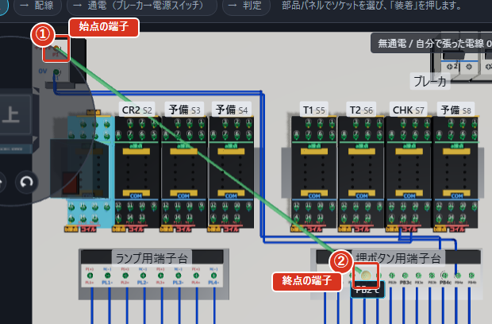

①「始点の端子」、②「終点の端子」を図で確認します。

①「札」、②「端子の番号」を図で確認します。

### 操作の順

1. 「線色」を確かめます。組立では指定された色、修復では白線を使います。
2. 3Dで端子から端子へドラッグすると、電線が1本つながります。または、始点を押してから終点を押します。終点候補の光と端子の札を確認して確定します。
3. 端子リストでは見出しを開き、始点の端子ボタン、終点の端子ボタンの順に押します。
4. キーだけならTabで端子ボタンへ進み、EnterまたはSpaceで選びます。次の端子へ移って同じキーで確定します。
5. 途中でやめるときはEsc。確定直後の間違いは「元に戻す」で取り消します。

### よくある間違い

同じ端子を2回選ぶと接続を作れません。1つの端子へ3本以上つなぐと危険操作に数えられるため、渡り配線にして2本までに分けます。

## 部品を置く・外す・交換する

### 何ができるか

組立・PLCで部品を装着し、交換や取外しもできます。

### どこにあるか

「部品」のパレットと、ソケットを選んだときのカードを使います。

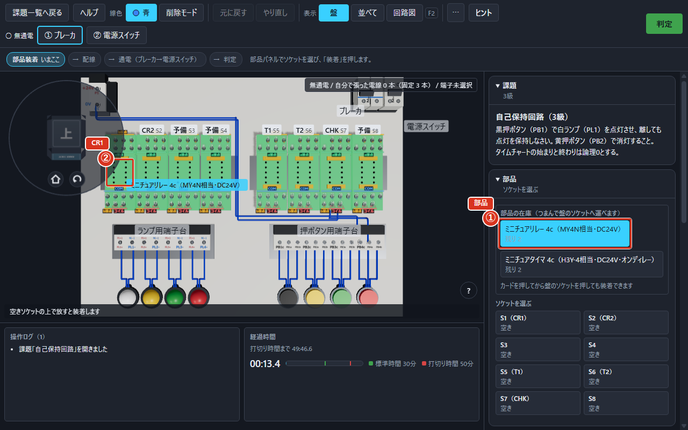

①「部品」、②「CR1」を図で確認します。

①「選択中」、②「取り外す」、③「交換…」を図で確認します。

### 操作の順

1. 組立・PLCでは、部品パレットからソケットへドラッグすると装着できます。カードを押してからソケットを押しても置けます。
2. 取外しは、装着済みの部品を盤の外へ運んで放すか、カードの「取り外す」を押します。
3. 交換は「交換…」から交換先を選び、「これに交換」を押します。やめるときは「交換をやめる」です。
4. 部品点検では専用の部品トレイからCHKへ挿します。点検・修復ではカードの「交換」で良品に替えます。

### よくある間違い

部品の在庫と、選んでいるソケットの名前を確認します。通電したまま抜き差ししようとすると注意が出ます。先に電源を切ってください。

## タイマの設定

### 何ができるか

タイマが動作するまでの時間をつまみや数値で指定できます。

### どこにあるか

タイマを装着すると、「部品」の下に「タイマ設定」が出ます。

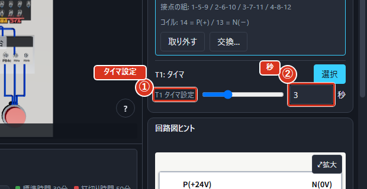

①「タイマ設定」、②「秒」を図で確認します。

### 操作の順

1. タイマを使う課題（例: b-003「オンディレー点灯回路」）を開き、指定のソケットへタイマを置きます。
2. タイマ名を確かめ、タイマのつまみをドラッグするか、数字の欄に秒数を入力します。変更はそのまま反映されます。
3. 課題文の待ち時間と、単位の「秒」を照合してから動かします。

### よくある間違い

数値を入れる欄は秒です。タイマの最大時間と刻みを超える値は使えません。b-001の自己保持だけの回路ではタイマ設定は不要です。

## 電源の入れ方と順序

### 何ができるか

3Dの操作部から、盤の通電状態を切り替えられます。

### どこにあるか

盤上の「ブレーカ」「電源スイッチ」、または上の帯の①・②を使います。

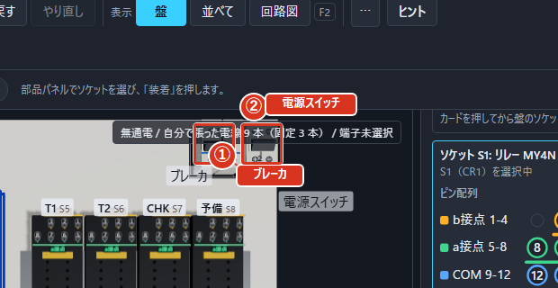

①「ブレーカ」、②「電源スイッチ」を図で確認します。

### 操作の順

1. 配線・部品・測定レンジを確認します。
2. 3Dのブレーカ・電源スイッチをクリックすると入切できます。入れるときは、ブレーカ、電源スイッチの順です。上の帯で通電状態を確認します。
3. 切るときは、電源スイッチ、ブレーカの順です。
4. PLCでは盤の電源とPLCの電源を分けます。PLCは壁コンセントに配線し、ラダーのRUN/STOPも確認します。

### よくある間違い

通電中に抵抗や導通を測ると危険操作になります。電源順序を間違えた回数は、作業を保存・読込しても消えません。

## テスターの使い方

### 何ができるか

電圧・抵抗・導通を測り、配線と部品の不具合を絞れます。

### どこにあるか

点検モードの「テスター」と、3Dの端子を使います。

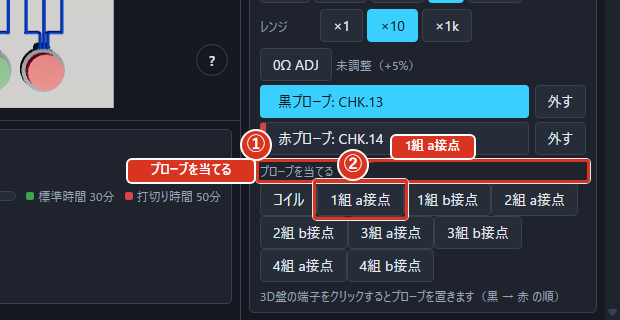

①「プローブを当てる」、②「1組 a接点」を図で確認します。

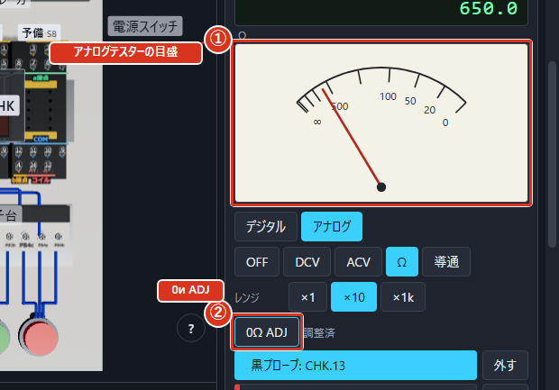

①「アナログテスターの目盛」、②「0Ω ADJ」を図で確認します。

### 操作の順

1. 電圧はDCVまたはACV、無通電の抵抗はΩ、接点のつながりは導通を選びます。
2. 3D端子を黒、赤の順に押して棒を置きます。「プローブを当てる」から接点の組を選ぶこともできます。
3. キーではbで黒い棒、rで赤い棒を次の端子へ進めます。数字と単位、レンジ超過の知らせを読みます。
4. アナログのΩ・導通は「0Ω ADJ」または0キーで調整します。デジタルでは調整は不要です。
5. 終わったら「外す」で棒を外します。抵抗レンジへ変える前には測る箇所を無通電にします。

### よくある間違い

電圧が来ているかを調べる場面でΩを使わないでください。正常に動くリレーでも、コイル抵抗が低ければレアショートの可能性があります。

## 回路図ヒントの読み方

### 何ができるか

回路図の記号と盤の端子を対応づけて調べられます。

### どこにあるか

上の帯の「⋯」から「回路図を表示」を選びます。

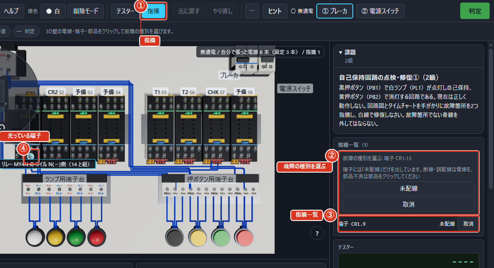

①「指摘」、②「故障の種別を選ぶ」、③「指摘一覧」、④「光っている端子」を図で確認します。

### 操作の順

1. 課題文で必要な動きを読んでから、表示できる課題で回路図ヒントを開きます。
2. 記号を押し、盤で光った端子を確認します。
3. 小さいときは図を押して拡大し、拡大・縮小・等倍を使います。Escで閉じます。

### よくある間違い

1級など、模範回路図を出さない課題があります。2級の回路点検では開いた回数が結果に残ります。回路図の下書き編集と、読むだけのヒントは別の機能です。

## タイムチャートの読み方

### 何ができるか

信号がいつON/OFFしたかを、模範と自分で見比べられます。

### どこにあるか

作業中は「タイムチャート（仕様）」と「ライブ記録」、結果では比較画面を使います。

①「信号の名前」、②「縦の合わせ線」、③「期待（模範）」を図で確認します。

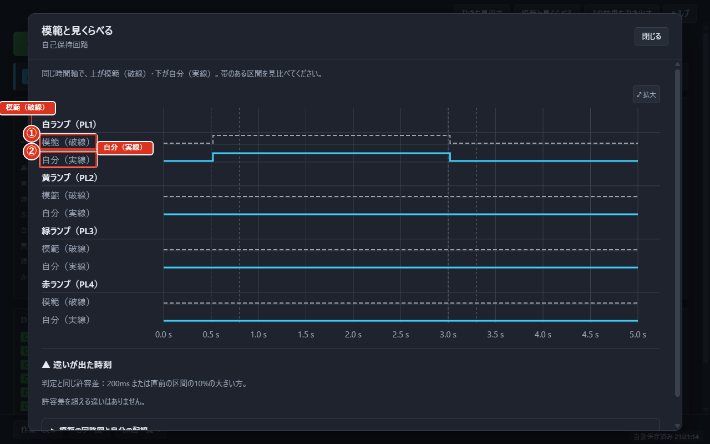

①「模範（破線）」、②「自分（実線）」を図で確認します。

### 操作の順

1. 信号の名前を左で確かめ、横方向の時間を読みます。高い段がON、低い段がOFFです。
2. 図を押すと拡大します。マウスを動かすと縦の合わせ線で時刻を読めます。
3. 結果の「模範と見くらべる」を開き、上の模範（破線）と下の自分（実線）を見ます。帯のある区間と「▲ 違いが出た時刻」を確認します。
4. 動作を1つずつ確かめる場合は結果へ戻り、「動きを見直す」を使います。

### よくある間違い

判定の許容差内のずれには帯を付けません。線が少し違って見えるだけで不合格と決めず、判定理由を確かめます。

## ラダーの記号を置く

### 何ができるか

接点・コイル・罫線を置いて、PLCに行わせる動きを描けます。

### どこにあるか

「ラダー」の格子と上の記号ボタンを使います。

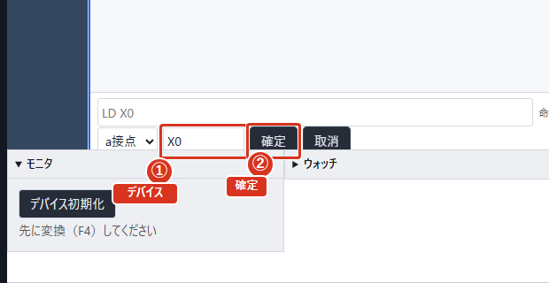

①「デバイス」、②「確定」を図で確認します。

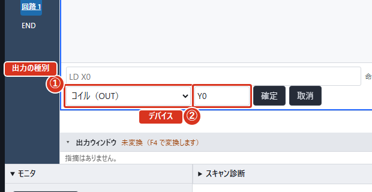

①「出力の種別」、②「デバイス」を図で確認します。

### 操作の順

1. 書込みモードにし、ラダーの格子をクリックすると、そのマスを選べます。
2. 三菱ではF5でa接点、F6でb接点、F7でコイルです。記号ボタンや右クリックの記号メニューからも選べます。
3. デバイスを入力し、「確定」を押します。タイマ・カウンタでは設定値も入れます。
4. ラダーの格子をダブルクリックするか、選択後のEnterでも入力欄を開けます。
5. オムロンはデバイス確定後にコメント欄へ進みます。シャープはS/D/Xで先に記号を置き、Enterでアドレスを入れます。ジェイテクトは記号ボタンから入力します。

### よくある間違い

各メーカーでキーが違います。シャープで記号だけ置いた状態は入力完了ではありません。デバイスやアドレスを入れてから確認します。

## 変換とモニタ

### 何ができるか

編集したプログラムを確認・書込みし、動いている接点を色で追えます。

### どこにあるか

各メーカーの道具列と、下の出力ウィンドウ・モニタを使います。

①「モニタ開始」、②「RUN／STOP」、③「デバイス初期化」、④「スキャン回数」、⑤「通電の色」を図で確認します。

### 操作の順

1. 三菱ではF4か「変換」で確認します。ほかのメーカーでは「プログラムチェック」など画面の操作名を使います。
2. 指摘があれば、該当する回路とデバイスを直します。
3. 「書込み」でPLCへ渡し、「モニタ開始」を選んでRUNにします。
4. 押しボタンを操作し、通電色、出力ランプ、スキャン回数を確認します。編集後は再度確認・書込みします。

### よくある間違い

盤の電源が入っていてもPLCがSTOPなら動きません。ラダーを表示しているだけ、変換しただけ、書込みしただけの段階を、運転中と取り違えないようにします。

## 表記（メーカー）の切替

### 何ができるか

メーカーごとの画面配置・記号入力・デバイス表記で練習できます。

### どこにあるか

ホームの「設定」→「既定メーカー」、またはPLC画面の「表記切替」を使います。

①「表記切替」、②「デバイスの書き方」、③「この表記に切り替える」を図で確認します。

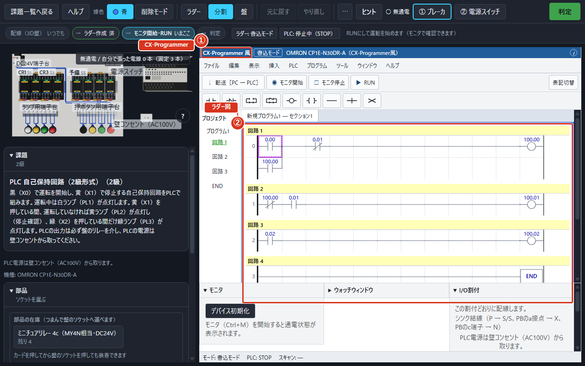

①「CX-Programmer」、②「ラダー図」を図で確認します。

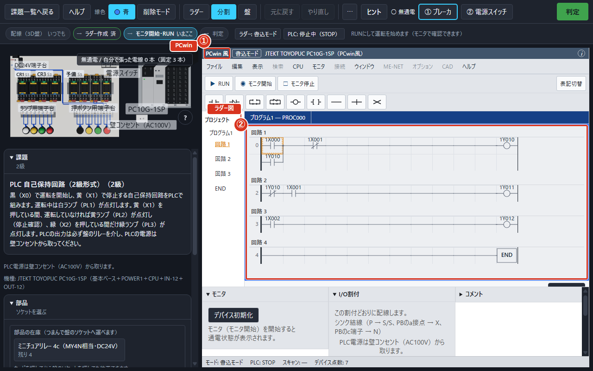

①「PCwin」、②「ラダー図」を図で確認します。

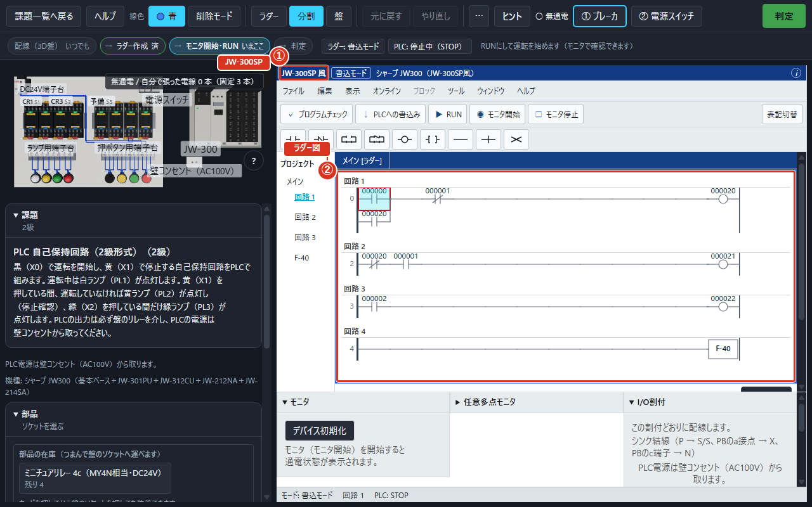

①「JW-300SP」、②「ラダー図」を図で確認します。

### 操作の順

1. 新しく課題を開く前にメーカーを選ぶ場合は、設定の「既定メーカー」を変更します。
2. 作業中に切り替える場合は「表記切替」を押し、切替先を選びます。
3. 「デバイスの書き方」と、タイマ・カウンタの値がどう変わるかを読み、「この表記に切り替える」を押します。
4. 機種が変わるので盤の配線はやり直します。残ったラダーとコメントを確認してから、新しい機種に配線します。

### よくある間違い

別メーカーでも同じキーが使えるとは限りません。PCwinの編集キーは公式の裏づけが取れていないため、記号ボタン・右クリック・ダブルクリックを使います。

## 作業ファイルの保存と読込

### 何ができるか

配線・解答・ラダーなどを保存して、あとから続けられます。

### どこにあるか

上の帯の「⋯」→「作業ファイル」を使います。

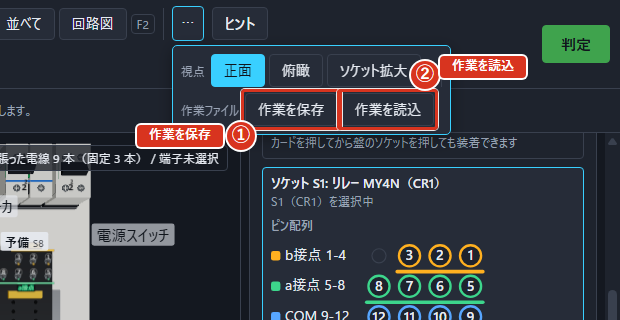

①「作業を保存」、②「作業を読込」を図で確認します。

### 操作の順

1. 「作業を保存」を選び、保存先と名前を決めます。拡張子は .ojtw です。
2. 続けるときは「作業を読込」で同じファイルを選びます。
3. いまの作業を破棄する確認が出たときは、必要な作業を保存したか確かめてから進みます。

### よくある間違い

作業ファイルと結果レポートは別です。続きを開くには .ojtw を使います。危険操作の回数は読込でも引き継がれます。

## 設定

### 何ができるか

文字や画面の大きさ、配色、音などを自分に合わせられます。

### どこにあるか

ホームの「設定」を使います。

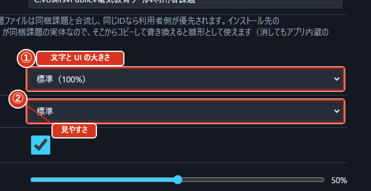

①「文字と UI の大きさ」、②「見やすさ」を図で確認します。

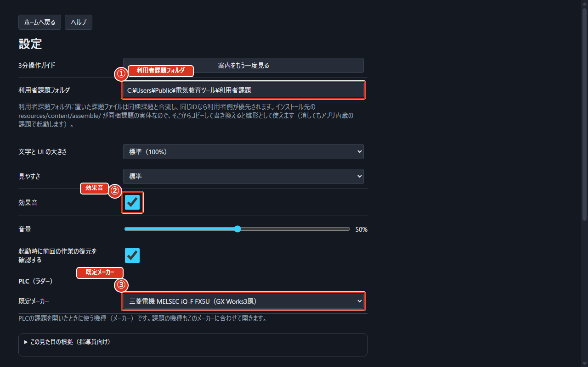

①「利用者課題フォルダ」、②「効果音」、③「既定メーカー」を図で確認します。

### 操作の順

1. 「文字と UI の大きさ」で90%・100%・115%・130%から選びます。
2. 「見やすさ」で標準か高コントラストを選びます。
3. 効果音、音量、前回作業の復元確認など、必要な項目を変更します。変更は保存されます。
4. PLCの列数・通電色は「メーカーの既定に従う」を使うと、メーカーに合う値になります。

### よくある間違い

PLCの「既定に戻す」はPLC項目だけを戻します。文字の大きさや音の設定まで戻る操作ではありません。

## ヘルプと説明書

### 何ができるか

いま必要な操作を検索し、図やPDFで詳しく確認できます。

### どこにあるか

各画面の「ヘルプ」、またはF1を使います。

①「言葉で探す」、②「もくじ」、③「説明書（PDF）を開く」、④「閉じる」を図で確認します。

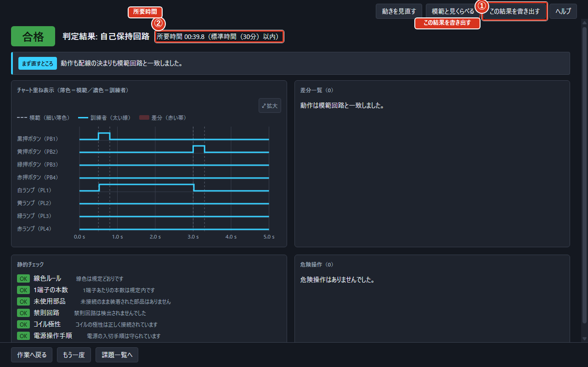

①「この結果を書き出す」、②「所要時間」を図で確認します。

### 操作の順

1. F1を押すと、いまの画面に合う節が開きます。
2. 「言葉で探す」に操作や表示された言葉を入れ、検索結果を選びます。もくじから章を選ぶこともできます。
3. 図は押すと大きくなります。「説明書（PDF）を開く」でPDFを開き、もくじから目的の節へ移ります。
4. いまの練習結果を残したい場合は、結果画面の「この結果を書き出す」でPDFかHTMLを保存します。説明書PDFとは別の1枚のレポートです。
5. ヘルプの「閉じる」またはEscで作業へ戻ります。

### よくある間違い

説明書は操作案内です。個人の成績履歴はアプリ内に保存しないため、残したい結果はその都度書き出してください。

## 初回ガイドの出し直し

### 何ができるか

盤を回す・部品を置く・配線する・通電する・判定する操作を、案内に沿って体験できます。

### どこにあるか

設定の「案内をもう一度見る」、またはF1ヘルプから始めます。

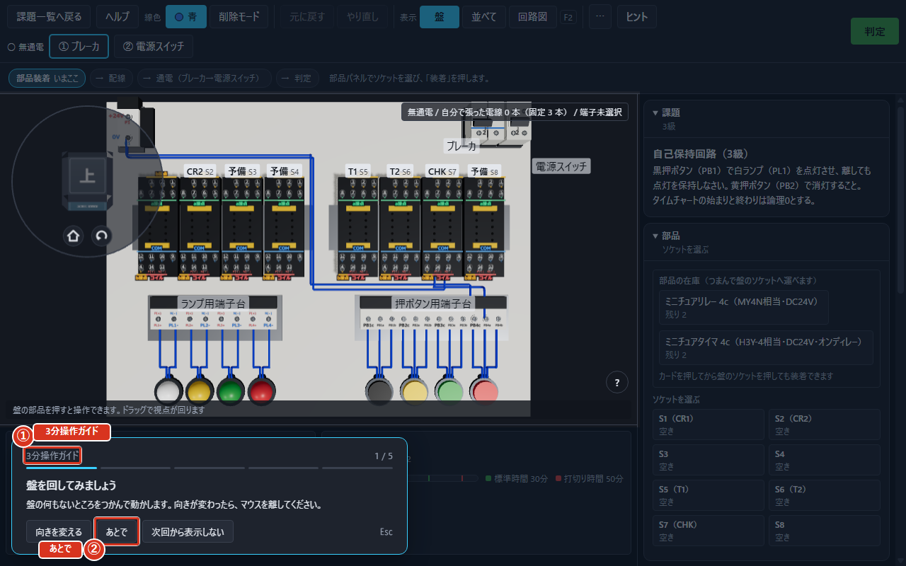

①「3分操作ガイド」、②「あとで」を図で確認します。

### 操作の順

1. 「案内をもう一度見る」を押して、回路組立の課題を開きます。
2. 明るくなった場所で案内された操作を行います。操作ができると次へ進みます。
3. 途中で閉じる場合は「あとで」またはEscです。「次回から表示しない」を選んでも、設定から出し直せます。

### よくある間違い

ガイドの説明を読むだけでは次の段階へ進みません。対象の部品や盤を実際に操作します。図がまだ準備中のときは、表示されるまで待ちます。

## 課題の索引

1. モードと級を選び、「学ぶこと」から練習したい内容を探します。
2. IDを課題一覧の検索へ入力して開きます。難は課題の難しさの目安です。
3. 「つまずきやすい所」を確かめ、同じところで迷ったときは上の機能別の説明へ戻ります。

| ID | モード | 級 | 難 | 題名 | 学ぶこと | つまずきやすい所 |
| --- | --- | --- | --- | --- | --- | --- |
| b-001 | B | 3 | 1 | 自己保持回路 | 自己保持 | 保持の道も停止接点を通す |
| b-002 | B | 3 | 2 | インターロック回路（先行優先） | 自己保持・同時動作の防止・操作の優先順位 | 同時押しの優先側を確認する |
| b-003 | B | 3 | 2 | オンディレー点灯回路 | 自己保持・時間による制御 | 時間の単位と接点が変わる瞬間を確認する |
| b-004 | B | 2 | 3 | 順次点灯回路（T1→T2） | 自己保持・複数タイマの連携・順序制御 | 各タイマの開始条件とリセットを区別する |
| b-005 | B | 2 | 3 | 一定時間動作回路（ワンショット） | 自己保持・時間による制御 | 時間の単位と接点が変わる瞬間を確認する |
| b-006 | B | 2 | 4 | フリッカ回路（リレー併用） | 自己保持・複数タイマの連携・点滅 | 各タイマの開始条件とリセットを区別する |
| b-007 | B | 1 | 4 | 早押し優先回路（3点） | 自己保持・同時動作の防止・操作の優先順位 | 同時押しの優先側を確認する |
| b-008 | B | 1 | 5 | 停止優先の起動・停止と警報表示 | 自己保持・操作の優先順位・警報 | 同時押しの優先側を確認する |
| b-009 | B | 3 | 1 | 押している間だけ点灯する回路 | 押している間だけの出力 | 指を離したときに出力が切れることを確認する |
| b-010 | B | 3 | 2 | AND 条件の点灯回路 | 直列と並列 | 直列条件と並列条件を取り違えない |
| b-011 | B | 3 | 2 | OR 条件の点灯回路 | 直列と並列 | 直列条件と並列条件を取り違えない |
| b-012 | B | 3 | 2 | 2箇所からの起動と停止優先 | 自己保持・操作の優先順位・直列と並列 | 同時押しの優先側を確認する |
| b-013 | B | 2 | 3 | 両手押し安全回路（片手押し表示つき） | 直列と並列・同時動作の防止 | 反対側が動作中の条件を確認する |
| b-014 | B | 2 | 3 | オフディレー消灯回路 | 自己保持・時間による制御 | 時間の単位と接点が変わる瞬間を確認する |
| b-015 | B | 2 | 3 | 正転・逆転の相互インタロック | 自己保持・同時動作の防止・直列と並列 | 反対側が動作中の条件を確認する |
| b-016 | B | 2 | 4 | 3段順次点灯（送り点灯） | 自己保持・複数タイマの連携・順序制御 | 各タイマの開始条件とリセットを区別する |
| b-017 | B | 1 | 4 | 後着優先回路（あとから押したほうが勝つ） | 自己保持・同時動作の防止・操作の優先順位 | 同時押しの優先側を確認する |
| b-018 | B | 1 | 5 | 警報ブザー付き点滅回路 | 自己保持・複数タイマの連携・点滅・警報 | 各タイマの開始条件とリセットを区別する |
| b-019 | B | 1 | 5 | 最低運転時間つき自己保持回路 | 自己保持・時間による制御・同時動作の防止 | 反対側が動作中の条件を確認する |
| b-020 | B | 1 | 5 | 起動遅れと動作時間の重ね合わせ（2タイマ） | 自己保持・複数タイマの連携・順序制御 | 各タイマの開始条件とリセットを区別する |
| c1-001 | C1 | 2 | 2 | リレーの点検①（コイルと接点） | 部品不良・電圧・抵抗・導通の測定 | 正常に動く部品も全接点とコイル抵抗を測る |
| c1-002 | C1 | 2 | 3 | リレーの点検②（レアショートを見逃さない） | 部品不良・電圧・抵抗・導通の測定 | 正常に動く部品も全接点とコイル抵抗を測る |
| c1-003 | C1 | 2 | 3 | タイマの点検 | 部品不良・時間による制御・電圧・抵抗・導通の測定 | 正常に動く部品も全接点とコイル抵抗を測る |
| c1-004 | C1 | 1 | 4 | リレー・タイマの混合点検 | 部品不良・時間による制御・電圧・抵抗・導通の測定 | 正常に動く部品も全接点とコイル抵抗を測る |
| c1-005 | C1 | 2 | 2 | リレーの点検⓪（a接点の断線を見つける） | 部品不良・電圧・抵抗・導通の測定 | 正常に動く部品も全接点とコイル抵抗を測る |
| c1-006 | C1 | 2 | 3 | リレーの点検③（a接点溶着とb接点断線の見分け） | 部品不良・電圧・抵抗・導通の測定 | 正常に動く部品も全接点とコイル抵抗を測る |
| c1-007 | C1 | 2 | 3 | リレーの点検④（コイル断線とレアショートの見分け） | 部品不良・電圧・抵抗・導通の測定 | 正常に動く部品も全接点とコイル抵抗を測る |
| c1-008 | C1 | 2 | 3 | タイマの点検②（時間は合っているのに出ない） | 部品不良・時間による制御・電圧・抵抗・導通の測定 | 正常に動く部品も全接点とコイル抵抗を測る |
| c1-009 | C1 | 2 | 4 | リレーの点検⑤（4個中3個は正常） | 部品不良・電圧・抵抗・導通の測定 | 正常に動く部品も全接点とコイル抵抗を測る |
| c1-010 | C1 | 1 | 4 | リレーの点検⑥（切れないb接点を含む混合） | 部品不良・電圧・抵抗・導通の測定 | 正常に動く部品も全接点とコイル抵抗を測る |
| c1-011 | C1 | 1 | 5 | リレー2・タイマ2の混合点検 | 部品不良・時間による制御・電圧・抵抗・導通の測定 | 正常に動く部品も全接点とコイル抵抗を測る |
| c1-012 | C1 | 1 | 5 | 総合点検（不良6種＋正常2個） | 部品不良・時間による制御・電圧・抵抗・導通の測定 | 正常に動く部品も全接点とコイル抵抗を測る |
| c2-001 | C2 | 2 | 2 | 自己保持回路の点検・修復① | 自己保持・配線の不具合 | 指摘した対象と修復した配線を照合する |
| c2-002 | C2 | 2 | 3 | 自己保持回路の点検・修復②（誤配線と接触不良） | 自己保持・配線の不具合・接触不良・電圧・抵抗・導通の測定 | 電圧低下と暗点灯から接触不良を絞る |
| c2-003 | C2 | 2 | 3 | オンディレー点灯回路の点検・修復 | 時間による制御・配線の不具合・部品不良 | 時間の単位と接点が変わる瞬間を確認する |
| c2-004 | C2 | 2 | 3 | ワンショット回路の点検・修復 | 自己保持・時間による制御・配線の不具合・部品不良 | 時間の単位と接点が変わる瞬間を確認する |
| c2-005 | C2 | 1 | 4 | インターロック回路の点検・修復 | 同時動作の防止・操作の優先順位・配線の不具合・接触不良・電圧・抵抗・導通の測定 | 同時押しの優先側を確認する |
| c2-006 | C2 | 1 | 4 | 順次点灯回路の点検・修復 | 複数タイマの連携・順序制御・配線の不具合 | 各タイマの開始条件とリセットを区別する |
| c2-007 | C2 | 1 | 5 | フリッカ回路の点検・修復 | 点滅・複数タイマの連携・配線の不具合・部品不良 | 各タイマの開始条件とリセットを区別する |
| c2-008 | C2 | 1 | 5 | 停止優先の起動・停止と警報表示の点検・修復 | 自己保持・操作の優先順位・警報・配線の不具合・部品不良 | 同時押しの優先側を確認する |
| c2-009 | C2 | 2 | 2 | AND 条件の点灯回路の点検・修復 | 直列と並列・配線の不具合 | 指摘した対象と修復した配線を照合する |
| c2-010 | C2 | 2 | 2 | OR 条件の点灯回路の点検・修復 | 直列と並列・配線の不具合 | 指摘した対象と修復した配線を照合する |
| c2-011 | C2 | 2 | 3 | 2箇所起動・停止優先回路の点検・修復 | 自己保持・操作の優先順位・接触不良・配線の不具合・電圧・抵抗・導通の測定 | 同時押しの優先側を確認する |
| c2-012 | C2 | 2 | 3 | 両手押し安全回路の点検・修復 | 直列と並列・同時動作の防止・部品不良・配線の不具合 | 反対側が動作中の条件を確認する |
| c2-013 | C2 | 2 | 3 | オフディレー消灯回路の点検・修復 | 自己保持・時間による制御・部品不良 | 時間の単位と接点が変わる瞬間を確認する |
| c2-014 | C2 | 2 | 4 | 相互インタロック回路の点検・修復 | 同時動作の防止・操作の優先順位・接触不良・電圧・抵抗・導通の測定 | 同時押しの優先側を確認する |
| c2-015 | C2 | 1 | 4 | 3段順次点灯回路の点検・修復 | 複数タイマの連携・順序制御・配線の不具合・部品不良 | 各タイマの開始条件とリセットを区別する |
| c2-016 | C2 | 1 | 4 | 後着優先回路の点検・修復 | 自己保持・操作の優先順位・接触不良・電圧・抵抗・導通の測定 | 同時押しの優先側を確認する |
| c2-017 | C2 | 1 | 5 | 警報ブザー付き点滅回路の点検・修復 | 複数タイマの連携・点滅・警報・配線の不具合・部品不良 | 各タイマの開始条件とリセットを区別する |
| c2-018 | C2 | 1 | 5 | 最低運転時間つき自己保持回路の点検・修復 | 自己保持・時間による制御・配線の不具合・接触不良・電圧・抵抗・導通の測定 | 時間の単位と接点が変わる瞬間を確認する |
| c2-019 | C2 | 1 | 5 | 2タイマ重ね合わせ回路の点検・修復 | 複数タイマの連携・順序制御・接触不良・電圧・抵抗・導通の測定 | 各タイマの開始条件とリセットを区別する |
| c2-020 | C2 | 1 | 5 | 停止優先・警報表示回路の総合点検（ランダム故障） | 自己保持・操作の優先順位・警報・配線の不具合・電圧・抵抗・導通の測定 | 同時押しの優先側を確認する |
| d-001 | D | 2 | 2 | PLC 自己保持回路（2級形式） | 自己保持 | 保持の道も停止接点を通す |
| d-002 | D | 2 | 3 | PLC インターロック（2級形式） | 自己保持・同時動作の防止 | 反対側が動作中の条件を確認する |
| d-003 | D | 2 | 3 | PLC オンディレー点灯（2級形式） | 自己保持・時間による制御 | 時間の単位と接点が変わる瞬間を確認する |
| d-004 | D | 2 | 3 | PLC ワンショット回路（2級形式） | 時間による制御 | 時間の単位と接点が変わる瞬間を確認する |
| d-005 | D | 1 | 4 | PLC 順次点灯（1級形式） | 自己保持・複数タイマの連携・順序制御 | 各タイマの開始条件とリセットを区別する |
| d-006 | D | 1 | 4 | PLC フリッカ回路（1級形式） | 自己保持・時間による制御・点滅 | 点灯時間と消灯時間を別々に確認する |
| d-007 | D | 1 | 5 | PLC カウンタによる順次点灯（1級形式） | 自己保持・回数を数える・順序制御 | 数える立上りとリセットを確認する |
| d-008 | D | 1 | 5 | PLC 停止優先と警報表示（1級形式） | 自己保持・操作の優先順位・警報 | 同時押しの優先側を確認する |
| d-009 | D | 2 | 2 | PLC 押している間だけの出力（2級形式） | 押している間だけの出力 | 指を離したときに出力が切れることを確認する |
| d-010 | D | 2 | 2 | PLC AND・OR の組合せ（2級形式） | 直列と並列 | 直列条件と並列条件を取り違えない |
| d-011 | D | 2 | 3 | PLC SET／RST による自己保持（2級形式） | 自己保持 | 保持の道も停止接点を通す |
| d-012 | D | 2 | 3 | PLC 立上り・立下りのワンショット（2級形式） | 時間による制御 | 時間の単位と接点が変わる瞬間を確認する |
| d-013 | D | 2 | 3 | PLC オフディレー消灯（2級形式） | 自己保持・時間による制御 | 時間の単位と接点が変わる瞬間を確認する |
| d-014 | D | 2 | 4 | PLC 相互インタロック（2級形式） | 同時動作の防止・自己保持・操作の優先順位 | 同時押しの優先側を確認する |
| d-015 | D | 1 | 4 | PLC 3段順次点灯（1級形式） | 複数タイマの連携・順序制御・自己保持 | 各タイマの開始条件とリセットを区別する |
| d-016 | D | 1 | 4 | PLC 押した回数で進む3段（1級形式） | 回数を数える・順序制御・点滅 | 数える立上りとリセットを確認する |
| d-017 | D | 1 | 5 | PLC 規定回数で警報とリセット（1級形式） | 回数を数える・警報 | 数える立上りとリセットを確認する |
| d-018 | D | 1 | 5 | PLC 1秒クロックの点滅（1級形式） | 点滅 | 点灯時間と消灯時間を別々に確認する |
| d-019 | D | 1 | 5 | PLC MC／MCR による運転条件（1級形式） | 自己保持・同時動作の防止 | 反対側が動作中の条件を確認する |
| d-020 | D | 1 | 5 | PLC 総合（カウンタ・タイマ・インタロック・警報）（1級形式） | 回数を数える・時間による制御・警報・同時動作の防止・自己保持 | 数える立上りとリセットを確認する |
