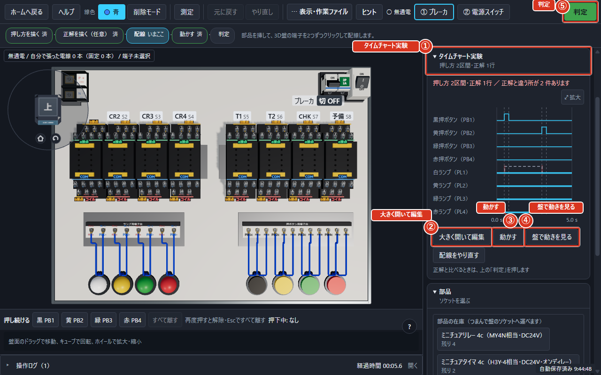
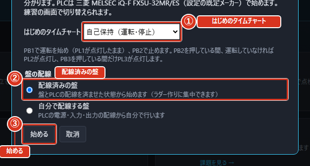
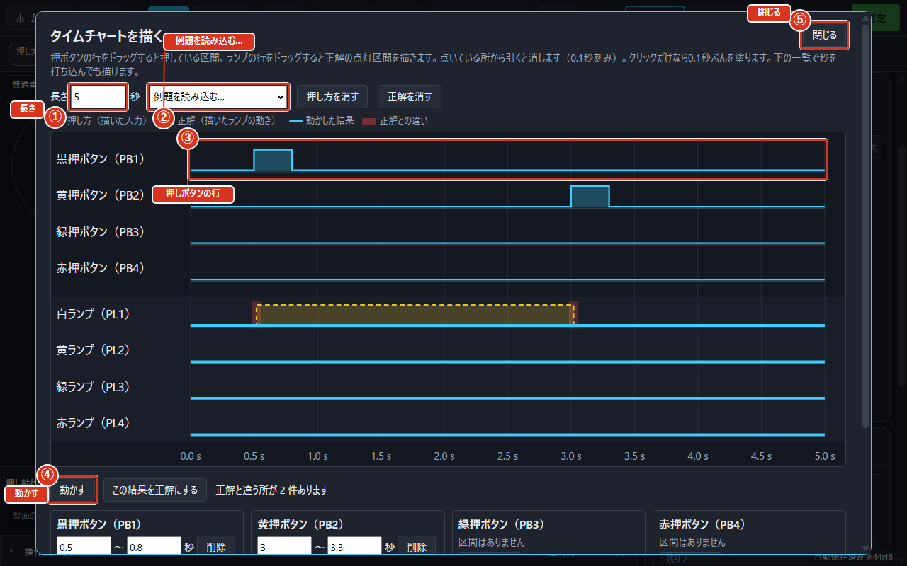
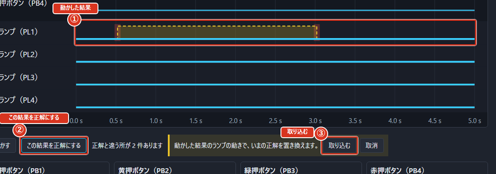
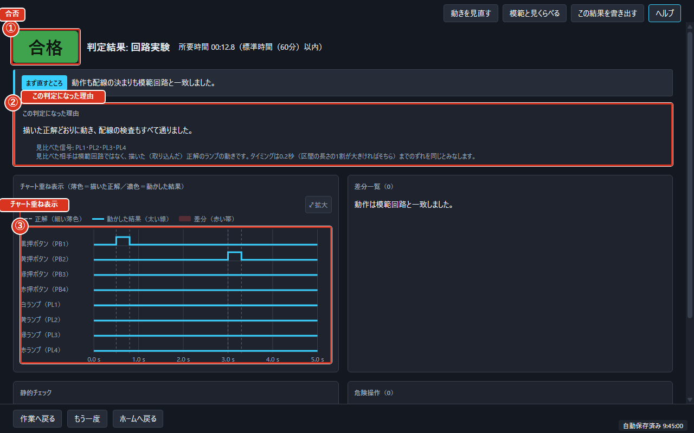
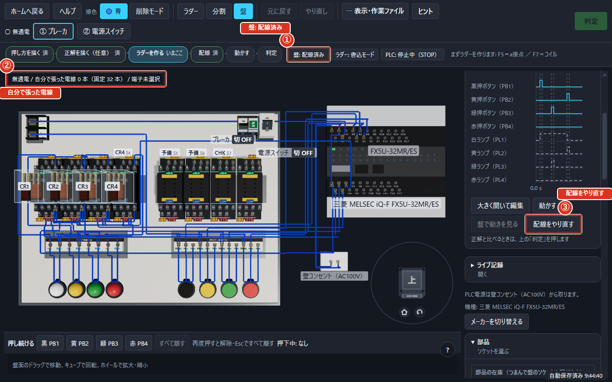

# 回路実験・PLC実験（タイムチャートで試す）

## このモードでやること

「回路実験」と「PLC実験」は、決まった課題を解くのではなく、自分で押しボタンの押し方を決めて回路を動かし、ランプがどう動くかを確かめる練習です。

- **回路実験**: 盤に部品を挿して配線した回路を動かします（回路組立と同じ盤です）。
- **PLC実験**: ラダー図を書いてPLCで動かします。盤とPLCの配線が済んだ盤から始めることもできます。

押しボタンの押し方は、タイムチャートに描きます。描いた押し方で回路を動かすと、ランプの動きがタイムチャートに重なって出ます。ランプがどう動けば正しいか（正解）も自分で描けるので、**自分で問題を作って、自分の回路が合っているかを判定**できます。正解は、動かした結果をそのまま取り込んで作ることもできます。

右の欄の「タイムチャート実験」が、このモードの中心です。ここに描いた押し方と正解、最後に動かした結果が小さいチャートで出ます。小さいチャートの線は、押しボタンの行が描いた押し方、ランプの行の細い薄色の線が正解、太い線が動かした結果です。正解と違う所には赤い帯が出ます。

1. ホームの「回路実験」か「PLC実験」を押して、実験を始めます。
2. 「大きく開いて編集」で、押しボタンの押し方を描きます。
3. 盤を配線します（PLC実験ではラダー図も書きます）。
4. 「動かす」を押して、ランプの動きを確かめます。
5. 正解を描くか、動かした結果を取り込みます（正解を作るのは好きなときでかまいません）。
6. 上の帯の「判定」で、正解どおりに動くかを確かめます。

実験は、その場で作る練習です。課題一覧には並びません。描いたタイムチャートとラダー図は、ほかの練習と同じように自動保存と作業ファイルに入るので、続きから再開できます。

図では、①が「タイムチャート実験」の欄、②が「大きく開いて編集」、③が「動かす」、④が「盤で動きを見る」、⑤が上の帯の「判定」です。

## 実験を始める

ホームのカードから始めます。回路実験とPLC実験のカードは、課題一覧ではなく「実験を始める」窓を開きます。

1. ホームの「回路実験」か「PLC実験」のカード（「実験を始める」と書いてあるカード）を押します。窓の見出しは「回路実験を始める」か「PLC実験を始める」です。
2. 窓の「はじめのタイムチャート」で、どこから始めるかを選びます。「空のタイムチャート」を選ぶと、押し方も正解も描いていない状態から始まります（窓には「押し方も正解も描いていない状態から始めます。」と出ます）。例題を選ぶと、その押し方と正解が入った状態から始まり、窓に例題の動きの説明が出ます。
3. PLC実験では、盤の配線を選びます。「配線済みの盤」は盤とPLCの配線が済んだ状態から始まり、ラダー図作りに集中できます。「自分で配線する盤」は、PLCの電源・入力・出力の配線から自分で行います。
4. 「始める」を押します。練習の画面が開きます。

例題は4つあります。「自己保持（運転・停止）」「インターロック（先行優先）」「オンディレー（遅れて点灯）」「ワンショット（一定時間点灯）」です。どれも内蔵の課題の模範回路を、その課題の押し方で動かした結果を正解にしてあります。

同じ実験の途中でカードを押すと、「いまの実験を続ける」も出ます。押すと、作業はそのままで練習の画面へ戻ります。「始める」を押すと新しく作り直します。作業が残っているときは、置き換える前に「いまの実験を置き換えて、新しく始めますか？」と確かめます。やめるときは「取消」を押します。

PLC実験のメーカーは、設定で選んだ既定のメーカーで始まります。練習の画面の「メーカーを切り替える」で、あとから変えられます。

図では、①が「はじめのタイムチャート」、②が「配線済みの盤」、③が「始める」です。

## 押し方を描く

押しボタンをいつ押して、いつ離すかを描きます。

1. 右の欄の「タイムチャート実験」の「大きく開いて編集」を押します。「タイムチャートを描く」の窓が開きます。
2. 上の4行が押しボタン（黒押ボタン（PB1）・黄押ボタン（PB2）・緑押ボタン（PB3）・赤押ボタン（PB4））、下の4行がランプです。
3. 押しボタンの行の上を、押し始める時刻から離す時刻まで左から右へドラッグします。ドラッグした区間が「押している区間」になります。時刻は0.1秒ごとに合わせます。
4. 押している区間の上から始めてドラッグすると、その区間を消します。クリックだけなら、押した所の0.1秒ぶんを塗るか消します。
5. 描き終えたら「閉じる」を押すか、`Esc` を押します。描いた内容はすぐに残ります。

マウスを使わずに描くこともできます。窓の下の行ごとの一覧で、区間の始まりと終わりの秒を打ち込みます（たとえば「黒押ボタン（PB1） 1つ目の始まり（秒）」の欄に 0.5、「黒押ボタン（PB1） 1つ目の終わり（秒）」の欄に 0.8）。「区間を足す」で区間が1つ増え、「削除」で消えます。秒は 0.01 秒単位まで打ち込めます。

窓の上には、次のものが並びます。

- 「長さ」: タイムチャート全体の長さ（2〜60秒、0.1秒単位）。短くすると、はみ出した押し方と正解は切り詰めます。
- 「例題を読み込む…」: 例題の押し方と正解を読み込みます（いまの押し方と正解は置き換わります）。
- 「押し方を消す」: 押しボタンの行をすべて消します。
- 「正解を消す」: ランプの行の正解をすべて消します。

押したまま終わる区間（終わりまで押し続ける区間）も描けます。描いたら、窓の下の「動かす」でそのまま動かせます（次の「動かして確かめる」）。

図では、①が「長さ」、②が「例題を読み込む…」、③が押しボタンの行、④が「動かす」、⑤が「閉じる」です。

## 動かして確かめる

描いた押し方で回路を動かします。

1. 右の欄の「動かす」か、「タイムチャートを描く」の窓の「動かす」を押します。動かしている間は「動かしています…」と出ます。
2. 描いた押し方のとおりに押しボタンを押して回路を動かし、ランプの動きを太い線でタイムチャートに重ねます。
3. 欄の1行で結果を確かめます。まだ動かしていないときは「まだ動かしていません」、正解があって同じ動きなら「正解どおりに動きました」、違えば「正解と違う所が◯件あります」と出ます。正解が無いときは「動かしました（正解が無いので判定はしていません）」と出ます。
4. 動きを盤の上で確かめたいときは「盤で動きを見る」を押します。押し方が変わる区間ごとに、3Dの盤（PLC実験ではラダーのモニタ）で止めて見直せます。終えるときは「練習の画面へ戻る」を押します。

「動かす」は、盤のライブの動き（ブレーカと電源スイッチを入れて、押しボタンを押して見る動き）とは別に、描いた押し方で最初から最後まで動かした結果を出します。ライブの動きはそのまま止まりません。

PLC実験では、変換を通したラダー図が要ります。変換していないと「変換（F4）を通してから動かします」のように、メーカーの変換のキーを添えて知らせます。

押し方を描き直すと、前に動かした結果は消えます（違う押し方の結果になるためです）。正解だけを描き直したときは、動かし直さずに比べ直します。

## 正解を作る

正解は、ランプがどう動けばよいかです。描く方法と、動かした結果を取り込む方法があります。

1. 描くときは、「タイムチャートを描く」の窓で、ランプの行をドラッグして点灯する区間を描きます（押しボタンの行と同じ描き方です）。
2. 取り込むときは、まず「動かす」を押します。続けて「この結果を正解にする」を押し、確かめの1行が出たら「取り込む」を押します。動かした結果のランプの動きが、そのまま正解になります。
3. 正解をやり直すときは「正解を消す」を押します。

ランプの行の一覧には「判定に使う」の印があります。印を外したランプは、判定で見比べません（チャートの名前に「（判定しない）」と出ます）。どれか1つは必ず判定に使います。

取り込みは「思ったとおりに動いた回路の動きを、そのまま問題にする」ときに便利です。たとえば、例題の模範どおりに配線して動かし、結果を取り込んでから配線を一度外して、もう一度自分で配線し直して判定する、という練習ができます。

図では、①が動かした結果（太い線）、②が「この結果を正解にする」、③が「取り込む」です。

## 判定する

正解どおりに動くか、配線の決まりを守っているかを確かめます。

1. 正解を描くか取り込みます。正解が無いと「判定」は押せず、「正解のランプの動きを描くと判定できます」と出ます。
2. 上の帯の「判定」を押します。
3. 結果の画面の「この判定になった理由」を読みます。合格なら「描いた正解どおりに動き、配線の検査もすべて通りました。」と出ます。
4. 「チャート重ね表示（薄色＝描いた正解／濃色＝動かした結果）」で、正解（細い薄色）と動かした結果（太い線）を見比べます。
5. 「もう一度」を押すと、盤を作り直して練習の画面へ戻ります。描いたタイムチャートとラダー図はそのまま残ります。「ホームへ戻る」でホームへ戻ります。

判定は、描いた正解のランプの動きと、動かした結果を見比べます。点く・消える時刻は 0.2 秒まで（区間の長さの1割のほうが長ければ、そちら）ずれても同じとみなします。あわせて、1端子の本数・コイル極性・電源操作手順・禁則回路を見ます。実験なので、線色ルールと未使用部品は見ません。PLC実験ではPLC電源の独立と二段構成も見ます（I/O割付は自由です）。

実験の欄には、正解があるとき「正解と比べるときは、上の「判定」を押します」と出ます。判定のボタンは上の帯の1か所だけです。

結果の画面の「動きを見直す」「模範と見くらべる」「この結果を書き出す」も、ほかの練習と同じように使えます。見比べる相手は模範回路ではなく、描いた正解です。

図では、①が合否、②が「この判定になった理由」、③が「チャート重ね表示（薄色＝描いた正解／濃色＝動かした結果）」です。

## PLC実験の配線

PLC実験の盤には「配線済みの盤」と「自分で配線する盤」があります。いまどちらかは、手順の帯の右に「盤: 配線済み」か「盤: 自分で配線」と出ます。

配線済みの盤では、リレー4個がCR1〜CR4に挿さり、盤とPLCの電線がすべて張ってあります。張ってある電線は固定電線（外せない電線）です。状態の表示には「自分で張った電線 0 本（固定 32 本）」のように出ます（本数は機種で変わります）。I/O割付は、押しボタン PB1〜PB4 が入力の0〜3番、出力の0〜3番がリレー CR1〜CR4 を通ってランプ PL1〜PL4 です。三菱なら X0〜X3 と Y0〜Y3 です。

自分で配線する盤は、PLC本体だけが机に置いてあり、リレーの装着と電線はすべて自分で行います。配線のしかたは「PLCでプログラムを作る」の章の「机上のPLCへ配線する」と同じです。

途中で盤の種類を変えたいときや、配線を最初からやり直したいときは、次のようにします。

1. 右の欄の「配線をやり直す」を押します。「盤を作り直しますか？」と確かめる窓が開きます。
2. PLC実験では「配線済みの盤」か「自分で配線する盤」を選びます。
3. 「作り直す」を押します。いまの配線と部品を外して、盤を最初の状態に戻します。タイムチャートとラダー図は残ります。

回路実験でも「配線をやり直す」で、何も付いていない盤に戻せます。

「メーカーを切り替える」でメーカーを変えると、配線済みの盤は新しい機種の端子の名前で張り直します。描いたタイムチャートは残ります。

図では、①が「盤: 配線済み」、②が「自分で張った電線」の表示、③が「配線をやり直す」です。

## うまくいかないとき

| 困ったこと | 確かめること・すること |
|---|---|
| 「判定」が押せない | 正解がまだありません。ランプの行に正解を描くか、「動かす」のあと「この結果を正解にする」で取り込みます |
| PLC実験で「動かす」を押しても動かない | ラダー図を変換します（変換の操作が無いメーカーでは、ラダー図の直す所を出力ウィンドウで確かめます）。ラダー図が無いときは「ラダーがありません」と出ます |
| 「入力の強制をすべて解除してから動かしてください。」と出た | 診断用に入力を強制しています。「強制をすべて解除」を押してから動かします |
| 「動かしている間にタイムチャートの押し方を描き直したので、その結果は使いませんでした。もう一度「動かす」を押してください。」と出た | 描き直した押し方でもう一度「動かす」を押します |
| 配線済みの盤の電線を外せない | 固定電線は外せません。「配線をやり直す」で「自分で配線する盤」を選ぶと、自分で配線できます |
| 例題を読み込んだのに違いが出る | 正解は例題の模範回路の動きです。自分の回路の配線・タイマの設定・ラダー図を見直します。「盤で動きを見る」で区間ごとに確かめると、どこから違うかが分かります |
| 実験が課題一覧に無い | 実験はその場で作る練習で、課題一覧には並びません。ホームのカードから始めます。続きは「続きから」か作業ファイルで開けます |
