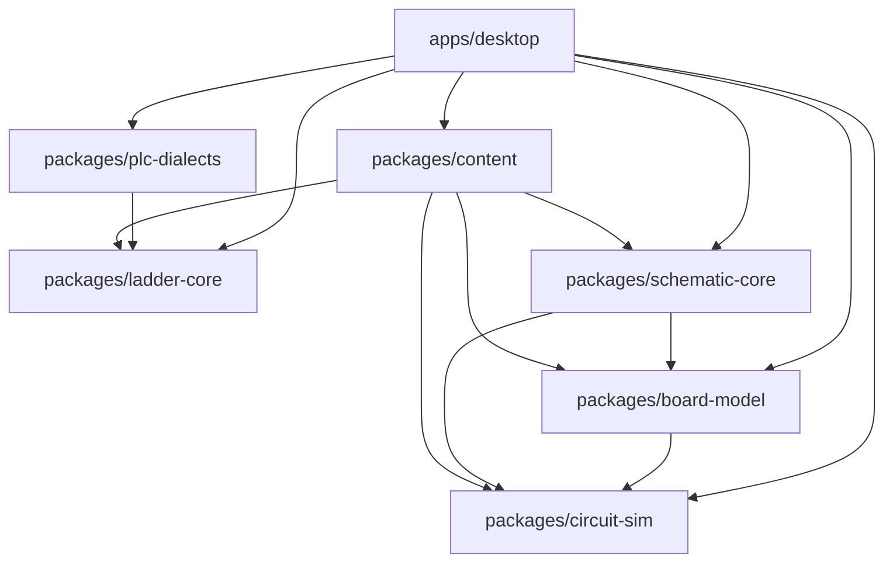

# 電気教育ツール 設計仕様書

- 文書ID: `2026-09-13-ojt-electrical-trainer-design`
- 作成日: 2026-09-13
- 文書種別: 確定済み要件・設計の記録（実装計画の入力）
- 想定読者: 本アプリを実装するAIエージェント／レビュー担当
- 根拠資料: `docs/research/2026-09-13-kentei-denki-hozen-reference.md`（以下「調査資料」。節番号は `§n.n` で引用）
- 補助資料: `docs/research/2026-09-13-plc-vendor-tools-reference.md`（以下「PLC調査資料」。4機種のハードウェア・デバイス体系・純正ツールUIの調査資料。節番号は `§n-X` で引用）

> 本書はプレースホルダを置かない。確定していない事実は「前提」として §17 に明記し、範囲外とする事項は「Phase N で確定する」という範囲決定として記述する。

---

## 1. 目的と対象

### 1.1 目的

製造業の新人教育向けのデスクトップアプリである。機械保全技能検定 電気系保全作業の 1級・2級の実技（課題1: PLCによる回路組立作業、課題2: リレー・タイマ点検＋有接点シーケンス回路の点検・修復作業）と、その土台となる有接点回路の組立（3級 課題1 相当の形式）を、3Dで再現した練習盤（以下「盤」）の上で体験させる。

実物の練習盤は本体だけで7万〜30万円、不良品リレー・タイマのセットだけで10万円前後が必要であり（調査資料 §2.5）、故障探索の反復練習は費用面で成立しにくい。本アプリはそれをソフトウェアで無限に再現することを価値提案の中心に置く。

### 1.2 対象範囲

| 項目 | 内容 |
|---|---|
| 対象級 | 1級・2級。有接点回路の組立練習は 3級 課題1 の形式（入力2点・出力2点、リレー・タイマ使用、調査資料 §5.4）を流用する |
| 対象課題 | 課題1（PLCによる回路組立）、課題2①（リレー・タイマの点検）、課題2②（有接点回路の点検・修復）、および有接点回路の組立 |
| 対象OS | Windows 10 / Windows 11 x64 |
| ネットワーク | 完全オフライン。起動時・実行時に外部通信を一切行わない |
| 記録 | 進捗・成績の永続記録はしない。課題ごとの結果表示のみ |
| UI言語 | 日本語のみ |
| アプリ名称 | **「電気教育ツール」**。2026-09-19 の利用者決定により「OJT電気保全トレーナー」（仮称）から改称。変更時の影響範囲は §17 #18 に記す |

### 1.3 対象外（本アプリが扱わないこと）

| 対象外事項 | 理由 |
|---|---|
| 圧着作業・ワイヤストリップ・工具操作の再現 | 3D操作で意味のある教育効果を出せない。配線は端子間の論理接続として扱う |
| 学科試験の問題演習 | 実技の再現に集中する |
| AC100V 一次側の測定・配線 | 盤の一次側（プラグ→ブレーカ→DC24V電源）は配線済みで受検者が触れない領域（調査資料 §2.3） |
| 成績のサーバ送信・クラウド同期 | オフライン方針 |
| 実機PLCとの通信 | 完全オフライン。PLC はアプリ内でシミュレートする |

---

## 2. 用語集

本書および実装コード・UI文言は以下の用語に統一する。

| 用語 | 定義 | 備考 |
|---|---|---|
| 盤 | 3Dで再現する練習盤（試験用盤）。本アプリでは特定製品ではなくJIPM公式資料の標準構成に基づく汎用盤 | 調査資料 §2.1, §2.2 |
| CR | 制御リレー。盤上表記 `CR1`〜`CR4` | 調査資料 §0 |
| T | タイマ。盤上表記 `T1`, `T2` | 調査資料 §0 |
| PB | 押ボタン（押しボタンスイッチ）。盤上 4個（黒・黄・緑・赤）、いずれも自動復帰型でc/a/b端子を持つ | 調査資料 §2.1, §3.6 |
| PL | ランプ（表示灯）。盤上 4個（白・黄・緑・赤）、DC24V用 | 調査資料 §2.1 |
| BZ | ブザー。JIPM標準構成には含まれない任意部品 | §5.3.4 参照 |
| P | 制御母線の +24V 側。回路図の左母線 | 調査資料 §0, §2.3 |
| N | 制御母線の 0V 側。回路図の右母線 | 同上 |
| IR | 内部表現（Intermediate Representation）。ラダープログラムをベンダー中立で保持するデータモデル | §10.3 |
| 方言 | メーカーごとのデバイス表記・命令語・タイマ単位・バリデーション規則の差分 | 調査資料 §8 |
| スキン | 純正ツール風UI。ショートカット・記号・画面構成を模した表示層。ロゴ・アイコン画像は複製しない | §10.6 |
| 課題1 | PLCによる回路組立作業（1級: 入力3点・出力4点／2級: 入力3点・出力3点） | 調査資料 §1.1 |
| 課題2 | ①リレー・タイマの点検 ②有接点シーケンス回路の点検および修復作業 | 調査資料 §1.1, §6.1 |
| チェック用ソケット | 盤上5個目の14ピンソケット。赤PBのa接点でコイルを励磁する青色の固定配線が施されている。部品単体の良否点検に使う。JIPM検定盤では黄線だが、本アプリは依頼者の盤（K96-CS3）に合わせて青。固定配線は `locked` で区別し、UIでは錠前表示・削除不可 | 調査資料 §3.5 |
| 限時動作瞬時復帰接点 | オンディレータイマの接点。通電後に設定時間で反転し、通電断で即時復帰する | 調査資料 §3.4 |
| 操作列 | 課題ごとに定義された、時刻付きのPB操作の列。判定時に模範回路と訓練者回路へ同一に与える | §7.3 |
| 模範回路 | 課題が持つ正解の回路（展開接続図またはラダーIR＋配線）。固定の正解波形は持たず、都度シミュレートする | §7.2 |
| ネットリスト | 端子・電線・部品インスタンスからなる、回路エンジンが解く対象のデータ構造 | §5.1 |
| スキャン | PLCランタイムの1周期（入力読込→演算→出力書込）。本アプリでは10ms固定 | §10.4 |
| 方言プロファイル | 1メーカー1機種分の方言をまとめた実装単位（パーサ／フォーマッタ／バリデータ／スキン定義） | §10.5 |
| 危険操作 | 実機なら機器破損・誤測定・被災につながる操作。警告表示と回数記録の対象で、練習は中断しない | §5.6 |
| 静的チェック | 通電せずに回路の構造だけで判定できる検査（線色、1端子の本数、コイル極性、未使用部品、禁則回路、2段結線、PLC電源独立、I/O割付準拠） | §7.4 |

---

## 3. 決定事項一覧

要件定義で確定した事項を「決定 / 理由 / 影響」で示す。以降の全節はこの表と矛盾してはならない。

| # | 決定 | 理由 | 影響 |
|---|---|---|---|
| 1 | サブプロジェクトを A共通基盤 → Bハード配線 → C故障探索 → DPLC → E教材運用 の順で進める | 下位が上位の前提になる（エンジンが無ければ配線も故障も判定できない） | §16 のフェーズ計画がこの順に対応する |
| 2 | 描画は最初から3D（Three.js）。2Dからの移行はしない | 端子の物理配置・段差の再現が教育価値の中心であり、後付けの3D化は作り直しになる | §4 の技術スタック、§12 のカメラ仕様 |
| 3 | 盤は特定製品ではなくJIPM公式資料の標準構成に基づく汎用盤とする。部品実型式は非公開のため相当品として OMRON MY4N（DC24V）と H3Y-4（DC24V、パワーオンディレー）を採用 | 公式PDFは仕様（DC24V用・4c・14ピン）のみ記載し型式指定がない（調査資料 §2.6, §17 未確認事項#2） | §6 の盤モデル、§5.3 の部品動作モデル |
| 4 | 対象級は1級・2級。有接点組立の練習は3級形式を流用 | 1級・2級の課題2は有接点回路が前提であり、その土台として3級課題1の形式が最適 | §7 の `grade` フィールド、§8 のヒント表示制御 |
| 5 | 進捗記録はしない。手動の作業ファイル保存/読込と、クラッシュ復帰用の一時保存のみ | 成績管理はOJT運用側の責務。アプリはデータ保持責任を持たない | §12.3、§13 の #7・#8 |
| 6 | Windows専用・完全オフライン | 工場内PCの運用実態に合わせる | §15 の配布方式、自動更新なし |
| 7 | 配線操作は「線色選択 → 端子クリック → 端子クリック」。経路は端子から盤面に垂直に出て配線帯（見えないガイド）を水平・垂直に走り端子で曲がって入る直角配線（マンハッタン経路）として自動生成（ダクトは無い。詳細は§6.6） | 3D空間でのケーブル引き回し操作は学習目的に寄与せず操作難度だけが上がる | §6.6、§8.2 |
| 8 | 合否判定は「模範回路と訓練者回路を同じ操作列で同じエンジンにかけ、出力波形を許容差付きで比較」。固定の正解波形は持たない | 検定の正答は非公開（調査資料 §5.7）であり、また課題追加時に波形を手作業で用意させない | §7.4、§8.3、§10.8 |
| 9 | 課題は内蔵＋JSONファイルで追加可能。GUIの課題エディタは対象外（模範回路は回路図エディタで描ける） | 教材追加は運用側が行う。専用エディタは工数に見合わない | §7、§11 |
| 10 | テスターはデジタルとアナログの両方を用意し切替可能 | 検定はどちらでも可（調査資料 §1.4）。アナログのレンジ選択・0Ω調整は教育項目 | §9.3 |
| 11 | 故障箇所の回答は3D盤上で部品/電線をクリックして種別選択。部品点検はマークシート風パネル | 実技と同じ「指摘」の形式。課題2①は実際にマークシート方式（調査資料 §6.6） | §9.1、§9.2 |
| 12 | テスター操作ミス等の危険操作は警告表示＋回数を結果に記録。練習は中断しない | 学習の流れを切らずに気づかせる。検定では活線作業は失格級だが練習では体験させる | §5.6、§8.3、§9.2 |
| 13 | 回路図（展開接続図）は表示に加え、訓練者が描けるエディタも提供（編集機能はPhase 5） | 1級は回路図が与えられずタイムチャートから起こす必要があり、作図能力が要求される（調査資料 §1.1） | §11、§16 |
| 14 | PLCの基準機種は 三菱 MELSEC iQ-F FX5U + GX Works3。初回リリースの方言は 三菱／JTEKT TOYOPUC **PC10G-1SP**（PCwin）／OMRON CP1E・CP1L（CX-Programmer）／シャープ JW-300（JW-300SP） | 検定はメーカー不問（調査資料 §7.3）であり、受講者の自社環境に合わせた練習需要がある。JTEKT は当初 PC10P を候補としたが、PC10P はPCIバス基板であり単体で机上に置けないため不採用とし、ラック形CPUの **PC10G-1SP** を3D本体および方言の手本とする（PLC調査資料 §3-A） | §10.1、§10.5、§16 の Phase 3/4 |
| 15 | ラダーエディタは共通エンジン＋メーカーごとの純正ツール風スキン。テキスト（ニーモニック）入力は付けず、命令語リストのエクスポートのみ | 純正ツールの操作感（ショートカット）が実務移行の障壁になるため模す。テキスト入力は方言パーサの実装コストが大きく教育効果が低い | §10.6、§10.7 |
| 16 | PLCと盤のI/O配線は3D上でPLC本体を盤の横（机上）に置き、端子へ実配線する | 検定ではPLCは盤上に置けず机上に置く（調査資料 §1.5）。配線そのものが採点対象 | §10.1、§10.2 |
| 17 | 技術基盤は Electron + TypeScript + React + Three.js（react-three-fiber）。pnpmモノレポ | オフラインのデスクトップ配布とWeb技術の3D資産を両立する | §4 全体 |
| 18 | 制御回路はDC24V。AC100Vはブレーカ1A→DC24V電源の一次側のみで配線済み | 調査資料 §2.3 で確定。回路図母線は `P(+24V)` / `N(0V)` | §5.1.1、§6.1、§11.1 |

---

## 4. 全体アーキテクチャ

### 4.1 pnpmワークスペース構成

| パッケージ | 役割 | UI依存 | 主な公開API |
|---|---|---|---|
| `packages/circuit-sim` | 電気回路エンジン。ネットリストを受け取り毎tick解いて状態を返す。純TypeScript | なし | `createSimulation()`, `step()`, `injectFault()`, `measure()` |
| `packages/board-model` | 盤・部品・PLC本体の定義データと型。3D配置情報とカタログJSON | なし | `BoardDefinition`, `PartCatalog`, `loadBoard()` |
| `packages/ladder-core` | ラダーIR、IR↔実行形式の変換、PLCランタイム | なし | `LadderProgram`, `compile()`, `createPlcRuntime()` |
| `packages/plc-dialects` | 4社の方言プロファイル（パーサ／フォーマッタ／バリデータ／スキン定義） | 定義データのみ（描画はしない） | `getDialect(vendor)`, `DialectProfile` |
| `packages/schematic-core` | 展開接続図の文書モデル、描画用レイアウト計算、ネットリスト変換 | なし（SVG要素の座標を返すのみ） | `SchematicDoc`, `layout()`, `toNetlist()` |
| `packages/content` | 課題JSONスキーマ（zod）、バリデータ、内蔵課題 | なし | `TaskSchema`, `validateTask()`, `builtinTasks` |
| `apps/desktop` | Electron main/preload/renderer、React画面、3Dシーン、エディタUI、判定画面 | あり | — |

### 4.2 依存方向



| 規則 | 内容 |
|---|---|
| `board-model` は `circuit-sim` に依存する | `circuit-sim` の**型と部品ファクトリ**（`createRelay4c()` / `createTimer4c()` / `createPushButton()` / `createLamp()` / `createPowerSupply()` / `createTerminalBlockLink()` / `createWire()`）に依存する。盤セッション（装着部品＋電線）からネットリストへの変換（`toNetlist()`）を `board-model` が担うため。逆方向、すなわち `circuit-sim` が `board-model` を知ることは禁止する（エンジンは特定の盤に依存しない） |
| `ladder-core` は `circuit-sim` と独立 | PLCのI/Oは `PlcIoPort` インターフェース（`readInputs(): boolean[]` / `writeOutputs(boolean[])`）で接続する。`ladder-core` 単体でユニットテスト可能 |
| `schematic-core` / `content` | `board-model` と `circuit-sim` の**型**に依存する（実装への依存は持たない）。`content` は課題JSONに模範回路図（`schematic-core` 型）と模範ラダーIR（`ladder-core` 型）を内包するため両者の型にも依存する |
| `plc-dialects` | `ladder-core` に依存する。逆方向の依存を持ってはならない |
| 循環依存 | 禁止。ESLint の `import/no-cycle` をエラー設定にする |

### 4.3 実行構成（プロセス／スレッド）

| 実行単位 | 担当 | 通信 |
|---|---|---|
| Electron main | 課題フォルダの読込、作業ファイルの保存/読込、設定の永続化、ウィンドウ管理 | preload 経由の IPC。チャネルは `content:list` / `content:read` / `workfile:save` / `workfile:load` / `settings:get` / `settings:set` の6本のみ |
| preload | `contextBridge` で上記6本だけを renderer に公開。`nodeIntegration` は無効、`contextIsolation` は有効 | — |
| renderer（React + Three.js） | 画面描画、3D操作、エディタUI、結果表示 | Worker へコマンド送信、Worker から状態スナップショット受信 |
| Simulation Worker（Web Worker） | `circuit-sim` ＋ `ladder-core` ランタイムを10ms周期で実行 | `postMessage`。コマンド: `load` / `addWire` / `removeWire` / `mountPart` / `unmountPart` / `setActuator` / `setTimerPreset` / `breaker` / `switch` / `injectFault` / `measure` / `loadLadder` / `run` / `pause` / `reset` / `judge`。`setPower` は廃止し、電源投入・遮断の順序判定（§5.3.5）のために `breaker`（ブレーカ開閉）と `switch`（電源スイッチ開閉）の2コマンドに分離する。通知: `snapshot`（既定 50ms ごと＝5tickに1回にまとめて送出）、`judgeResult`（判定の並走結果） |

`snapshot` の内容: 主要信号の現在値に加え、前回送出以降の変化を3種のdeltaとして運ぶ。`logDelta`（§5.7 信号ログへの追加分）、`hazardDelta`（§5.6 危険操作イベントの追加分。UIの警告バナーと回数カウンタの更新に使う）、`chatterDelta`（§5.3.2 チャタリング検出の追加分）。旧仕様で個別に発行していた `event` 通知はこれらのdeltaに統合し廃止する。加えて `droppedTicks`（renderer が非表示＝最小化・裏タブ等の間にWorkerが計算したが送出しなかった tick 数。表示再開時にまとめて分かるようにする）を持つ。

判定実行時は Worker 内に模範回路用と訓練者回路用の2つのシミュレーションインスタンスを作り、同一の操作列を与えて並走させる。並走は実時間ではなく可能な限り速く進める（早送り実行）。

### 4.4 データフロー

```
課題JSON
  └→ 盤の初期状態（装着部品 ＋ 電線 ＋ タイマ設定 ＋ 注入故障）
       └→ ネットリスト（端子・電線・部品インスタンス）
            └→ 回路エンジン（10ms tick）
                 ├→ 3D表示（ランプ発光・リレー動作表示・テスター読値）
                 ├→ 信号ログ → タイムチャート
                 └→ 判定（模範回路の信号ログとの比較 ＋ 静的チェック ＋ 危険操作回数）
```

PLCモードでは、PLC本体はネットリスト上の1部品として扱う。

| PLC要素 | ネットリスト上の表現 |
|---|---|
| 入力 Xn | `PLC.SS` と `PLC.Xn` の間の抵抗要素（機種別。既定4.7kΩ、§5.1.3）。この要素の電流が 3mA以上で論理ON、1.5mA以下で論理OFF、その間はヒステリシスで直前の状態を維持する（§5.1.3 と同一の判定） |
| 出力 Yn | `PLC.Yn` と `PLC.COMg`（所属COMグループ）の間の接点要素。ランタイムが開閉を駆動する |
| PLC電源 L/N | 壁コンセント（AC100V）オブジェクトへの接続の有無だけを見る。電気的には解かない（AC非対応のため） |

### 4.5 技術スタック

| 分類 | 採用 | バージョン方針 |
|---|---|---|
| ランタイム | Node.js LTS | 実装開始時点の最新LTS系列の最新パッチに固定 |
| パッケージ管理 | pnpm（workspace） | `packageManager` フィールドでバージョンを固定 |
| 言語 | TypeScript（`strict: true`、`noUncheckedIndexedAccess: true`） | 最新安定メジャー |
| UI | React（関数コンポーネント＋Hooks） | 最新安定メジャー |
| 3D | three ＋ @react-three/fiber ＋ @react-three/drei | three のマイナー更新に追随。3者のバージョン整合を lockfile で担保 |
| デスクトップ | Electron ＋ electron-vite | Electron は最新安定メジャー |
| スキーマ | zod（定義の唯一の源）。zod から JSON Schema を生成して `resources/schema/task.schema.json` に同梱 | 最新安定メジャー |
| テスト | Vitest（単体・結合）、Playwright（Electron E2E） | 最新安定メジャー |
| 静的解析 | ESLint ＋ Prettier。`import/no-cycle` をエラー | 最新安定メジャー |

すべての依存は lockfile で固定し、オフライン環境でのビルド再現性を確保する。実行時にCDNから取得する資産は持たない。

---

## 5. 回路エンジン仕様（packages/circuit-sim）

### 5.1 ネットリストモデル

| 型 | フィールド | 説明 |
|---|---|---|
| `Terminal` | `id: string` | 端子。IDは `<部品ID>.<端子名>`（§6.4） |
| `Wire` | `id, from: TerminalId, to: TerminalId, color: '青'\|'白'\|'黄'` | 電線。抵抗は1mΩ相当の理想導体として扱う |
| `Part` | `id, kind, terminals: TerminalId[], elements: Element[]` | 部品インスタンス。`elements` が電気的実体 |
| `Element` | `kind: 'source'\|'contact'\|'load'`, 端子2点, 種別固有パラメータ, `fault?: Fault` | 部品の内部要素 |

#### 5.1.1 電源要素（source）

| 項目 | 値 |
|---|---|
| 出力 | DC24V。P端子が +24V、N端子が 0V |
| 内部抵抗 | 0.1Ω |
| 過電流保護 | 出力電流が **1A** を超えた tick で保護動作。出力を0Vに落とし `event: 'overcurrent'` を発行する |
| 保護からの復帰 | 電源スイッチOFF → ブレーカOFF → ブレーカON → 電源スイッチON の手順を踏んだときのみ復帰する |
| 交流 | 扱わない。AC100V一次側（プラグ→ブレーカ→電源）は配線済み・測定対象外（調査資料 §2.3） |

#### 5.1.2 接点要素（contact）

| 項目 | 値 |
|---|---|
| 端子数 | 2 |
| 状態 | `open` / `closed` |
| 駆動源 | 手動アクチュエータ（PB）／CRコイル／Tの限時出力／PL出力 |
| 種別 | a（メーク）／b（ブレーク）／c（1つのCOMに a と b が同居する組） |
| 閉時の抵抗 | 1mΩ |
| 開時 | 非接続（行列に寄与しない） |
| 故障パラメータ | 直列抵抗（接触不良、Ω指定）／溶着（常時closed）／不導通（常時open） |

#### 5.1.3 負荷要素（load）

| 負荷 | 抵抗値 | 24V印加時の電流 | 根拠・備考 |
|---|---|---|---|
| CRコイル | 650Ω | 36.9mA | 調査資料 §6.3「正常コイルの抵抗値は650Ω程度（DC24Vコイル）」 |
| Tの電源（コイル相当） | 650Ω | 36.9mA | CRコイルと同等として扱う（§17 #14） |
| PL（DC24V LED表示灯相当） | 2.4kΩ | 10mA | §17 #14 |
| BZ | 1kΩ | 24mA | §17 #14 |
| PLC入力 | 機種ごとに定義。既定 4.7kΩ | 5.1mA | ON判定は端子電流 **3mA以上**、OFF判定は **1.5mA以下**、その間はヒステリシスで状態維持。機種別の値: FX5U 4.5kΩ（5.3mA／ON感度3.5mA以上・OFF 1.5mA以下）、CP1E 3.3kΩ（`0.00`〜`0.07`）と4.8kΩ（`0.08`以降）、JW-212NA 3.3kΩ（7.5mA）、TOYOPUC IN-12 2.4kΩ（10mA）。PLC調査資料 §1-A / §2-A / §4-A |

負荷の故障:

| 故障 | モデル |
|---|---|
| 断線（`coil-open` / `lamp-open`） | 要素を開放（非接続）にする |
| レアショート（`coil-layer-short`） | **コイルの動作は正常**。励磁しきい値・復帰しきい値・動作時間・復帰時間は正常品と同一で、リレー／タイマは通常どおり励磁・復帰する。変化するのは**コイル抵抗だけ**で、公称値 × `ratio` に下がる（`ratio` の既定 **0.65**、許容範囲 **0.4〜0.85**。CRコイル 650Ω なら既定で **422.5Ω**、消費電流 56.8mA）。したがって**機能試験（動作確認・接点の導通確認）では発見できず、コイル抵抗の測定でのみ発見できる**。根拠: 調査資料 §6.3「正常動作に見える場合でも念のためコイルの抵抗値を測定する。正常コイルの抵抗値は650Ω程度。これより小さければレアショート」 |

### 5.2 解法

| 項目 | 仕様 |
|---|---|
| tick | 10ms 固定 |
| 手法 | 各tickで抵抗回路の節点解析（Modified Nodal Analysis の抵抗回路版）を解く |
| 行列構築 | 接続されている要素のコンダクタンスを節点アドミタンス行列に加算する |
| 開放要素 | 行列に寄与させない |
| 閉接点 | 1mΩ（1000S） |
| 安定化 | 孤立節点・特異行列を避けるため、全節点に対地 1nS（ナノジーメンス）の漏れコンダクタンスを加える |
| 交流 | 扱わない |
| 規模上限 | 端子400・節点200を想定。200節点で1ms以内、上限400節点（`MAX_NODES`）で3ms以内（実測: 200節点 0.9ms、396節点 2.7ms、10ms tick の27%）。LU再利用は将来の最適化 |
| 数値解法 | LU分解（部分ピボット選択）。行列の構造が変化しない間は分解結果を再利用する |
| 決定論 | 乱数を使わない。同じネットリストと同じ操作列からは必ず同じ結果が出る。故障のランダム選択は課題開始前にseedから決め、以降のシミュレーションは決定論的 |

### 5.3 部品動作モデル

#### 5.3.1 CR（MY4N相当、4c、14ピン）

| 項目 | 値 | 根拠 |
|---|---|---|
| コイル端子 | 13 = (−)、14 = (+)。極性あり | 調査資料 §3.2 |
| 接点構成 | c接点4組: (COM9, b1, a5) / (COM10, b2, a6) / (COM11, b3, a7) / (COM12, b4, a8) | 調査資料 §3.2 |
| 励磁 | コイル電圧 **19.2V以上**（定格の80%）で励磁 | 本アプリの前提（§17） |
| 復帰 | コイル電圧 **2.4V以下**（定格の10%）で復帰 | 同上 |
| ヒステリシス | 2.4V超〜19.2V未満は直前の状態を維持する | 同上 |
| 動作時間・復帰時間 | いずれも1tick（10ms） | 同上 |
| 極性違反 | 13に+、14に−を接続した場合は励磁しない。静的チェック `coilPolarity`（§7.4）のエラーとして記録する（危険操作にはカウントしない） | 調査資料 §2.1「タイマには極性がある」/ §3.2 |

#### 5.3.2 T（H3Y-4相当、パワーオンディレー、限時動作瞬時復帰接点4c、瞬時接点なし）

| 項目 | 値 | 根拠 |
|---|---|---|
| 電源端子 | 13 – 14（14が+）。極性あり | 調査資料 §3.3 |
| 限時接点 | NC: 9-1, 10-2, 11-3, 12-4 ／ NO: 9-5, 10-6, 11-7, 12-8。CRとピン互換 | 調査資料 §3.3 |
| 瞬時接点 | 無し | 調査資料 §3.3 |
| 計時 | 電源電圧が19.2V以上の間、経過時間を10msずつ加算する |  |
| タイムアップ | 経過時間が設定時間に到達した tick で限時接点を反転する |  |
| 復帰 | 電源電圧が2.4V以下になった tick で限時接点を即時復帰する（瞬時復帰） | 調査資料 §3.4 |
| **復帰時間モデル** | 通電断の継続が **100ms未満**（Rt = 0.1s、調査資料 §3.3）で再通電した場合、経過時間を**リセットせず保持**する。100ms以上の断で経過時間を0に戻す |  |
| 禁則回路の帰結 | 上記により、タイマ自身の限時接点で自コイルを切るワンショット回路、およびタイマ2個だけのフリッカ回路は、断が10ms（1tick）しか続かず経過時間が保持されるため tick 周期で接点が反転しチャタリングする。リレーを介して100ms以上の断を確保した構成は正常に動作する | 調査資料 §5.5「厳禁」の再現 |
| 設定範囲 | 0.1s 〜 レンジ上限。レンジは `0〜10s`（分解能0.1s）と `0〜60s`（分解能0.5s）の2種を用意し、課題または訓練者が選ぶ。既定は `0〜10s` | 調査資料はRt≥0.1sのみ確定。レンジ一覧は資料に無いため本アプリの前提（§17） |
| 設定操作 | 部品UIのダイヤル。数値入力も可。設定値は作業ファイルに保存される |  |

チャタリングの検出条件: 判定区間内の任意の1秒窓で、同一信号の状態遷移が**20回以上**（10Hz以上、`CHATTER_MIN_TRANSITIONS = 20`）発生した場合をチャタリングとする。最短の正規フリッカ（各タイマ休止100ms、周期200ms）は10回/秒でちょうど旧閾値に当たるため2倍の余裕を取る。禁則回路は100回/秒で反転するので検出に影響しない。

#### 5.3.3 PB（4個）

| ID | 色 | 端子 | 動作 |
|---|---|---|---|
| PB1 | 黒 | `PB1.c` / `PB1.a` / `PB1.b` | 自動復帰型。押下中は c–a 閉・c–b 開、離すと c–a 開・c–b 閉 |
| PB2 | 黄 | `PB2.c` / `PB2.a` / `PB2.b` | 同上 |
| PB3 | 緑 | `PB3.c` / `PB3.a` / `PB3.b` | 同上 |
| PB4 | 赤 | `PB4.c` / `PB4.a` / `PB4.b` | 同上。a接点は端子台 `TB_PB.4c` / `TB_PB.4a` を経由してチェック用ソケットの青色固定配線に使われている（§6.3） |

出典: 調査資料 §2.2, §3.6。

#### 5.3.4 PL（4個）／BZ

| ID | 色 | 端子 | 備考 |
|---|---|---|---|
| PL1 | 白 | `PL1.+` / `PL1.-` | DC24V用。2.4kΩ。端子電圧 **14.4V（定格の60%）以上で点灯**、**7.2〜14.4V（30〜60%）で暗点灯**、**7.2V未満で消灯**。しきい値は部品メタデータ（`litVolts` / `dimVolts`）で変更できる（§17.2 #23） |
| PL2 | 黄 | `PL2.+` / `PL2.-` | 同上 |
| PL3 | 緑 | `PL3.+` / `PL3.-` | 同上 |
| PL4 | 赤 | `PL4.+` / `PL4.-` | 同上 |
| BZ | — | `BZ.+` / `BZ.-` | **JIPM盤の標準構成には無い**（調査資料 §2.1）。既定では盤に置かない。課題定義の `board.extraParts` で追加したときのみ盤上に出現する任意部品 |

#### 5.3.5 ブレーカ・電源スイッチ

| 項目 | 仕様 | 根拠 |
|---|---|---|
| ブレーカ | 1A。AC100V一次側に位置する。本アプリでは開閉器としてのみモデル化し、過電流トリップはDC側の電源保護（§5.1.1）で代表させる | 調査資料 §2.1 |
| 電源スイッチ | AC一次側のケーブル途中のスイッチ | 調査資料 §6.5(C) |
| ON手順 | ブレーカ → 電源スイッチ | 調査資料 §6.5(C) |
| OFF手順 | 電源スイッチ → ブレーカ | 同上 |
| 逆手順 | `event: 'power-sequence-violation'` を発行し危険操作として回数記録する。電源自体は通常どおり入切される（練習は中断しない） | 決定事項#12 |

### 5.4 故障注入API

```ts
injectFault(target: FaultTarget, kind: FaultKind, param?: number | TerminalId): void
// FaultTarget = { wireId } | { partId, elementIndex }
// param は kind ごとに型が決まる（数値: contact-resistive のΩ、coil-layer-short の ratio／
//          TerminalId: wire-misrouted の付け替え先／その他の kind では省略する）
```

| `kind` | 対象 | パラメータ | 意味 |
|---|---|---|---|
| `wire-open` | 電線 | — | 電線の途中で断線。両端の端子には圧着端子が残る（3D上は線が見えるが導通しない） |
| `wire-missing` | 電線 | — | 電線そのものが存在しない（未配線） |
| `wire-misrouted` | 電線 | 別端子ID | 片端が誤った端子に接続されている（誤配線） |
| `contact-open` | 接点 | — | 不導通（常時open） |
| `contact-welded` | 接点 | — | 溶着（常時closed） |
| `contact-resistive` | 接点 | Ω | 接触不良（直列抵抗。既定 500Ω） |
| `coil-open` | CRコイル／T電源 | — | コイル断線 |
| `coil-layer-short` | CRコイル | `ratio`（0.4〜0.85、既定 **0.65**） | レアショート。コイル抵抗を公称値 × `ratio` に下げる。動作そのものは正常（§5.1.3） |
| `lamp-open` | PL／BZ | — | 断線 |

注入は課題読込時（`faults` 定義から）と、開発用デバッグUIから行う。訓練者は注入できない。

### 5.5 テスター測定API

```ts
measure(mode: 'DCV'|'ACV'|'OHM'|'CONT', probeBlack: TerminalId, probeRed: TerminalId): Reading
```

| レンジ | 戻り値 | 条件・備考 |
|---|---|---|
| DCV | 赤プローブ節点電位 − 黒プローブ節点電位 [V] | 通電・無通電を問わず測定可 |
| ACV | 常に 0.00V | AC一次側は測定対象外だがレンジとしては存在する（実機の操作感を保つため） |
| Ω | プローブ間の等価抵抗 [Ω] | 測定開始時にまずプローブ間の回路電圧を読む。**1V未満のときだけ有効**で、プローブ間に試験電圧1Vを印加し、流れる電流から等価抵抗を算出する。回り込み経路を含む値になるため「リレーを抜いて測る」教育がそのまま成立する（調査資料 §6.5(A)）。回路電圧が1V以上のときは §5.6 #1 の危険操作（`ohm-on-live`）を発行し、読値は `----`（測定不能表示）とする |
| CONT（導通） | 抵抗値 ≤ 50Ω でブザー音（WebAudio合成）＋「導通」表示。> 50Ω で無音＋「−−−」 | Ωレンジと同じ条件・同じ制約（回路電圧1V以上では `----` と `ohm-on-live`） |

無限大の扱い: 等価抵抗が 10MΩ を超えた場合は `OL`（オーバーレンジ）として返す。

### 5.6 危険操作の判定

エンジンが検知し `event` として発行する。UIは警告バナーを出し、セッションのカウンタを加算する。練習は中断しない（決定事項#12）。

| # | 条件 | イベント名 | 実機での帰結（警告文に表示する） |
|---|---|---|---|
| 1 | プローブ間電圧が **1V以上**の状態でΩ／導通レンジを使用 | `ohm-on-live` | テスターのヒューズ溶断・誤測定（調査資料 §6.5 設計メモ） |
| 2 | アナログテスターで指示値がレンジ上限を超える | `range-exceeded` | 針の振り切れ・可動コイル損傷 |
| 3 | 短絡状態（電源保護が動作する状態）で電源ON。電源投入直後（1tick以内）の保護動作に限定する | `short-circuit-power-on` | 電源保護動作。ブレーカ／電源の損傷 |
| 4 | 電源ON/OFFの手順違反（§5.3.5） | `power-sequence-violation` | 突入電流・アーク |
| 5 | 1端子に3本目を接続しようとした（接続は拒否される） | `over-wires-per-terminal` | ネジ端子の保持不良・脱落（調査資料 §4.5、上限2本は本アプリの前提 §17） |
| 6 | 運転中の過電流（電源投入直後以外で保護動作した場合） | `overcurrent` | 電源保護動作。配線・部品の損傷 |

重複計上の抑制: `ohm-on-live` はプローブ配置ごとに1回、`over-wires-per-terminal` は端子ごとに1回（その端子の電線を外すまで再計上しない）。

### 5.7 出力（信号ログ）

| 項目 | 内容 |
|---|---|
| 記録単位 | tick（10ms）ごと |
| 記録対象 | 全アクチュエータ（PB押下状態）、全接点の open/closed、全コイルの励磁状態、全負荷の通電状態、および主要節点（P、N、各PL端子、各コイル端子、各PLC入出力端子）の電位 |
| 形式 | 変化点のみを記録するランレングス形式（`{t, signal, value}` の列）。全tickの完全ダンプは開発用オプション |
| 用途 | タイムチャートの生成、判定の比較入力、結果画面の差分一覧 |

---

## 6. 盤モデル仕様（packages/board-model）

### 6.1 盤の構成

調査資料 §2.1・§2.2 を根拠に、標準盤 `board-jipm-std` を定義する。

| 要素 | 数量 | 仕様 | 根拠 |
|---|---|---|---|
| 14ピンソケット | 8個（左4・右4） | 4c用。左クラスタ S1〜S4、右クラスタ S5〜S8。役割は既定で CR1〜CR4/T1/T2/CHK の5つ＋予備1、課題で上書き可 | §2.1, §2.2 |
| PL | 4 | 白・黄・緑・赤、DC24V用 | §2.1, §2.2 |
| PB | 4 | 黒・黄・緑・赤、自動復帰型 | §2.1, §2.2 |
| ランプ用端子台 | 8P（+/− × 4） | PL本体との間は配線済み | §2.1, §2.2 |
| PB用端子台 | 12P（c/a/b × 4） | PB本体との間は配線済み | §2.1, §2.2 |
| P/N供給端子 | P×1・N×1（計2点） | `P.1` / `N.1`。DC24V電源の出力端子。内部で同電位。依頼者の盤（K96-CS3）に合わせた構成とし、複数箇所への分配は端子台やソケットの端子を中継する**渡り配線**で行う（§6.6, §11.3） | §2.2（DC24V電源の −/+ 端子）。本数は依頼者の盤に合わせた本アプリの前提（JIPM資料の本数は未確認。§17 #32） |
| ブレーカ | 1 | 1A、AC一次側 | §2.1 |
| 電源スイッチ | 1 | AC一次側 | §2.4 |
| DC24V電源 | 1 | 配線済み。端子は測定可 | §2.1, §2.3 |
| ネジ端子 | 全端子 | M3（No.2） | §2.1 |

ソケットの役割割当は課題が指定する。

| 課題形式 | ソケット役割 | 根拠 |
|---|---|---|
| 課題1形式 | `CR1` / `CR2` / `CR3` / `CR4` ＋ `CHK`（チェック用） | §2.2 |
| 課題2形式 | `CR1` / `CR2` / `T1` / `T2` ＋ `CHK`（チェック用） | §2.2 |

### 6.2 ソケット端子の物理配置とピン割付

物理配置（4段、上段が奥、下段が手前。調査資料 §3.1）:

```
段1:  [空]  ③  ②  ①
段2:   ⑧   ⑦  ⑥  ⑤
段3:   ⑫   ⑪  ⑩  ⑨
段4:   ④   ⑭  ⑬  [空]
```

実物（PYF14A相当）に合わせ、リレー／タイマの差込穴（14ピン、2列×7）は本体中央、ネジ端子は本体の奥端側（上）に段1・段2、手前端側（下）に段3・段4を2段ずつ置き、各段は4列である。数値は本アプリ既定で、`packages/board-model/src/board-jipm.ts` の定数が唯一の源である。

| 項目 | 値 | 定数 |
|---|---|---|
| ソケット本体（幅 × 奥行） | 30 × 76 mm | `SOCKET_BODY_WIDTH_MM` / `SOCKET_BODY_LENGTH_MM` |
| ソケットの取付ピッチ | 32 mm（本体幅30mm ＋ 隣との隙間2mm） | `SOCKET_PITCH_MM` |
| ネジ端子の列ピッチ（4列） | 8 mm | `SOCKET_COL_PITCH_MM` |
| 同じ側の段ピッチ（段1–段2／段3–段4） | 8 mm | `SOCKET_TIER_ROW_PITCH_MM` |
| 本体端から最初のネジ端子段まで | 6 mm | `SOCKET_TIER_INSET_MM` |
| 差込穴の列ピッチ／段ピッチ | 12 mm ／ 5 mm | `SOCKET_PIN_HOLE_COL_PITCH_MM` / `SOCKET_PIN_HOLE_ROW_PITCH_MM` |

列・段のピッチが 8 mm なのは、端子の当たり判定（半径 4 mm、`TERMINAL_PICK_RADIUS_MM`。§6.5）が隣の端子と重ならない最小値だからである。本体両端の余白が (30 − 3×8) ÷ 2 = 3 mm になるので、取付ピッチ 32 mm では隣のソケットの端子とも 3 + 2 + 3 = 8 mm 空く。各端子には番号と役割のラベル（`circledNumber()` ＋ 半角スペース ＋ `roleLabel()`。例「⑬ −」「⑭ +」「⑨ COM」「⑤ a」「① b」）を持たせ、3Dでそのまま印字する。

ピン割付（調査資料 §3.2, §3.3。MY4N と H3Y-4 で同一のため**ソケットモデルは1種類**）:

| 接点組 | COM | b接点（NC） | a接点（NO） |
|---|---|---|---|
| 1組目 | 9 | 1 | 5 |
| 2組目 | 10 | 2 | 6 |
| 3組目 | 11 | 3 | 7 |
| 4組目 | 12 | 4 | 8 |

| コイル／電源 | 端子 | 極性 |
|---|---|---|
| MY4N / H3Y-4 | 13 – 14 | 13 = (−)、14 = (+) |

段4に ④ が混ざる非連番配置は、実際の受検者のミス要因であり教材価値が高いため、3Dの当たり判定とラベルをそのまま再現する（調査資料 §3.1 設計メモ）。

### 6.3 チェック用ソケットの固定配線

```
P ──[ PB4（赤）の a接点 ]──[ CHK のコイル端子 14 ]  ／  [ CHK の 13 ]── N
```

| 項目 | 仕様 |
|---|---|
| 線色 | 青 |
| 電線 | `P.1 → TB_PB.4c`、`TB_PB.4a → CHK.14`、`CHK.13 → N.1` の3本。PB4本体ではなくPB用端子台（12P）側に接続する（盤上の配線可能な端子は端子台側のため。§6.4） |
| 属性 | `locked: true`（変更不可）。削除・付け替えを試みると「チェック用回路の青色配線は変更できません」と表示する |
| 根拠 | 調査資料 §3.5「受検者はこの黄色配線を変更してはならない」 |

JIPM検定盤では黄線だが、本アプリは依頼者の盤（K96-CS3）に合わせて青。固定配線は `locked` で区別し、UIでは錠前表示・削除不可。

`TB_PB.4c` と `TB_PB.4a` にはこの青色配線が各1本ずつ既に接続されているため、同端子には追加で1本まで配線できる（1端子2本まで、§6.6）。`P.1` と `N.1` も同様に、チェック用回路の固定配線が既に各1本を使っているため、訓練者が母線から直接取れる電線は各1本である。母線を複数箇所へ分配する場合は、その1本を端子台やソケットの端子で次の段へ渡す**渡り配線**で行う（1端子2本の規則の範囲内。§6.6、§11.3）。

端子台（`TB_PL`/`TB_PB`）からの既設青線は各ランプ／押ボタンの真上から垂直・平行（2mmピッチ）に降り、機器の奥側の根元にある盤面の貫通穴（`panelHole`）を通って盤面下の本体端子（`PL1.+/-`、`PB1.c/a/b`、`wirable: false`）につながる。機器の表面や中心に線を結ばない。3Dでは穴までを描き、盤面下は描かないか短い区間のみ。

### 6.4 端子IDの命名規則

`<部品ID>.<端子名>` とする。

| 部品 | 部品ID | 端子ID例 |
|---|---|---|
| CRソケット | `CR1`〜`CR4` | `CR1.1`〜`CR1.14`（例: `CR1.13`, `CR1.9`） |
| Tソケット | `T1`, `T2` | `T1.14`, `T1.9` |
| チェック用ソケット | `CHK` | `CHK.13`, `CHK.14` |
| PB本体 | `PB1`(黒), `PB2`(黄), `PB3`(緑), `PB4`(赤) | `PB1.c`, `PB1.a`, `PB1.b` |
| PL本体 | `PL1`(白), `PL2`(黄), `PL3`(緑), `PL4`(赤) | `PL1.+`, `PL1.-` |
| ランプ用端子台 | `TB_PL` | `TB_PL.1+`, `TB_PL.1-` 〜 `TB_PL.4-` |
| PB用端子台 | `TB_PB` | `TB_PB.1c`, `TB_PB.1a`, `TB_PB.1b` 〜 `TB_PB.4b` |
| P供給端子 | `P` | `P.1`（1点のみ。依頼者の盤に合わせる。§6.1, §17 #32） |
| N供給端子 | `N` | `N.1`（1点のみ。同上） |
| DC24V電源 | `PS` | `PS.+`, `PS.-` |
| ブレーカ | `CB` | `CB.1`, `CB.2` |
| 電源スイッチ | `SW` | `SW.1`, `SW.2` |
| BZ（任意部品） | `BZ` | `BZ.+`, `BZ.-` |
| PLC本体 | `PLC` | `PLC.X0`, `PLC.Y0`, `PLC.COM0`, `PLC.SS`, `PLC.L`, `PLC.N`（端子名は機種の実端子表記に従う。OMRON は `PLC.0.00` / `PLC.100.00` / `PLC.COM1`、JW300 は `PLC.A0` / `PLC.COM.A`、TOYOPUC は `PLC.X0` / `PLC.COM0`。§10.1 の端子集合が唯一の定義） |
| 壁コンセント | `OUTLET` | `OUTLET.L`, `OUTLET.N` |

PB本体・PL本体と端子台の間は配線済みで異常なしとして扱う（調査資料 §2.2, §6.1）。この既設配線はネットリスト上では `locked: true` の0Ω相当リンク（`PB1.c`–`TB_PB.1c` 等、PBで12本・PLで8本）として存在し、故障注入の対象にならない。したがって訓練者が配線に使えるのは `TB_PB.*` と `TB_PL.*` であり、`PB1.c` 等の本体端子はテスター測定と3D表示のためだけに存在する（本体端子への配線操作は受け付けない）。

### 6.5 3D座標

| 項目 | 仕様 |
|---|---|
| 座標系 | 盤の左上手前を原点とする mm 単位の 2.5D。各部品は盤面上の (x, y) と回転角、盤面からの高さ h を持つ |
| 配置の規定 | 配置は `docs/reference/K96-CS3-board-photo.png`（OMRON 形K96-CS3 の写真）に従う: 傾斜コンソール型の盤面。上部左に DC24V 供給端子、上部右にブレーカ。上段の DIN レールに 14ピンソケットが左右各4個（計8個）。中段の DIN レールに、ランプ・押ボタンの手前に各機器の両極を引き出した接続端子台（左 8P、右 12P）。下段は左に PL1〜PL4、右に PB1〜PB4。端子台から本体への既設配線は青線。ダクトは無い。訓練者の配線は端子から盤面に垂直に出て配線帯（見えないガイド）を通る直角配線（マンハッタン経路）として自動生成する（詳細は§6.6）。具体座標・傾斜角は Plan 1B の盤定義で確定（写真からの推定値、本アプリ既定） |
| 具体座標 | Phase 1 の実装で調査資料 §2.2 の配置図に基づき確定する（範囲決定）。本仕様では相対配置と縦横比の保持のみを規定する |
| 配線経路（直角配線） | ダクトは無い。経路は端子から盤面に垂直方向へ出て最寄りの配線帯に入り、配線帯を水平または垂直に走り、目的端子の列で曲がって端子へ入る直角経路（マンハッタン経路）として生成し、端子間を結ぶ。生成規則は §6.6 |
| 端子の当たり判定 | ソケット・端子台・供給端子など通常の端子は半径4mm（`TERMINAL_PICK_RADIUS_MM`）の円形ピック領域を持つ。PB／PL本体端子は既設ハーネスが2mmピッチ（`HARNESS_PITCH_MM`）で並ぶため、通常端子と同じ半径では互いに重なってしまい、半径1mm（`BODY_TERMINAL_PICK_RADIUS_MM`）とする。ソケットの4段配置（§6.2）をそのまま再現する |
| 機器ごとの貫通穴座標 | 各ランプ・押ボタン（`PL1`〜`PL4`、`PB1`〜`PB4`）は部品ローカル座標に `panelHole: {x, y}`（機器奥側の根元、1点）を持つ。既設配線（§6.3）の3D経路はこの穴を通って盤面下の本体端子へ抜ける |

### 6.6 部品カタログと電線モデル

部品カタログ（JSON）のスキーマ:

| フィールド | 型 | 説明 |
|---|---|---|
| `kind` | string | 部品種別（`relay-my4n` / `timer-h3y4` / `lamp` / `pushbutton` / `buzzer` / `plc` 等） |
| `displayName` | string | 表示名（日本語） |
| `terminals[]` | `{id, role, pos: {x,y,z}}` | 端子一覧。`role` は `coil+` / `coil-` / `com` / `no` / `nc` / `+` / `-` / `c` / `a` / `b` / `x` / `y` / `ss` / `plc-com` / `ac-l` / `ac-n` |
| `elements[]` | Element定義 | 内部要素（§5.1） |
| `mountableOn` | string[] | 装着可能なソケット種別（`socket-14pin` 等） |
| `settings` | object | 設定UI定義。タイマは `{type:'dial', ranges:[{max:10,step:0.1},{max:60,step:0.5}]}` |

電線モデル:

| フィールド | 値 |
|---|---|
| `id` | 一意ID |
| `from` / `to` | 端子ID |
| `color` | `青` / `白` / `黄` |
| `locked` | 真のときユーザーは削除・変更できない（チェック用回路） |
| `throughPanelAt?` | 任意。既設配線が通る盤面貫通穴の座標参照（`panelHole`、§6.5）。指定時、3D描画は穴までを描き盤面下は省略するか短区間のみとする |

配線パレットの既定色は**青**。**白**は課題（問題）が修復を許可するモード（モードC2）でのみ選択できる。**黄**はデータ型としては保持するが、既定ではパレットに表示しない。チェック用回路の固定配線も色は青で、新規配線と区別しない（JIPM検定盤では黄線だが、本アプリは依頼者の盤（K96-CS3）に合わせて青。固定配線は `locked` で区別し、UIでは錠前表示・削除不可。§6.3）。

| 規則 | 内容 |
|---|---|
| 1端子の本数上限 | **2本まで**（§17 前提）。訓練者が3本目を接続しようとした時点でその接続を拒否し、`over-wires-per-terminal` イベントを発行して危険操作としてカウントする（§5.6）。課題JSONや作業ファイルから読み込んだ配線が上限を超えている場合は接続を保持したうえで静的チェック `terminalLimit` のエラーとする |
| 経路 | 自動。端子から盤面に垂直方向へ出て、最寄りの配線帯（見えないガイド。`ch-top`＝y=42（P/N供給端子とソケット上段列の間。専用のP/N帯は無く、P/N端子もここに出る）、`ch-mid`＝y=142（ソケット列と端子台列の間）、`ch-low`＝y=178（端子台列とPL/PB列の間）、`ch-left`＝x=10（左余白）、`ch-gap`＝x=159（左右ソケットクラスタの間）、`ch-right`＝x=324（右余白）の6本を定義）に入り、配線帯を水平または垂直に走り、目的端子の列で曲がって端子へ入る直角経路。同じ配線帯を通る電線は2mmピッチで並走レーンを割り当て、曲がり角は半径約6mmのフィレット。電線は盤面からの高さのはしご `WIRE_Z_LADDER_MM = [2.4, 4.2, 6.0, 7.8]`（mm）を走る: x方向の走行は2.4mm（第2層は6.0mm）、y方向の走行は4.2mm（第2層は7.8mm）とし、直交する走行どうしは必ず1.8mm以上離れるため直径1.6mmの電線が貫通しない。高さが変わる角には明示的な垂直ホップ点を入れる。配線帯は1本あたり8レーン×2層＝16スロットを持ち、空きが無ければ `laneOverflow` を立てて描画は継続する。端子からの引き出し線はレーンの偶奇で層を分け、レーンに応じて±2.1mm以内で横にずらす（`LEAD_OUT_STAGGER_MM` = 0.6）。ソケット本体の上は横切らない。既設の青線（端子台→PL/PB本体）も同じ経路器で平行に整列させる。既設配線が `throughPanelAt`（`panelHole`、§6.5）を持つ場合はその座標までを経路として生成し、穴から先は描画しない（§6.3）。配線帯は `BoardDefinition.wiringChannels` として盤定義に持つ（ダクトは無い。電線の描画直径は 1.6mm） |
| 見た目 | 両端にY型圧着端子を表現した形状を付ける（調査資料 §4.1） |

必須制約: 経路（フィレット後のポリライン）は、両端の端子からの引き出し区間を除き、いかなる部品の占有矩形（`BoardDefinition.footprints`: ソケット（装着部品を含む）、端子台、ランプ・押ボタン本体、ブレーカ、電源スイッチ、DC24V端子台）の内部も通らない。配線帯は占有矩形と重ならない位置にのみ定義する。直行する配線帯で到達できない場合は余白の配線帯を回る迂回路を選び、到達不能なら経路器は理由付きで失敗しUIが警告する。単体テストで『全経路×全占有矩形の交差なし・直角セグメントのみ・レーン重複なし』を保証する。

---

## 7. 課題データ形式（packages/content）

### 7.1 共通ヘッダ

| フィールド | 型 | 説明 |
|---|---|---|
| `id` | string | 一意ID。`b-001` のような英数字とハイフン |
| `title` | string | 課題名（日本語） |
| `grade` | `1`\|`2`\|`3` | 想定級。ヒント表示の制御に使う（§8.4） |
| `mode` | `assemble`\|`inspect-parts`\|`inspect-repair`\|`plc` | モードB／モードC1／モードC2／モードD |
| `description` | string | 課題文（Markdown可、表示はプレーンテキスト＋改行） |
| `timeLimit` | `{standardMin, cutoffMin}` | 標準時間／打切り時間（分）。既定は課題1形式 `{50, 60}`、課題2形式 `{30, 50}`（調査資料 §1.2）。有接点の回路組立課題は課題2形式 `{standardMin:30, cutoffMin:50}` を既定とし、1級相当の課題は `{50, 60}` とする |
| `board` | `{boardId, socketRoles, extraParts?}` | 盤ID、5ソケットの役割割当（物理ソケットIDから役割への対応。`{"S1":"CR1","S2":"CR2","S3":"T1","S4":"T2","S5":"CHK"}` 等）、任意追加部品（`["BZ"]` 等） |
| `inventory` | `[{kind, count}]` | 訓練者が使える部品と本数（例: `relay-my4n` × 4、`timer-h3y4` × 2） |

### 7.2 模範回路

| フィールド | 型 | 説明 |
|---|---|---|
| `schematic` | SchematicDoc | 展開接続図の文書モデル（§11.1）。アプリはこれから模範配線（ネットリスト）を生成する |
| `physicalOverride` | `{[elementId]: TerminalId[]}` | 任意。回路図要素から物理端子への割当を手動指定する。省略時は §11.3 の既定規則で自動割当 |

固定の正解波形は持たない（決定事項#8）。判定時に模範回路をその場でシミュレートする。

### 7.3 操作列

```json
"operations": [
  { "t": 0,    "target": "PB1", "action": "press" },
  { "t": 300,  "target": "PB1", "action": "release" },
  { "t": 4000, "target": "PB3", "action": "press" },
  { "t": 4300, "target": "PB3", "action": "release" }
],
"durationMs": 12000
```

| 項目 | 仕様 |
|---|---|
| `t` | 判定開始からのミリ秒。10msの倍数に丸める |
| `target` | `PB1`〜`PB4` |
| `action` | `press` / `release` |
| `durationMs` | 判定区間の長さ。タイムチャートの横軸長でもある |
| 電源投入 | `t=0` の時点で正しい手順（ブレーカ→スイッチ）により通電済みとする。操作列に電源操作は書かない |
| 始点・終点 | タイムチャートの始まりと終わりは論理「0」であること（調査資料 §5.3）。内蔵課題の自己整合テストでこれを検証する |

### 7.4 判定設定

モードB（標準盤・BZなし）の課題での記述例:

```json
"judge": {
  "compareSignals": ["PL1", "PL2", "PL3", "PL4"],
  "tolerance": { "edgeMs": 200, "ratio": 0.10 },
  "staticChecks": {
    "wireColorRule": true, "terminalLimit": true, "coilPolarity": true, "unusedParts": true,
    "powerSequence": true, "forbiddenCircuit": true, "twoStage": false, "plcPowerIndependent": false, "ioAssignment": false
  }
}
```

| 項目 | 既定 | 説明 |
|---|---|---|
| `compareSignals` | 盤に実在する出力部品すべて（標準盤では `PL1`〜`PL4`。課題が `BZ` を追加した場合は `BZ` を含む） | 比較対象の出力信号 |
| `tolerance.edgeMs` | 200 | 遷移時刻の許容差（ms） |
| `tolerance.ratio` | 0.10 | 区間長に対する許容比。**遷移ごとに `edgeMs` と「直前の区間長 × ratio」の大きい方**を許容差とする |
| `staticChecks` | モードごとに既定が異なる（下表） | 有効にした項目のみ結果に現れる |

| 静的チェック | 内容 | 既定で有効なモード |
|---|---|---|
| `wireColorRule` | 線色ルール（新規=青／修復=白／チェック回路=青、調査資料 §4.2）。JIPM検定盤では黄線だが、本アプリは依頼者の盤（K96-CS3）に合わせて青。固定配線は `locked` で区別し、UIでは錠前表示・削除不可 | 全モード |
| `terminalLimit` | 1端子2本まで。訓練者の配線操作は3本目をその場で拒否するため、ここで検出されるのは課題JSON・作業ファイル由来の配線のみ（§6.6） | 全モード |
| `coilPolarity` | CR/Tのコイル極性（13 = −、14 = +）が守られているか（§5.3.1） | 全モード |
| `unusedParts` | どのピンにも電線が接続されていない装着部品の検出 | 全モード |
| `powerSequence` | 電源ON/OFF手順違反の回数（§5.6 #4）。全モードで既定有効 | 全モード |
| `forbiddenCircuit` | 禁則回路（タイマ自己遮断ワンショット／タイマ2個フリッカ）の検出。Phase 1はチャタリング検出のみで判定する（復帰時間モデルにより禁則回路は必ずtick周期で反転するため検出漏れなし。§5.3.2）。構造パターン照合はPhase 2で追加する（C2と同じ解析基盤を用いる） | B, C2 |
| `twoStage` | PLC出力 → 盤上CR → PL の2段結線になっているか（調査資料 §5.3） | D |
| `plcPowerIndependent` | PLCの電源が盤のAC100V／DC24Vから取られていないか（調査資料 §1.5） | D |
| `ioAssignment` | `io` が `fixed` のとき、割付どおりに配線されているか | D |

判定結果は「合否」「差分一覧」「静的チェック結果」「危険操作回数」「所要時間」で構成する。合格は**動作一致（全比較信号が許容差内）かつ有効な静的チェックにエラーが無いこと**とする。危険操作回数と所要時間は記録するが合否には影響しない（§17 前提）。

### 7.5 故障課題の定義

```json
"faults": [
  { "target": { "wireId": "w-012" }, "kind": "wire-open" },
  { "target": { "partId": "CR2", "elementIndex": 1 }, "kind": "contact-welded" }
]
```

または

```json
"faults": { "random": { "count": 2, "types": ["wire-open","wire-missing","wire-misrouted"], "seed": 12345 } }
```

| 項目 | 仕様 |
|---|---|
| 明示リスト | 対象・種別・パラメータを直接指定する |
| ランダム | `count` 個を `types` から選ぶ。`seed` を指定すると再現可能、省略すると**課題開始ごとに新しい乱数**を使い同じ課題を繰り返し練習できる |
| ランダムの制約 | 生成後に必ず「模範回路と動作が異なること」「電源保護が即座に動作しないこと」を検証し、満たさない組合せは破棄して引き直す（最大100回。超過時は明示リストのフォールバックを使う） |

モードC1（部品点検）は別形式:

```json
"parts": [
  { "id": "p1", "kind": "relay-my4n", "truth": "normal" },
  { "id": "p2", "kind": "relay-my4n", "truth": "coil-open" },
  { "id": "p3", "kind": "timer-h3y4", "truth": "a-weld" },
  { "id": "p4", "kind": "relay-my4n", "truth": "coil-layer-short", "ratio": 0.65 }
]
```

| フィールド | 仕様 |
|---|---|
| `truth` | `normal` ＋ 不良原因6種（`coil-open`／`coil-layer-short`／`a-open`／`a-weld`／`b-open`／`b-weld`）のいずれか（調査資料 §6.2）。タイマに `coil-layer-short` は指定できない（§17 #6） |
| `ratio` | `truth` が `coil-layer-short` のときのみ指定できる任意フィールド。0.4〜0.85、既定 0.65（§5.1.3）。他の `truth` に指定するとスキーマ検証エラー |
| 接点系 `truth` と §5.4 の対応 | `a-open`／`b-open` は §5.4 の `contact-open`、`a-weld`／`b-weld` は `contact-welded` を、該当する接点組の a接点／b接点に適用したものである。溶着は組のもう一方の接点を機械的に開く（§9.1） |
| 組の選択 | 4組のうちどの組に故障を入れるかは課題開始時に seed から決める。訓練者の解答は「どの組か」を問わない（検定の解答様式に合わせる。§9.1） |

### 7.6 PLC課題の定義

| フィールド | 型 | 説明 |
|---|---|---|
| `plc` | `{vendor, model}` | `vendor` は `mitsubishi`／`jtekt`／`omron`／`sharp`。`model` は `FX5U`／`PC10G-1SP`／`CP1E`／`JW-300` の4値のみ（zodの列挙型で検証する）。CP1L は CP1E と同じ方言プロファイル・同じ3D本体を使うため独立した `model` 値を持たない |
| `io` | `{mode: 'fixed'\|'free', map?}` | `fixed` は割付を課題が固定し静的チェックで検証する。`free` は訓練者が決め、既定割付を推奨として表示する |
| `referenceLadder` | LadderProgram（IR） | 模範ラダー |
| `wiringRequired` | `true` | 盤とPLCの実配線を必須とする（決定事項#16） |

既定I/O割付（`free` の場合の推奨表示。JIPMは割付を規定しないため**本アプリの既定**として定める。調査資料 §7.2 未確認事項#9）:

| 入力 | 割当 | 出力 | 割当 |
|---|---|---|---|
| X0 | PB1（黒） | Y0 | CR1 → PL1（白） |
| X1 | PB2（黄） | Y1 | CR2 → PL2（黄） |
| X2 | PB3（緑） | Y2 | CR3 → PL3（緑） |
| X3 | PB4（赤） | Y3 | CR4 → PL4（赤） |

検定での使用範囲: 1級は入力3点・出力4点なので X0〜X2 と Y0〜Y3、2級は入力3点・出力3点なので X0〜X2 と Y0〜Y2 を使う（調査資料 §1.1, §5.2）。X3 は4入力を使う独自課題のための予備であり、内蔵課題では使用しない。X3 を使う場合、`TB_PB.4c` / `TB_PB.4a` にはチェック用の青色配線が既に1本あるため、追加できるのは1本のみである（§6.3）。

### 7.7 タイムチャート

| 項目 | 仕様 |
|---|---|
| 生成 | 模範回路 ＋ 操作列のシミュレーション結果から自動生成する。課題JSONに波形を書かない |
| 信号の並び | 上段に入力（PB）、下段に出力（PL／BZ）。検定の提示形式に合わせる（調査資料 §5.2） |
| ラベル | タイマ秒数等は模範回路のタイマ設定から自動付与する（例: `t1=3秒`） |
| 表示 | 判定前は課題の仕様として表示、判定後は訓練者の実測波形を重ねて表示する |

**読みやすさ（縦の補助線と拡大表示。2026-09-18 の利用者要望「クリックで拡大したり縦の補助線を入れて見やすく」）:**

| 補助線 | 仕様 |
|---|---|
| 目盛線 | 横軸の目盛位置に薄いグリッド線を立てる。刻みは区間長から 0.1 / 0.2 / 0.5 / 1 / 2 / 5 秒…の「きりの良い」値を選び、目盛が5〜12本に収まるようにする（`niceTickStep()`）。ラベルは `1.0 s` の形。小さいチャートはラベルを1本おきに間引き、拡大表示では全部に付ける |
| 操作の破線 | 操作の変化点（押ボタンの押す・離す）とタイマ設定の印の時刻に、全信号行をまたぐ縦の破線を立てる（`operationEdgeTimes()`）。出力の変化点まで破線にすると線が多すぎるので入れない |
| カーソル線 | ポインタに追従する縦線と時刻チップ（`1.23 s`）。画面上6px以内に信号の変化点・印があればその時刻に吸い付く（`nearestSnap()`）。カーソルは専用の子コンポーネントが持ち、マウス移動で波形は再描画しない |

| 拡大表示 | 仕様 |
|---|---|
| 開き方 | チャートをクリック、キーボードなら Enter／Space（`role="button"` ＋ `tabIndex=0`）。見出し右上に「⤢ 拡大」ボタンも置く |
| 表示 | React ポータルでウィンドウの約92%の大きさのモーダルを出す。暗い背景、見出しはチャートの題名。データと色は元の図と同じで、行の高さと文字を大きくする（信号名は実寸14px以上） |
| 閉じ方 | ×ボタン／Esc／背景クリック。開いたときはモーダル内へフォーカスを移し、閉じたら元のチャートへ戻す |
| ショートカット | 開いているあいだは盤のショートカット（Esc／Delete／視点の数字キー）を通さない（`shouldIgnoreShortcut()` が `isModalOpen()` を見る）。本文のスクロールも止める |

### 7.8 フォルダ構成と検証

| 種別 | パス |
|---|---|
| アプリ同梱 | `resources/content/<mode>/<id>.json` |
| 利用者追加 | 設定で指定。既定 `%APPDATA%/電気教育ツール/content/` |
| 優先順位 | 同一IDが両方にある場合は**利用者側を優先**する |

| 項目 | 仕様 |
|---|---|
| 検証 | zodスキーマで検証する。読込エラーは課題一覧に理由付きで表示し、他の課題の読込は継続する |
| 自己整合テスト | 内蔵課題は「模範回路を自分の操作列で判定にかけると合格する」ことをCIで全件検証する。落ちた課題はビルドを失敗させる |

### 7.9 内蔵課題の目標数

| モード | 内容 | 題数 |
|---|---|---|
| B（回路組立） | 自己保持回路／インターロック（先行優先）／オンディレー点灯／順次点灯（T1→T2）／ワンショット（リレー併用）／フリッカ（リレー併用）／早押し優先（3点）／停止優先＋警報表示（BZ無しのため赤PLで代替） | 8 |
| C1（部品点検） | 1セット = リレー・タイマ複数個。正常と不良の組合せを変える | 4セット |
| C2（回路点検・修復） | 1級形式4題（タイムチャートのみ）＋2級形式4題（回路図あり） | 8 |
| D（PLC） | 1級形式4題（入力3・出力4）＋2級形式4題（入力3・出力3） | 8 |

---

## 8. モードB 回路組立

### 8.1 画面

| 領域 | 内容 |
|---|---|
| 中央 | 3Dビューポート（盤） |
| 右パネル | 課題文、タイムチャート（仕様）、部品パネル（在庫と装着状態）、タイマ設定 |
| 下部 | 操作ログ、警告一覧、経過時間（標準時間と打切り時間の目印を目盛に表示） |
| 上部ツールバー | 線色、削除モード、元に戻す／やり直し、視点プリセット（正面／俯瞰／ソケット拡大）、電源（ブレーカ・スイッチ）、判定 |

選択できる線色はモードで決まる。新規配線に使えるのは、モードB・モードDでは**青のみ**、モードC2では**白のみ**である。黄はデータ型としては保持するが既定ではパレットに表示せず、いずれのモードでも選択できない（パレット既定は§6.6）。既設のチェック用回路配線も色は青で、`locked` により削除できない（色では区別しない。§6.3）。

### 8.2 操作

| 操作 | 仕様 |
|---|---|
| 端子ラベル | 全端子に印字ラベルを常時表示する。ソケットは各ネジ端子に ①〜⑭ と役割（⑬「−」/⑭「+」、⑨〜⑫「COM」、⑤〜⑧「a」、①〜④「b」）、上部に役割名（CR1 等）と物理ID（S1 等）。端子台は `PL1+ PL1− …`、`PB1c PB1a PB1b …`、P/N 端子は `P1`/`N1`。ブレーカ・電源スイッチ・DC24V 端子台にも名称。極性 +/− は色でも区別。既定の正面視点で判読できる大きさ（**画面上12px相当以上**。2026-09-20 の所有者決定で 10px から改訂。指摘 UX-10）、ソケット拡大視点では明瞭。ホバーのツールチップは補助。 |
| 端子ホバー | `CR1 ⑨ COM` の形式でツールチップを出す（部品ID＋丸数字端子番号＋役割）。常時表示の端子ラベル（上記）を補う補助情報 |
| 配線 | 線色選択 → 端子クリック → 端子クリックで電線を生成。両端にY型圧着端子の見た目を付ける |
| 配線の取消 | 1本目クリック後に Esc または空間クリックで取り消す |
| 電線の選択・削除 | 電線のクリック選択は**削除モードのときのみ**有効。配線モード（線色を選んで端子を待ち受けている状態）では端子クリックを優先し、電線をクリックしても選択されない。削除モードで電線をクリックすると選択、Delete で削除。既設配線はホバーで『既設配線（削除不可）』を表示し、選択・削除できない |
| 元に戻す／やり直し | 配線・部品装着・タイマ設定の全操作を対象に、上限50手 |
| 部品装着 | 部品パネルからソケットへドラッグ、またはソケットクリック → 部品選択 |
| 部品取り外し | 装着済み部品をクリック → 「取り外す」 |
| タイマ設定 | 部品のダイヤルUI。0.1s刻み（0〜10sレンジ）または0.5s刻み（0〜60sレンジ） |
| 通電 | ブレーカ → 電源スイッチの順にクリック。逆順は危険操作として記録（§5.6） |
| PB操作 | クリックで押下→自動復帰、ドラッグ（押しっぱなし）で保持 |
| フィードバック | PL発光（エミッシブ）、CR/Tの動作表示（MY4Nの動作表示灯相当）、動作音（WebAudio合成）、タイムチャートのリアルタイム記録 |

### 8.3 判定

| 手順 | 内容 |
|---|---|
| 1 | 「判定」ボタンで判定モードに入る。訓練者の回路と模範回路をWorker内で並走させ、課題の操作列を自動再生する |
| 2 | 静的チェック（§7.4）を実行する |
| 3 | 結果画面を表示する |

結果画面の構成:

| 項目 | 内容 |
|---|---|
| 合否 | 動作一致かつ静的チェックにエラーなしで「合格」 |
| 差分一覧 | `時刻 / 信号 / 期待 / 実際` の表。許容差を超えた遷移のみを列挙する |
| チャート | 模範波形（薄色）と訓練者波形（濃色）の重ね表示。差分一覧に出た区間は赤く敷く。§7.7 の補助線（目盛線・操作の破線・カーソル線）は結果画面のチャートにも同じように入る。**クリックで拡大**すると、重ね表示ではなく「期待（模範）8行の下に実際（訓練者）8行」を**1本の共通時間軸**に積み上げた図になり、赤い差分の帯は上下どちらの行にも入る（重なった2本の線を目で追うより、同じ時刻で上下に見比べるほうが読み取りやすい） |
| 静的チェック結果 | 項目ごとに OK / 警告 / エラー |
| 危険操作 | 種別ごとの回数 |
| 所要時間 | 経過時間と、標準時間・打切り時間との対比 |
| 禁則回路 | チャタリングを検出した場合「タイマの接点で自分のコイルを切る回路は実機では動作が不安定になります（リレーを介してください）」等の明示警告を出す（調査資料 §5.5） |

### 8.4 ヒント表示

| `grade` | 回路図ヒント |
|---|---|
| 3 | 常時表示（3級は回路図とタイムチャートの両方が提示される。調査資料 §1.1） |
| 2 | 開閉可（既定は閉。開いた回数を結果に表示する機能は Phase 2 で追加。下記） |
| 1 | 非表示（1級は回路図が与えられない。調査資料 §1.1） |

2級の「回路図ヒントを開いた回数を結果に表示する」機能は **Phase 2** で `JudgeOptions`（判定オプション）に追加する。**Phase 1 では回路図ヒントの開閉のみを提供し、開いた回数は結果画面に表示しない**。

---

## 9. モードC 点検・故障探索・修復

### 9.1 C1 部品点検（inspect-parts）

| 項目 | 仕様 |
|---|---|
| 初期状態 | 部品トレイに複数のCR/Tが並ぶ。一部が不良品（調査資料 §2.1「課題2用・不良品を含む」） |
| 操作 | 部品をチェック用ソケットに挿す → 赤PB（PB4）を押して励磁し動作を見る → 接点の導通を測る → **コイル抵抗を測る** → 部品を外して次へ |
| 切り分け手順 | ①励磁して吸引するか（しなければコイル断線）②励磁ON/OFFでの a接点・b接点の導通（異常があれば接点の導通不良または溶着）③**①②が正常でもコイル抵抗を必ず測る**（正常の85%以下ならレアショート）。レアショートは動作が正常なため、抵抗測定を省くと見逃す（調査資料 §6.3） |
| 測定1（コイル抵抗） | Ωレンジで `CHK.13`–`CHK.14` を測る。**赤PB（PB4）を離していれば**コイル端子はPB4のa接点で母線から切り離され、プローブ間の回路電圧は0Vになるため、盤の電源がONのままでも安全に測れる（調査資料 §6.5(C)「課題2のリレー・タイマ不良判別時は電源ONのまま差し替えOK」と整合）。**赤PBを押したままΩレンジを当てると** プローブ間に24Vが出るため `ohm-on-live` の危険操作になる（§5.5、§5.6 #1） |
| 測定2（接点の導通） | 導通レンジで励磁ON時／OFF時の a接点（`CHK.9`–`CHK.5` 等）・b接点（`CHK.9`–`CHK.1` 等）を測る。接点端子はチェック用回路のどこにも接続されていないため、赤PBを押していても回路電圧は0Vで危険操作にならない |
| C2との違い | C2では部品が盤の回路に組み込まれているため、装着したまま抵抗を測ると回り込み値になる。C1のチェック用ソケットは回り込みが起きない構成である（調査資料 §6.5(A)、§5.5） |
| 回答 | マークシート風パネル。部品 × ｛正常, コイル断線, レアショート, a接点導通不良, a接点溶着, b接点導通不良, b接点溶着｝の排他選択（調査資料 §6.2） |
| 判定 | 全部品の回答一致で合格。部分正解は「n/m 正解」として表示する |
| ヘルプ | 下表を折りたたみパネルで表示する |

判定表（ヘルプ内容。調査資料 §6.3）:

| チェック状況 | 不良原因 |
|---|---|
| 赤PBを押してもコイルが吸引しない ＋ コイル抵抗が `OL`（測定不能） | コイル断線 |
| ON時に a接点 導通なし | a接点 導通不良（接触不良） |
| OFF時に a接点 導通あり | a接点 溶着 |
| ON時に b接点 導通あり | b接点 溶着 |
| OFF時に b接点 導通なし | b接点 導通不良（接触不良） |
| 動作も接点も正常 ＋ コイル抵抗が約650Ω（正常の85%超） | 正常 |
| **動作も接点も正常 ＋ コイル抵抗が正常の85%以下（本アプリの既定は約420Ω）** | **レアショート** |

補足（ヘルプ本文に併記する）: レアショートのコイルは**通常どおり励磁・復帰し、接点も正常に開閉する**。動作を見るだけでは正常品と区別できないため、**正常に見えた部品も必ずコイル抵抗を測る**（調査資料 §6.3）。判定のしきい値は正常値 650Ω の 85%（＝約552Ω）で、これ以下をレアショートとする（本アプリの既定。§17 #7）。

なお検定の解答規則として、a接点溶着によるb接点の導通不良は「a接点の溶着」、b接点溶着によるa接点の導通不良は「b接点の溶着」と答える（調査資料 §6.1）。本アプリの故障注入もこの規則に沿い、溶着は該当する組のもう一方の接点を機械的に開いた状態にする。

### 9.2 C2 回路点検・修復（inspect-repair）

| 項目 | 仕様 |
|---|---|
| 初期状態 | 青線で配線済みの盤に故障（断線・未配線・誤配線）が注入された状態で開始する（調査資料 §6.4） |
| 提示情報 | 2級形式は回路図＋タイムチャート、1級形式はタイムチャートのみ（調査資料 §1.1） |
| 測定 | 電圧: 通電・部品装着状態／導通・抵抗: 無通電・部品取り外し状態（調査資料 §6.5） |
| 指摘 | 3D上で電線・端子・部品をクリック → 故障種別（断線／未配線／誤配線／部品不良）を選んで「指摘」を登録する。指摘一覧は右パネルに出る |
| 修復 | 新規配線は**白線のみ**（線色パレットに青は出ない）。既設の青線は削除できるが、削除の可否をその場で判定すると答えが漏れるため警告は出さず、判定時に「故障箇所でない青線を削除した本数」を**改造**として結果に計上する（調査資料 §6.1「修復した箇所は指示された白色の線を新たに加工して配線する」「不良箇所以外を変更するのは改造」） |
| 部品交換 | C1で良品と判定した部品に差し替える操作を許可する（調査資料 §6.1） |
| 判定 | ①指摘の正誤（過不足を過剰指摘数・見逃し数として表示）②修復後の動作比較（§7.4）③白線ルールと改造（故障箇所でない青線の削除）の有無 ④危険操作回数 ⑤所要時間 |
| 合格条件 | 全故障を過不足なく指摘し、修復後の動作が模範と一致し、白線ルール違反と改造がいずれも0であること |

連動ハイライト: 2級形式で回路図が表示されている場合、回路図の要素をクリックすると3D盤の対応端子がハイライトされる（Phase 2 で読取専用レンダラに実装）。

### 9.3 テスターUI

右パネルのテスター部に配置する。デジタル／アナログを切替可能（決定事項#10）。

| 種別 | レンジ | 表示 |
|---|---|---|
| デジタル | OFF / DCV / ACV / Ω / 導通。**オートレンジ** | 解像度 0.01V / 0.1Ω。オーバーレンジは `OL` |
| アナログ | DCV 2.5 / 10 / 50 / 250、ACV 10 / 50 / 250、Ω ×1 / ×10 / ×1k | 針の振れを描画する |

アナログテスターの仕様:

| 項目 | 仕様 |
|---|---|
| DCV/ACVの針 | 目盛に対して線形。振れ角 = 測定値 ÷ レンジ × フルスケール角 |
| Ωの針 | 中央目盛方式（非線形）。振れ角 = フルスケール角 × `Rin / (Rin + R)`（`Rin` はレンジ内部抵抗: ×1 で 12Ω、×10 で 120Ω、×1k で 12kΩ）。右端が0Ω、左端が∞ |
| レンジ不足 | 指示値がレンジ上限を超えたら針を振り切れ位置に固定し、`range-exceeded` 警告を出す（§5.6） |
| 0Ω調整 | 「0Ω ADJ」ボタン。Ωレンジに切り替えた後、未実施のままΩ測定すると読値に **+5%** の誤差が乗る。レンジを変えるたびに再調整が必要 |
| プローブ | 黒 → 赤 の順に端子をクリックして配置する。配置済みプローブはドラッグで付け替える |
| 更新 | 読値は tick（10ms）ごとに更新する。アナログ針は指数移動平均（時定数100ms）で追従させ、実機の慣性を模す |

---

## 10. モードD PLC

### 10.1 3D構成

| 項目 | 仕様 |
|---|---|
| PLC本体 | 選択メーカーの本体を盤の右側の机上に配置する。盤上には置かない（調査資料 §1.5） |
| PLC電源 | 盤とは別の「壁コンセント（AC100V）」オブジェクト（`OUTLET`）へ配線する |
| 違反検出 | 盤の `P.*` / `N.*` / `CB.*` / `SW.*` / `PS.*` から **PLC本体の電源端子（`PLC.L` / `PLC.N`）** へ配線した場合、`plcPowerIndependent` チェックがエラーになり警告を出す（調査資料 §1.5「試験用盤のAC100VおよびDC24VをPLCの電源として使用してはならない」）。入力回路（`PLC.SS` と `PLC.Xn`）へ盤のDC24Vを使うことは**違反ではない**（§10.2） |
| 端子配列 | 各機種の端子列・LED・電源端子・S/S・COMグループを部品カタログ（§6.6）と同じスキーマで定義する。具体値は下表のとおり PLC調査資料に従う |

機種ごとの3Dモデル（PLC調査資料 §1-A / §2-A / §3-A / §4-A、§5-5）:

| 機種 | 形態 | 外形 W×H×D | 電源端子 | 入力側 | 出力側 | 主なLED |
|---|---|---|---|---|---|---|
| 三菱 FX5U-32MR/ES | 一体形・千鳥2列ネジ端子台（M3、着脱式） | 150 × 90 × 83 mm | `L` / `⏚` / `N`（AC100〜240V） | `S/S` `0V` `24V` ＋ `X0`〜`X17`（8進16点）。`S/S`–`24V` 短絡でシンク、`S/S`–`0V` 短絡でソース | `Y0`〜`Y17`（リレー16点）＋ `COM0`, `COM1`, … を仕切り線で区切る | PWR(緑) / ERR(赤) / P.RUN(緑) / BAT(赤) / CARD(緑)、入出力表示LED。RUN/STOP/RESETスイッチあり |
| OMRON CP1E-N30DR-A | 一体形・千鳥2列ネジ端子台 | 130 × 90 × 85 mm（取付穴ピッチ120mm） | `L1` / `L2/N`（**入力端子台側に同居**） | `COM` ＋ `0.00`〜`0.11`（12点）、`1.00`〜`1.05`（6点）の計18点 | `100.00`〜`100.07`、`101.00`〜`101.03` の計12点 ＋ `COM`×5（コモン分割は §17.1 の前提値: 3/3/2/2/2 点）。出力端子台に DC24Vサービス電源 `+` / `−` が同居 | 【本アプリの前提】POWER / RUN / ERR / ALM ＋ 入出力表示LED（PLC調査資料 O-3 未確認） |
| JTEKT TOYOPUC PC10G-1SP | **ラック形**。基本ベース（電源部＋3スロット）に `POWER1`（電源）＋`PC10G-1SP`（CPU）＋`IN-12`（DC入力16点）＋`OUT-12`（リレー出力16点）を実装した構成として描く。入出力モジュールは**着脱式端子台** | 【本アプリの前提】各モジュール 幅35 × 高さ130 × 奥行120 mm 相当。ベース外形はモジュール幅の合計＋左右各10mm（PLC調査資料 J-1 / J-3 / J-5 が未確認のため本アプリの前提値） | `POWER1` の AC入力端子（AC85〜264V 47〜66Hz、38W以下） | `IN-12`（THK-2750）: DC24V 16点、10mA/点、応答15ms以下、**8点/COM** | `OUT-12`（THK-2752）: リレー接点出力16点、AC240/DC24V、**2A/点・5A/COM** | 入力ON時LED点灯（`IN-12`）。CPU・電源モジュールのLEDモニタ |
| シャープ JW300 | **ラック形**。基本ベース＋`JW-301PU`（電源）＋`JW-312CU`（コントロール）＋`JW-212NA`（DC入力16点）＋`JW-214SA`（リレー出力16点） | 各ユニット 幅35 × 高さ130 × 奥行109.4 mm（CUは奥行99.8 mm） | `JW-301PU` の AC85〜264V 端子 | `JW-212NA`: 18P着脱式端子台。`A` 群 `0`〜`7` ＋ `COM.A`、`B` 群 `0`〜`7` ＋ `COM.B`。**8点1コモン・コモン極性なし** | `JW-214SA`: リレー16点 | RUN / FLT / MW、入力表示灯 A/B 各8点2段 |

端子の左右・上下の**物理的な並び順**は4機種とも一次資料が会員限定・パスワード保護・スキャン画像であるため確定できていない（PLC調査資料 M-1 / O-1 / J-3 / S-3）。本アプリは上表の端子集合と分類（電源／コモン／入力／出力）を確定事項とし、**並び順は上表の記載順を既定の配列として実装する**。実機の並び順が判明した時点で部品カタログJSONの `terminals[].pos` のみを差し替える（§17 #11）。

### 10.2 配線ルール

| ルール | 内容 | 根拠 |
|---|---|---|
| 入力側 | PB用端子台（`TB_PB.nc` / `TB_PB.na`）→ PLCの X 入力端子 | 調査資料 §7.2 |
| 入力コモン | **シンク結線**: `P.*` → `PLC.SS`、`TB_PB.na` → `PLC.Xn`、`TB_PB.nc` → `N.*`。**ソース結線**: `N.*` → `PLC.SS`、`TB_PB.na` → `PLC.Xn`、`TB_PB.nc` → `P.*`。どちらでもよい。入力回路のDC24Vは盤から取ってよく、禁止されているのは**PLC本体の電源**を盤から取ることである | 調査資料 §7.2 の標準結線図、§1.5 |
| 出力側 | Y出力 → 盤の CR コイル（`CRn.14`/`CRn.13`）→ CR の a接点（`CRn.9`/`CRn.5` 等）→ ランプ用端子台 → PL の**2段結線** | 調査資料 §5.3「PLCからの出力は試験用盤上のリレーを介すること」 |
| 直結の禁止 | Y出力 → PL の直結は違反（`twoStage` チェックがエラー） | 同上 |
| リレー駆動電源 | CRコイルの電源は盤のDC24Vを使う。PLCの電源でリレーを駆動しない | 調査資料 §5.3 |
| 線色 | 青 | 調査資料 §4.2（課題1用は青） |

### 10.3 ラダーIR

```ts
type LadderProgram = { networks: Network[] };
type Network = { id: string; comment?: string; rows: number; cols: number; cells: Cell[][] };
type Cell =
  | { kind: 'contact'; type: 'NO'|'NC'|'P'|'F'; device: Device }
  | { kind: 'coil'; type: 'OUT'|'SET'|'RST'; device: Device }
  | { kind: 'timer'; type: 'TON'; device: Device; presetMs: number }
  | { kind: 'counter'; type: 'CTU'; device: Device; preset: number; resetDevice: Device }
  | { kind: 'mc' | 'mcr'; device: Device }
  | { kind: 'end' }
  | { kind: 'hline' } | { kind: 'vline' } | { kind: 'empty' };
type Device = { kind: 'input'|'output'|'internal'|'timer'|'counter'|'special'; index: number };
```

| 項目 | 仕様 |
|---|---|
| プログラム | ネットワークの列 |
| ネットワーク | セルグリッド（行×列）。**IRは最大の列数を持ち**、スキンが表示上の列数を狭める。IRの列数は **16固定**（最終列がコイル列）。表示列数はスキンの `gridCols`（接点列数。全スキン既定11）＋コイル列1で決まる（§10.6）。表示列数を変えてもIRは16列のまま保持されるためプログラムは失われない |
| 接点 | NO（a接点）／NC（b接点）／P（立上り）／F（立下り） |
| コイル | OUT／SET／RST |
| タイマ | TON のみ。設定値は**msで統一**して保持する。デバイス番号を持つ |
| カウンタ | CTU。設定値とリセットデバイスを持つ |
| MC/MCR | マスターコントロール |
| END | プログラム終端 |
| 特殊デバイス | 3種を抽象定義する: `special.0` = 常時ON、`special.1` = 初期パルス（最初の1スキャンのみON）、`special.2` = 1秒クロック（0.5s ON / 0.5s OFF）。各方言が実デバイス名へ写す（三菱は M8000 / M8002 / M8013 相当。調査資料 §8.1） |

### 10.4 ランタイム

| 項目 | 仕様 |
|---|---|
| スキャン周期 | 10ms。回路エンジンと同期する（同じtickで動く） |
| 実行順 | ①入力読込（PLC入力要素の通電状態を取り込む）②ネットワークを上から順に実行 ③出力書込（Y接点の開閉をエンジンへ反映） |
| タイマ | 条件成立中は経過msを10ずつ加算、設定値到達で接点ON。条件断で0にリセット（PLCタイマは有接点タイマと異なり復帰時間を持たない） |
| カウンタ | 入力の立上りで加算。リセットデバイスONで0に戻す。値は保持する |
| SET/RST | 保持する。RUN停止・リセットで初期化する |
| 二重コイル | 変換時に警告を出す。実行は**後勝ち**（後のネットワークの結果が残る） |
| 決定論 | 乱数なし。同じ入力列で同じ結果 |

### 10.5 方言プロファイルのインターフェース

```ts
interface DialectProfile {
  id: 'mitsubishi' | 'jtekt' | 'omron' | 'sharp';
  displayName: string;
  formatDevice(d: Device): string;
  parseDevice(s: string): Device | Error;
  deviceRanges: Record<Device['kind'], { radix: 8|10|16; prefix: string; min: number; max: number }>;
  timerPreset(ms: number): { text: string; device: Device } | Error;
  parseTimerPreset(text: string, device: Device): number | Error;
  instructionNames: Record<'ld'|'ldi'|'and'|'ani'|'or'|'ori'|'out'|'set'|'rst'|'pulseUp'|'pulseDown'|'timer'|'counter', string>;
  symbols: SymbolDrawing;       // 記号描画定義
  gridCols: number;             // 表示グリッドの接点列数（コイル列を含まない。全スキン既定11）
  shortcuts: ShortcutTable;     // ショートカット表
  convertStep: boolean;         // 「変換」操作を要求するか（CX-Programmer風・PCwin風は false）
  monitorColors: MonitorColors; // モニタ時の通電色
  panels: PanelLayout;          // メニュー／パネル構成
  validate(p: LadderProgram): DialectError[];
  errorMessages: Record<string, string>; // 変換エラー文言
}
```

方言ごとの確定事項（調査資料 §8、PLC調査資料 §5-1 / §5-2 / §5-3）:

| 項目 | 三菱 FX5U | OMRON CP1E / CP1L | JTEKT TOYOPUC PC10G-1SP | シャープ JW-300 |
|---|---|---|---|---|
| 入力 | `X`（**8進**、1024点） | `CIO 0`〜`99CH` のビット（`0.00` 形式、**10進2桁**） | `1X000`〜`1X7FF`（**16進**、先頭の `1/2/3` は**プログラム番号**） | リレー番号（**8進**）。割付はユニット装着位置による |
| 出力 | `Y`（8進、1024点） | `CIO 100`〜`199CH`（`100.00` 形式） | `1Y000`〜`1Y7FF` | リレー番号（8進） |
| 内部リレー | `M`（10進、32768点） | `W0`〜`W99CH` | `1M000`〜`1M7FF` | リレー番号（8進） |
| 保持リレー | `L`（10進、32768点） | `H0`〜`H49CH` | `1K000`〜`1K2FF` | キープリレー領域 |
| タイマ | `T`（10進、8000点）＋積算 `ST`（1024点） | `T0`〜`T255` | `1T000`〜`1T1FF` | TMR番号 `00000`〜`17777`（8進） |
| カウンタ | `C`（10進、32768点） | `C0`〜`C255` | `1C000`〜`1C1FF` | CNT番号 `00000`〜`17777` |
| タイマ命令・単位 | `OUT T□ K□`。単位は **既定100ms／`T200`〜10ms／`T256`〜1ms** として実装する（調査資料 §8.2 のFX3系体系。FX5U実機の単位はPLC調査資料 M-4 が未確認。§17 #19） | `TIM`（BCD、0.1s、`#0000`〜`#9999`）／`TIMX`（BIN、0.1s、`&0`〜`&65535`）／`TIMH`（高速）／`TTIM`（積算0.1s） | 16進表記。設定値レジスタ `H`。単位はPLC調査資料 J-9 が未確認のため**0.1s単位で実装する**（§17 #19） | `TMR`（減算式、0.1／0.01／0.001s を指定）。書式は `DTMR(BCD) 00001 / 0100` のように番号＋設定値。加算式は `UTMR` |
| 立上り／立下り微分 | `PLS` / `PLF`（出力形）、`LDP` / `LDF`（入力形）。GX Works3 では `Alt + /` で切換 | `DIFU` / `DIFD`（出力形）、`UP` / `DOWN`（接点形） | エッジ検出デバイス `P`。命令名はPLC調査資料 J-8 が未確認のため `PLS` / `PLF` を前提表記とする（§17 #19） | `OUT POS`（`P`）/ `OUT NEG`（`N`）、接点は `STR POS` / `AND POS` / `OR POS` |
| セット／リセット | `SET` / `RST` | `SET` / `RSET` | 同上（前提） | `SET`（`S`）/ `RST`（`R`） |
| 出力／ブロック接続 | `OUT`、`ANB` / `ORB` | `OUT` / `OUT NOT`、`AND LD` / `OR LD` | 同上（前提） | `OUT` / `OUT NOT`、`AND STR` / `OR STR` |
| 区間制御（MC/MCR） | `MC` / `MCR` | `IL` / `ILC` | 同上（前提） | `F-47`(ONLS) / `F-48`(ONLR) |
| END | `END` | `END` | 同上（前提） | `F-40` |
| 常時ON | `M8000`（調査資料 §8.1） | `P_On` | `1V` 帯（PLC調査資料 J-7 未確認のため `1V00` を前提割当） | `007366` を b接点で使用 |
| 初期パルス | `M8002`（調査資料 §8.1） | `A200.11` | 同上（`1V01` を前提割当） | `007362` |
| 1秒クロック | `M8013`（本アプリの前提割当。PLC調査資料 M-5 が未確認） | `P_1s` | `V072`（PLC調査資料 §5-3 はPCwinの画面写真からの読み取りのため、本アプリの前提割当として扱う） | `007364` |
| 固有バリデーション | デバイス範囲、番号帯とタイマ単位の整合、X/Yの8進表記（`X8`/`X9` を拒否） | デバイス範囲、CH.ビットのビット部が00〜15であること、BCD/BINの指定整合 | デバイス範囲、**X と Y、T と C の同一番号の重複使用禁止**（調査資料 §8.1）、プログラム番号の1〜3 | リレー番号の8進表記（`8`/`9` を拒否）、番号範囲 |

タイマ設定値はIRでは常にmsで保持し、`timerPreset(ms)` が方言表記へ、`parseTimerPreset()` が逆変換を行う。方言で表現できないms値（例: 三菱の既定帯で15ms）は `Error` を返し、UIは「この機種では 10ms 単位で指定できません。100ms 刻みに丸めますか？」と提示する。

TOYOPUC のデバイス範囲は PLC調査資料 §3-B の「TOYOPUC-PC10G『PC10標準モード』」の値であり、本アプリが採用する PC10G-1SP に対応する。

「前提」と記した命令名・特殊デバイス番号は、一次資料が入手できていないため §17.1 の前提方針により採用した**本アプリの表記**である。UIには常に方言名を表示したうえで、設定画面に「一部の命令名・キー割当は実機マニュアル未確認のため本アプリの表記です」と注記する（§17.1、§17 #19）。

### 10.6 スキン

区分の意味: **◎ = 一次資料で確認済み** ／ **○ = 二次資料で確認** ／ **△ = 一次資料が未確認のため §17.1 の前提方針により一般に知られている値を前提として採用済み**。△ は「未決定」ではなく「実機と異なると判明するまでこの値で実装する」決定である。

| スキン | キー割当 | 画面構成・操作フロー |
|---|---|---|
| GX Works3風（三菱） | ◎ `F5` a接点／`F7` コイル／`F8` 応用命令／`/` a・b接点切換／`Alt + /` 微分・SET/RST切換／`F2` 書込みモード（読出し時）・簡易編集（書込み時）／`Shift+F2` 読出しモード／`F3` モニタ／`Shift+F3` モニタ（書込み）／`Ins` 挿入・上書き切換／`Ctrl + ←↑↓→` 罫線／`Tab` 次の回路記号／`F1` ヘルプ（PLC調査資料 §1-D）。△ `F6` b接点／`Shift+F5` OR a接点／`Shift+F6` OR b接点／`F9` 横線／`Shift+F9` 縦線／`F4` 変換（決定事項#15。PLC調査資料 M-7 が未確認のため、三菱系ツールで広く知られた割当を前提として採用。§17.1） | ナビゲーションウィンドウ（プロジェクトツリー）＋ラダーエディタ＋出力ウィンドウ。**変換が必要**（［変換］→［全変換］→結果は出力ウィンドウ）→［オンライン］→［シーケンサへの書込み］→ `F3` モニタ |
| CX-Programmer風（OMRON） | ○ `C` a接点／`/` b接点／`O` コイル／`I` 命令入力／`Ctrl+E` オンライン編集／`Ctrl+Shift+E` 転送（PLC調査資料 §5-4）。△ `W` 横線／`L` 縦線（決定事項#15。PLC調査資料 O-6 が未確認のため前提として採用。§17.1） | プロジェクトツリー＋ラダー編集＋出力ウィンドウ。**オフライン編集では変換が不要**（`convertStep: false`） |
| PCwin風（JTEKT） | △ GX Works3風と同一のキー割当を既定として採用する（PLC調査資料 J-10 が未確認。スキン定義ファイルの1箇所で差し替えられる。§17.1） | 左にプロジェクトツリー（プログラム／データファイル／パラメータ／LD／SFC）、右にラダー編集エリア、上部にメニューバーとツールバー（`JP1` `DGR` `MOB` `STP` `RDY` `RUN` `RES` 等）、下部にステータスバー。**スクリーンエディタ方式**（`convertStep: false`）。モニタは LD追っかけモニタとタイムチャートモニタ（サンプリング0.1s・最大600s・最大32点）を模す |
| JW-300SP風（シャープ） | △ GX Works3風と同一のキー割当を既定として採用する（PLC調査資料 S-6 が未確認。§17.1） | プロジェクトツリー＋ラダー編集＋出力ウィンドウ。変換の要否が未確認のため `convertStep: true` を前提として採用する（§17.1） |

全スキン共通の画面構成: プロジェクトツリー、ラダー編集領域、デバイスコメント、モニタ、出力ウィンドウ、ツールバー（**汎用アイコンのみ。各社のロゴ・アイコン・画面キャプチャ・図記号ビットマップは複製しない**。PLC調査資料 §6）。

操作フローはスキンごとに `convertStep` フラグで分岐する。`true` なら「変換」→「PLC書込」→「RUN/STOP」→「モニタ開始」、`false` なら「PLC書込」→「RUN/STOP」→「モニタ開始」。ボタン名称もスキンごとに変える。

ラダーのグリッド列数とモニタ中の通電表示色は4機種とも一次資料が未確認である（PLC調査資料 G-1, G-2）。§17.1 の前提方針に従い、次の値を**本アプリ既定**として採用する。

| スキン | ラダーの表示列数（本アプリ既定） | モニタ中の通電表示色（本アプリ既定） |
|---|---|---|
| GX Works3風（三菱） | 接点 **11列** ＋ コイル列1（計12列） | **青** `#1E64FF` |
| CX-Programmer風（OMRON） | 同等（接点11列＋コイル列1） | **緑** `#2FA02C` |
| PCwin風（JTEKT） | 同等（接点11列＋コイル列1） | **オレンジ** `#E08A1E` |
| JW-300SP風（シャープ） | 同等（接点11列＋コイル列1） | **水色** `#00A0C8` |

列数は4スキンとも同一（接点11列）とし、色のみ各社の一般的な印象に寄せて変える。いずれも一次資料による確定値ではなく**本アプリ既定**であり、`DialectProfile.gridCols`（接点列数）と `monitorColors` で機種ごとに差し替えられる。利用者も設定画面から接点列数（**8〜15**。IRが16列でありコイル列に1列を使うため上限は15）と通電色を変更できる。実機と異なると判明した場合の修正箇所はスキン定義（`gridCols` / `monitorColors`）のみで、エンジン・IR・ランタイムの変更は不要である（§17.1、§17 #19）。

### 10.7 表記切替とエクスポート

| 機能 | 仕様 |
|---|---|
| 表記切替 | 同じIRを別スキンで表示する。切替時に対象方言のバリデータを走らせ、表現できないデバイス・設定値を一覧で示す |
| 命令語リストのエクスポート | テキスト（UTF-8、CRLF）。印刷用レイアウトも用意する。ファイル出力先は利用者が選ぶ |
| テキスト入力 | **実装しない**（決定事項#15）。ラダーはグリッド編集のみ |

### 10.8 判定

訓練者のラダー＋配線と、模範ラダー＋模範配線を、課題の操作列で並走比較する（§7.4）。加えて静的チェック:

| 項目 | 内容 |
|---|---|
| `twoStage` | 2段結線になっているか |
| `plcPowerIndependent` | PLC電源が盤から独立しているか |
| `ioAssignment` | `io.mode` が `fixed` のとき割付どおりか |
| 二重コイル | 同一デバイスへの複数OUTコイル |
| 未使用デバイス | 宣言・配置したが使われていないデバイス |
| 方言バリデータ | デバイス範囲、番号重複（TOYOPUCのX/Y・T/C重複禁止等） |

---

## 11. 図面エディタ（展開接続図、packages/schematic-core ＋ apps/desktop）

### 11.1 文書形式

| 項目 | 仕様 |
|---|---|
| 構造 | グリッド。**行＝段（ラング）**、**列＝段内の直列位置** |
| 向き | 既定は**横書き**（左が `P`、右が `N`）。検定の回路図がこの向きで提示されるため（調査資料 §8.4、§2.3）、模範回路図・C2の提示回路図はすべてこの向きで描く。縦書き（上が `P`、下が `N`）への切替は**表示のみ**で、文書モデルは常に横書きで保持する |
| 要素 | PB の a接点／b接点（色を持つ）、CR の a接点／b接点（`CRn`。何組目かは自動採番）、T の限時動作瞬時復帰 a接点／b接点、CRコイル、Tコイル（設定秒を併記）、PL（色）、BZ、結線、分岐点 |
| 記号 | 調査資料 §3.4 の「参考 接点図記号」に従う。タイマ接点はパラシュート状の限時記号を付ける |
| 母線表記 | 左母線が `P(+24V)`、右母線が `N(0V)`（調査資料 §8.4） |

### 11.2 描画

| フェーズ | 内容 |
|---|---|
| Phase 1 | 読取専用レンダラ（SVG）。課題の模範回路図と、C2の2級形式で提示する回路図を描画する |
| Phase 5 | ラダーと同じグリッド編集エンジンで編集可能にする |

`layout()` は文書モデルから SVG 要素の座標配列を返す純粋関数とし、描画そのものは `apps/desktop` が行う。

### 11.3 回路図 → ネットリスト変換

| 規則 | 内容 |
|---|---|
| CR接点 | `CRn` に現れた接点を**出現順に組1〜組4へ1つずつ**割り当てる。k組目に割り当てられた接点は、a接点なら `(CRn.{8+k}, CRn.{4+k})`、b接点なら `(CRn.{8+k}, CRn.{0+k})` を使う（組1 = COM⑨・a⑤・b①、組2 = COM⑩・a⑥・b②、組3 = COM⑪・a⑦・b③、組4 = COM⑫・a⑧・b④）。a接点とb接点はCOM端子を共有するため、**1つの組を2つの接点に割り当ててはならない**。1つのCRにつき4組まで（5個目の接点が現れたら変換エラー）。同一CRのa接点とb接点を意図的に同一COMへ繋ぐ（c接点として使う）場合は `physicalOverride` で明示する |
| T接点 | CRと同じ規則（ピン互換のため。調査資料 §3.3） |
| コイル | `CRn` のコイル → `CRn.14`（P側）と `CRn.13`（N側） |
| PB | `PBn` の a接点 → `TB_PB.nc` と `TB_PB.na`、b接点 → `TB_PB.nc` と `TB_PB.nb` |
| PL | `PLn` → `TB_PL.n+` と `TB_PL.n-` |
| P/N | 母線 → 回路図上で母線に接続する各要素を `P.1` / `N.1` を起点に**渡り配線**で順に接続する。1端子2本の制約（§6.6）を満たすよう、`P.1`/`N.1` から出た1本を次の要素の端子（端子台やソケットの端子）で受けて次段へ渡し、鎖状につないでいく。チェック用回路の固定配線が `P.1`/`N.1` の1本を既に使っている場合は残り1本を起点にする（§6.3） |
| 上書き | `physicalOverride` があればその割当を優先する |
| 線色 | 生成された電線には課題種別に応じた色を付ける。モードB・モードD = 青、C2の初期配線 = 青、C2の修復 = 白、チェック用回路 = 青（既設・`locked`。§6.3） |
| エラー | 接点組の不足、端子本数超過、未接続の要素は変換エラーとして理由付きで返す |

### 11.4 エディタ機能（Phase 5）

| 機能 | 内容 |
|---|---|
| 検算 | 訓練者が描いた回路図をネットリスト化し、課題の操作列で判定にかける。3D盤に配線する前に机上で確かめられる |
| 配線ガイド | 回路図の要素をクリックすると3D盤の対応端子をハイライトする |
| C2での連動ハイライト | Phase 2 で読取専用レンダラに実装する（§9.2） |

---

## 12. アプリ画面構成

### 12.1 画面遷移

```
ホーム（モード選択: 回路組立／部品点検／回路点検・修復／PLC）
  └→ 課題一覧（級・タイトル・所要目安・読込エラー表示）
       └→ セッション画面（§8 / §9 / §10）
            └→ 結果画面
設定画面（既定メーカー、既定テスター種別、ラダーの表示列数と通電色、音のON/OFFと音量、利用者課題フォルダ、
　　　　「このアプリについて」＝商標注記（§15）と「一部の命令名・キー割当は実機マニュアル未確認のため本アプリの表記です」の注記（§17.1））
```

### 12.2 3Dカメラ

**操作感は Blender に合わせる**（2026-09-14 利用者要望: 「3D図の回転や拡大などは blender の操作感を目指し、キューブをドラッグすることで画面を回せるように」）。マウス・キーボード・ビューキューブの対応は次のとおり。

| マウス操作 | 割り当て |
|---|---|
| 左ドラッグ | 軌道回転（注視点＝盤の中心のまわり） |
| 中ドラッグ | 軌道回転 |
| Shift＋中ドラッグ／右ドラッグ | 平行移動（画面平面。`screenSpacePanning`） |
| Ctrl＋中ドラッグ | ズーム（ドリー） |
| ホイール | ズーム（注視点へ寄る。カーソル位置へは寄せない） |
| **ビューキューブのドラッグ** | 軌道回転。**1000px で1回転**（≒0.36°/px）。キューブはカメラの向きを映すので指に付いてくる。放すと慣性（ダンピング）で減衰して止まる |
| ビューキューブのクリック（移動 4px 未満） | 面・辺・角に対応する視点プリセットへスナップ（面＝その方向、辺・角＝視線の向きがいちばん近いプリセット） |
| 回転ドラッグの終わりのクリック | 端子・電線・部品を**拾わない**（移動 4px 以上はドラッグ扱い。盤の上から視点を回したときの誤配線を防ぐ） |

| キー | 視点 |
|---|---|
| テンキー 1 / 3 / 7 | 正面 / 右 / 俯瞰 |
| Ctrl＋テンキー 1 / 3 / 7 | 後 / 左 / 下 |
| Home | 盤全体（＝正面） |
| 上段 1 / 2 / 3 | 正面 / 俯瞰 / ソケット拡大（従来どおり。ツールバーの3ボタンと同じ） |
| テンキー 5 | 割り当てない（Blender の平行投影切替は見送り。投影は透視のまま） |

| 項目 | 仕様 |
|---|---|
| プリセット | 正面／俯瞰／ソケット拡大／後／左／右／下の7種。ツールバーは前の3種、残りはテンキーとビューキューブから。`下` は極角上限（下の「角度・距離制限」）ちょうどに置く「許される範囲でいちばん低い位置から見上げる」視点で、盤の真下へは回り込まない |
| ナビゲーションギズモ | 3Dビュー左上に Blender 風のビューキューブ（面ラベルは 前/後/左/右/上/下、drei `GizmoHelper` + `GizmoViewcube`）。ドラッグ中は盤側の `OrbitControls` を止めて二重回転を防ぐ。ホバーで面が光る |
| 効き | `rotateSpeed` 0.7、`zoomSpeed` 0.9、`dampingFactor` 0.1（慣性あり）、自動回転なし |
| 角度・距離制限 | 距離 90〜1200mm、極角上限 0.48π（盤の裏側・真下へ回り込ませない）、注視点は盤の中心（平行移動でのみ動く） |
| 遷移 | 視点プリセットとギズモのスナップは同じ ~300ms の ease-out 補間 |
| 端子ラベル | 全端子に印字ラベルを常時表示する。ソケットは各ネジ端子に ①〜⑭ と役割（⑬「−」/⑭「+」、⑨〜⑫「COM」、⑤〜⑧「a」、①〜④「b」）、上部に役割名（CR1 等）と物理ID（S1 等）。端子台は `PL1+ PL1− …`、`PB1c PB1a PB1b …`、P/N 端子は `P1`/`N1`。ブレーカ・電源スイッチ・DC24V 端子台にも名称。極性 +/− は色でも区別。既定の正面視点で判読できる大きさ（**画面上12px相当以上**。2026-09-20 の所有者決定で 10px から改訂。指摘 UX-10）、ソケット拡大視点では明瞭。ホバーのツールチップは補助。 |
| ピック | Three.js のレイキャストで端子・電線・部品を取得する。既設配線はホバーで『既設配線（削除不可）』を表示し、選択・削除できない |
| 純粋関数化 | 「ピック結果 → 実行する操作」の対応は `resolvePick(hit, uiState): Action` という純粋関数に分離し、3Dなしで単体テストできるようにする |

### 12.3 作業ファイルとクラッシュ復帰

| 項目 | 仕様 |
|---|---|
| 作業ファイル | JSON。任意の場所へ保存／読込する。内容は `formatVersion`（§13 #8）、課題ID、盤の状態（装着部品・電線・タイマ設定）、ラダーIR、テスター状態、経過時間、危険操作カウンタ |
| 拡張子 | `.ojtw` |
| 一時保存 | 30秒ごとに Electron の `userData` ディレクトリ直下の単一ファイル `userData/autosave.json`（Windows では `%APPDATA%/電気教育ツール/autosave.json`）へ上書き保存する。ファイルは常に1つのみで世代は持たず、復元対象は常に1件である |
| 復帰 | 起動時に一時保存が残っていれば「前回の作業を復元しますか？」を確認する。復元しない選択をした場合は一時保存を削除する |
| 進捗記録 | しない（決定事項#5）。結果は画面に表示するのみで保存しない |

---

## 13. エラー処理

| # | 事象 | 挙動 |
|---|---|---|
| 1 | 課題JSONのスキーマ違反 | 該当課題を一覧に「読込エラー」として理由（zodのパスとメッセージを日本語化）付きで表示する。他の課題は読み込む。アプリは落ちない |
| 2 | 課題の模範回路が変換不能（接点組不足等） | 課題一覧で「模範回路エラー」として表示し、開始できないようにする。理由を表示する |
| 3 | エンジンの数値的破綻（特異行列・NaN） | 当該tickの解を直前の解で置き換え、`event: 'solver-warning'` を発行する。連続10tick発生したらシミュレーションを停止し「回路の状態を解けませんでした。配線を見直してください」と表示する。全節点への1nS漏れコンダクタンス（§5.2）により通常は発生しない |
| 4 | WebGLコンテキスト消失 | `webglcontextlost` を捕捉し、3Dシーンを再構築する。再構築中は「描画を復旧しています」を表示する。盤の状態はWorker側に保持されているため失われない |
| 5 | renderer の未捕捉例外 | 画面上部に例外バナーを出し、「セッションをリセット」ボタンを提供する。リセットは3DとUIを初期化し、直近の一時保存から盤の状態を復元する |
| 6 | Worker の異常終了 | Workerを再起動し、直近の一時保存から復元する。復元できない場合は課題一覧へ戻す |
| 7 | 作業ファイルの保存失敗（権限・容量） | 失敗理由を表示し、別の保存先を選ばせる。作業内容は失わない |
| 8 | 作業ファイルのバージョン不整合 | ファイルに `formatVersion` を持たせる。未知のバージョンは「このファイルは新しいバージョンで作成されています」と表示して読み込まない |
| 9 | 利用者課題フォルダが存在しない | 設定画面に警告を出し、内蔵課題のみで動作する |

作業保持の原則: どのエラーでも、訓練者が行った配線・部品装着・ラダー編集は可能な限り失わない。失う場合は事前に明示する。

---

## 14. テスト戦略

### 14.1 ゴールデンケース（Vitest、`packages/circuit-sim` ＋ `packages/ladder-core` ＋ `packages/board-model`）

各ケースは「ネットリスト（または回路図）＋操作列 → 期待する信号ログ」を固定した回帰テストとする。

| # | ケース | 検証内容 |
|---|---|---|
| 1 | a接点 | PB押下でPL点灯、離すと消灯 |
| 2 | b接点 | PB押下でPL消灯 |
| 3 | AND回路 | PB2個同時押下でのみ動作 |
| 4 | OR回路 | いずれかの押下で動作 |
| 5 | 自己保持回路 | 起動で保持、停止で解除。停止接点先頭形・起動先頭形の両方（調査資料 §8.3） |
| 6 | インターロック（先行優先） | 相反動作が同時に成立しない |
| 7 | 新入力優先回路 | 後入力が優先される |
| 8 | オンディレータイマ回路 | 設定時間後に動作（±1tick） |
| 9 | オフディレー（リレー併用） | 停止信号後、設定時間で開放 |
| 10 | ワンショット（リレー併用） | 設定時間だけ動作し正常に復帰する |
| 11 | フリッカ（リレー併用） | 一定周期でON/OFFを繰り返す |
| 12 | 禁則: タイマ自己遮断ワンショット | チャタリング検出が発火する（調査資料 §5.5） |
| 13 | 禁則: タイマ2個フリッカ | 同上 |
| 14 | タイマ復帰時間の保持 | 断が90msなら経過時間保持、110msならリセット |
| 15 | CRの極性違反 | 13に+を接続しても励磁しない |
| 16 | 短絡と電源保護 | P–N直結で保護動作。OFF→ON手順でのみ復帰する |
| 17 | コイル断線 | 抵抗測定がOL、動作しない |
| 18 | レアショート | コイルは正常に励磁・復帰し接点も正常に開閉する。コイル抵抗のみ 650Ω → **422.5Ω**（既定 `ratio` 0.65）になる。`ratio` を 0.4 と 0.85 にしたときの抵抗が 260Ω / 552.5Ω になる |
| 19 | 接点溶着 | OFF時にa導通、組のb接点が開 |
| 20 | 接触不良（500Ω） | 分圧により後段のコイル電圧が19.2V未満になる |
| 21 | 抵抗測定の回り込み | リレー装着状態と取り外し状態で読値が変わる（調査資料 §6.5(A)） |
| 22 | 1端子3本 | 静的チェックで `over-wires-per-terminal` |
| 23 | 判定の許容差 | 遷移が150msずれ→合格、250msずれ→不合格。区間長依存の10%規則も検証 |
| 24 | 決定論 | 同一入力で2回実行し信号ログが完全一致 |
| 25 | PLCタイマ単位変換 | 三菱 `T0 K100`=10s、`T200 K100`=1s、OMRON `TIM #50`=5s、`TIMX &30`=3s（調査資料 §8.2） |
| 26 | PLC二重コイル | 変換警告が出て後勝ちで実行される |
| 27 | PLC特殊デバイス | 常時ON・初期パルス・1秒クロックの各挙動 |
| 28 | 方言バリデータ | TOYOPUCでX/Y同番号、T/C同番号がエラーになる（調査資料 §8.1） |
| 29 | 回路図→ネットリスト変換 | CR接点5組目でエラー、4組目までは正しい端子に割り当たる |
| 30 | 課題の自己整合 | 内蔵課題を全件、模範回路で判定して合格する |
| 31 | 配線経路と占有矩形の非交差 | 全経路×全占有矩形の交差なし・直角セグメントのみ・レーン重複なしを保証する（§6.6 必須制約） |

フェーズ対応: ケース **#25〜#28 は `ladder-core` を要するため Phase 3** で追加する。**それ以外（#1〜#24、#29〜#31）は Phase 1** で実装し通す。Phase 1 は故障注入APIと測定APIを含む（§16）ため、#17〜#21 もテスターUIなしのエンジン単体テストとして Phase 1 で成立する。#30 は各フェーズで内蔵課題が増えるたびに対象が増える。

### 14.2 その他のテスト

| 層 | 手段 | 内容 |
|---|---|---|
| 結合 | Vitest | 課題JSON読込 → ネットリスト生成 → シミュレーション → 判定 の一連を、内蔵課題全件で実行する |
| 純粋関数 | Vitest | `resolvePick`、`layout`、自動経路生成、アナログ針の振れ角計算、テスター読値の丸め |
| UI | Vitest ＋ Testing Library | 右パネル・結果画面・マークシートパネルの状態遷移 |
| E2E | Playwright（Electron） | ①起動→課題選択→配線→通電→判定→結果（Phase 1） ②C2で故障を指摘して修復し合格（Phase 2） ③PLCでラダーを組んで配線して合格（Phase 3） ④作業ファイルの保存→再起動→読込（Phase 2） |
| カバレッジ | Vitest のカバレッジ計測 | `circuit-sim` / `ladder-core` / `schematic-core` / `content` は行・分岐とも **90%以上**（各パッケージが存在するフェーズ以降で適用。`ladder-core` は Phase 3 以降）。`apps/desktop` は目標を設けず、上記E2E4本の通過をもって可とする |

### 14.3 開発プロセス規則

| 規則 | 内容 |
|---|---|
| TDD | エンジン系（`circuit-sim` / `ladder-core` / `schematic-core` / `content`）は必ずテストを先に書く。失敗を確認してから実装する |
| レビュー | 各フェーズの完了時、レビュー担当（別エージェント）が受入基準（§16）を実際に実行して検証する。テストの実行結果を確認せずに「完了」と報告してはならない |
| CI | `pnpm -r test`、`pnpm -r lint`、`pnpm -r build`、課題の自己整合テストを全て通すこと |

---

## 15. 配布・非機能

| 項目 | 仕様 |
|---|---|
| パッケージング | electron-builder。**NSISインストーラ** と **ポータブル版（zip展開のみで動作）** の2形態 |
| 署名 | コード署名なし。SmartScreen の警告が出るため、「詳細情報 → 実行」の手順を README とインストーラの説明画面に日本語で記載する |
| オフライン | 実行時・起動時に外部通信を行わない |
| フォント | 同梱しない。対象OS標準の **Yu Gothic UI** / **Meiryo**（Windows 10/11に標準搭載）をフォントスタックで指定して使用し、配布サイズを削減する。OS標準フォントのため外部取得は発生せずオフライン方針と矛盾しない |
| 自動更新 | 無し。更新は新しいインストーラの配布で行う |
| 性能目標 | 内蔵GPU・FHD（1920×1080）で **60fps**。シミュレーションは200節点で1tick 1ms以内、上限400節点で3ms以内（§5.2） |
| 3D規模 | 盤＋部品＋PLCで三角形数 **20万以下**。テクスチャは2048px以下。電線はチューブジオメトリを共有マテリアルで描く |
| 並行性 | シミュレーションは Web Worker。renderer のフレーム処理をブロックしない |
| 音 | WebAudio の合成音のみ（リレー動作音、テスターの導通ブザー、警告音）。音声ファイルを同梱しない |
| 文言 | 日本語のみ。ただし全文言を `resources/i18n/ja.json` に集約し、ハードコードしない |
| 商標表示 | 設定画面内の「このアプリについて」に商標注記を常設する。MELSEC / MELSEC iQ-F / MELSOFT / GX Works3 は三菱電機、SYSMAC / CP1E / CP1L / CX-Programmer / CX-One はオムロン、TOYOPUC / PCwin はジェイテクト、JW / JW300 / JW-300SP はシャープの商標または登録商標である旨と、各社製品名は識別目的でのみ使用し提携・後援関係を示さない旨を明記する。各社のロゴ・アイコン・画面キャプチャ・図記号ビットマップは同梱しない（PLC調査資料 §6） |
| アクセシビリティ | キーボードのみで課題選択・判定・結果確認まで到達できること。3D操作はマウス必須 |

---

## 16. フェーズ計画

| Phase | 含む | 含まない | 成果物 | 受入基準（動作で確認できる文） | 目安 |
|---|---|---|---|---|---|
| **1** | モノレポ雛形、`circuit-sim`（§5 の全機能。故障注入APIと測定APIの実装を含む。UIは無し）、`board-model`（JIPM標準盤）、`content` スキーマ＋モードB課題8題、回路図の**読取専用**レンダラ、`apps/desktop` 骨格、3D盤の配線・部品装着・タイマ設定・通電・PB操作、判定と結果画面、危険操作のうちテスターを使わない3種（`over-wires-per-terminal` / `power-sequence-violation` / `short-circuit-power-on`）の検知と結果画面への回数表示 | テスターUI、テスター由来の危険操作（`ohm-on-live` / `range-exceeded`）、故障注入UI、PLC、回路図編集、作業ファイル保存/読込、C1/C2 | 動作するデスクトップアプリ（モードBのみ） | ①アプリを起動しモードB課題「自己保持回路」を選び、3D盤上でCR1を装着し配線し、ブレーカ→スイッチで通電、黒PBで自己保持しPL1が点灯する ②「判定」で合格が表示され、タイムチャートが重ね表示される ③わざと1本外して判定すると不合格になり差分一覧に該当信号が出る ④`pnpm -r test` が全て通り、`circuit-sim` / `schematic-core` / `content` の行・分岐カバレッジが90%以上 ⑤3D盤の全端子に番号・極性ラベルが表示され、正面視点で判読できる（スクリーンショットで確認） ⑥左上のビューキューブで視点を切り替えられる | 2〜3日 |
| **2** | テスター（デジタル／アナログ）、テスター由来の危険操作（`ohm-on-live` / `range-exceeded`）の検知と警告バナー、故障注入の課題適用、モードC1（課題4セット）、モードC2（課題8題）、C2での回路図連動ハイライト、作業ファイルの保存/読込、クラッシュ復帰、設定画面 | PLC、回路図編集、方言 | モードB・C1・C2 が動くアプリ | ①C1課題でチェック用ソケットに不良リレーを挿し、赤PBで励磁しテスターで測ると判定表どおりの読値になる ②コイル断線のリレーは赤PBで吸引せずコイル抵抗が `OL`、レアショートのリレーは**正常に吸引するのにコイル抵抗が約420Ω**と読め、マークシートパネルでそれぞれ「コイル断線」「レアショート」を選ぶと正解になる ③C2課題で故障2箇所を指摘し白線で修復すると合格する ④電源ONのままΩレンジを当てると警告が出て結果に回数が記録される ⑤作業を保存し、アプリを再起動して読み込むと配線と装着が復元される | 2〜3日 |
| **3** | `ladder-core`（IR・ランタイム）、`plc-dialects` の三菱プロファイル、GX Works3風スキン、PLC本体（FX5U）の3Dと実配線、モードD課題8題、PLC判定（静的チェック含む） | 三菱以外の方言、表記切替、命令語リストのエクスポート、回路図編集 | モードD（三菱のみ）が動くアプリ | ①PLC課題を開き、GX Works3風スキンでF5/F7を使ってラダーを組み「変換」が通る ②3D上でPB端子台→X0、Y0→CR1コイル、CR1のa接点→PL1 と配線し、PLC電源を壁コンセントへ配線する ③判定で合格する ④Y0→PL1 を直結すると `twoStage` エラーになる ⑤PLC電源を盤のP/Nから取ると `plcPowerIndependent` エラーになる | 3〜4日 |
| **4** | OMRON・JTEKT・シャープの方言プロファイルとスキン（ショートカット表・記号・画面構成・`convertStep`）、CP1E（一体形）と TOYOPUC PC10G-1SP・JW300（ラック形: ベース＋電源＋CPU＋I/Oモジュール）の3Dモデル、表記切替、命令語リストのエクスポート、方言バリデータ | 回路図編集、配布パッケージ | 4方言が切替できるアプリ | ①設定で既定メーカーをOMRONにするとCX-Programmer風スキンで開き「変換」ボタンが出ない ②三菱で組んだラダーをOMRON表記に切り替えるとデバイス名が `0.00` 形式に変わる ③TOYOPUC（PC10G-1SP）のラック（`POWER1`＋CPU＋`IN-12`＋`OUT-12`）が3Dに出て `IN-12` のCOM端子へ配線でき、XとYに同番号を割り当てるとバリデータがエラーを出す ④シャープでリレー番号に `8` を入力すると8進エラーになる ⑤JW300のラック（電源＋CU＋`JW-212NA`＋`JW-214SA`）が3Dに出て `COM.A` へ配線できる ⑥命令語リストをテキストへ書き出すと方言どおりの命令名で出力される | 2〜3日 |
| **5** | 回路図エディタの編集機能、検算、配線ガイドのハイライト、electron-builder による NSIS＋ポータブルの配布パッケージ、性能最適化（60fps／三角形20万以下の達成） | 新規モード、課題エディタGUI | 配布可能なインストーラ | ①回路図エディタで自己保持回路を描き「検算」で合格する ②回路図の要素をクリックすると3D盤の対応端子が光る ③NSISインストーラでインストールし、オフラインのWindows 11で起動して課題を1つ完了できる ④内蔵GPU・FHDで60fpsを維持する | 2〜3日 |
| **6** | 取扱説明書（`docs/manual/` の日本語Markdown 13章＋本アプリの実画面に丸数字の吹き出しを描き込んだスクリーンショット17枚）、そのPDF化（Markdown→HTML→`printToPDF`）とNSIS・ポータブル両方への同梱、アプリ内ヘルプ（`F1` と全画面の「ヘルプ」ボタン、目次・検索・現在画面の節・縮小版の図と原寸の拡大表示・「説明書（PDF）を開く」）、PDFを開くIPC 1本（`manual:open`。§4.3 の8本目）、説明書とヘルプの内容一致・機能網羅・専門用語不使用・画像の自動検査 | 多言語化、動画・音声教材、Webでの説明書公開、課題エディタGUI、リリースの公開（タグ付け・配布） | 取扱説明書PDFを同梱し、どの画面でも `F1` でヘルプが開く配布物 | ①どの画面でも `F1` で「ヘルプ」が開き、その画面の節が最初に表示される（モードDのラダー編集で押しても同じ引き出しが開く） ②検索欄に「自己保持」と入れると該当節が一覧に出て、押すとその節へ跳ぶ ③「説明書（PDF）を開く」で同梱のPDFがOSの既定ビューアで開く ④NSISとポータブルの両方に `manual.pdf` が含まれ、`check-dist.mjs` がその存在と大きさを検査して `release/artifacts.md` に行を載せる ⑤取扱説明書の見出し一覧が機能一覧表（`docs/manual/coverage.json`）のすべての行を覆い、専門用語チェック（禁止語リスト）が0件である ⑥アプリ内ヘルプの見出しと本文が同梱PDFのそれと一字一句一致する（正本から作り直して比べる） ⑦`docs/manual/images` の画像がすべて本アプリの実際の画面で、説明する操作要素の上に丸数字の吹き出しと枠が描かれ、本文がその番号で場所を指しており、原寸は1枚300KB以下で寸法が定義どおり、縮小版は幅400px・80KB以下である ⑧アプリ内ヘルプに同梱PDFと同じ図が縮小版で出て、押すか `Enter` で原寸が覆いで開き、`Esc` で戻る | 1〜2日 |
| **7** | v1.0.0 の全体評価（`docs/reviews/2026-09-20-project-evaluation.md`、指摘174件）のうち**171件の修正**（残る3件は仕様訂正で閉じる）、**課題の拡充**（28題→**72題**。B 20 / C1 12 / C2 20 / D 20。同じ級の中の難易度 `difficulty` 1〜5 と学習テーマ `tags` を任意フィールドで追加）、**純正ツールの忠実な再現**（4方言のキー割当で記号が実際に入る・回路入力の1行直接入力・応用命令欄・カーソル意味論・未変換の見え方・ウィンドウ構成・モニタ表示）、**3D盤の直接操作**（ブレーカ／スイッチをクリックで入切、部品をパレットからソケットへドラッグ、端子から端子へのドラッグ配線とプレビュー、ホバー予告、初回ガイド5枚）と**全画面のUI/UX刷新**（共通シェル・文字サイズと高コントラストの設定・色に頼らない符号化・結果の「なぜ落ちたか」・課題一覧の学習導線）、**ビューキューブの回り込み不具合の修正**、**取扱説明書とヘルプの体裁刷新**（表紙・柱・章番号・図番号・注意箱・本文幅、**もくじのクリックで飛ぶPDF**としおり、チュートリアル章2本の新設、図の撮り直し）、**インストーラのライセンス表示の文字化け修正**、CI（`pnpm verify`）と配布ゲートの強化、**v1.1.0 のリリース** | 新規モード、多言語化、**進捗・成績のアプリによる永続記録**（決定#5。結果の1枚書き出し PR-14 は「利用者が選んだ場所へ1回書き出すだけ」として含む。2026-09-20 の所有者決定）、課題エディタGUI（決定#9。代わりに課題検証CLIを入れる）、コード署名 | 指摘を潰し課題を2.5倍に増やし、3Dを直接触れるようにした v1.1.0 の配布物と、読める取扱説明書PDF | ①インストーラのライセンス画面が日本語で正しく読める ②評価レポートの指摘174件のうち171件が対応済みで、残り3件を仕様訂正で閉じたことが設計仕様に記録されている ③内蔵課題が72題（B 20 / C1 12 / C2 20 / D 20）あり、すべて模範解が自身の判定に合格する ④4方言すべてで、キー割当表に有効として載っている全行のキーを押すとそのとおりの操作が起きる ⑤3D盤でブレーカを押すと通電し、部品をパレットからソケットへ運べ、端子から端子へドラッグで配線できる ⑥俯瞰の視点からビューキューブを下へ引くと正面へ回り込める ⑦説明書PDFのもくじを押すとその章・節へ飛び、しおりに全章が並び、チュートリアル章が全72題を索引している ⑧初回にモードBを開くと5枚の案内が出て、操作すると進み、設定から出し直せる | 10〜14日 |

詳細設計は `docs/superpowers/specs/2026-09-20-phase7-review-fixes-design.md`、実装プランは `docs/superpowers/plans/2026-09-20-phase7-review-fixes.md`（タスク 1〜41）にある。

作業量目安はサブエージェントの連続作業換算である。各フェーズの終了時にレビュー担当が受入基準を実行して検証する（§14.3）。

---

## 17. 前提と未確認事項の扱い

調査資料の「未確認事項一覧」および執筆中に確定が必要になった事項について、本仕様が置いた前提を示す。

### 17.1 純正ツール情報の前提方針

**方針（決定）**: 純正ツールのスクリーンショット・マニュアル・実機端子の写真は本プロジェクトでは**入手できない**（メーカー会員限定資料・パスワード保護・スキャン画像のため。PLC調査資料 §7）。これらに依存する項目は、**一般に知られている値を「前提」として採用して実装を進める**。実機と異なると判明した時点で、下表の「修正箇所」だけを差し替える。前提であることを理由に実装を止めたり、UIに「未確定」と表示したりはしない。設定画面の「このアプリについて」に「一部の命令名・キー割当は実機マニュアル未確認のため本アプリの表記です」と常設注記する（§12.1）。

修正箇所の区分は3つのみで、**いずれの場合も回路エンジン（`circuit-sim`）・ラダーIR・PLCランタイム（`ladder-core`）の変更は不要**である。

| 区分 | 実体 |
|---|---|
| 方言プロファイル | `packages/plc-dialects/<vendor>/profile` の `instructionNames` / `deviceRanges` / `timerPreset` / 特殊デバイス写像 |
| スキン定義 | 同プロファイルの `shortcuts` / `gridCols` / `monitorColors` / `panels` / `convertStep` |
| 盤モデル | `packages/board-model` のPLC部品カタログ（`terminals[].pos` / 外形寸法） |

| 項目 | 採用した前提値（本アプリ既定） | 根拠の種別 | 実機と異なった場合の修正箇所 |
|---|---|---|---|
| GX Works3 の `F6`（b接点）／`Shift+F5`（OR a接点）／`Shift+F6`（OR b接点）／`F9`（横線）／`Shift+F9`（縦線）／`F4`（変換） | 左記のとおり割り当てる | 慣例（三菱系ツールで広く知られた割当） | スキン定義 |
| CX-Programmer の横線／縦線 | `W`（横線）／`L`（縦線） | 慣例 | スキン定義 |
| PCwin のキー操作 | GX Works3風と同一の割当を流用 | 本アプリ独自 | スキン定義 |
| JW-300SP のキー操作 | GX Works3風と同一の割当を流用 | 本アプリ独自 | スキン定義 |
| JW-300SP の画面構成・変換の要否 | プロジェクトツリー＋ラダー編集＋出力ウィンドウ、`convertStep: true` | 本アプリ独自 | スキン定義 |
| 各ツールのラダー表示列数 | 4スキンとも接点11列＋コイル列1（§10.6） | 慣例 | スキン定義 |
| 各ツールのモニタ通電表示色 | 三菱=青 `#1E64FF`／OMRON=緑 `#2FA02C`／JTEKT=オレンジ `#E08A1E`／シャープ=水色 `#00A0C8`（§10.6） | 本アプリ独自（各社の一般的印象に寄せた） | スキン定義 |
| FX5U 端子台の実順序（および CP1E・TOYOPUC・JW300 の端子並び順） | §10.1 の表の記載順を配列順として実装する | 本アプリ独自（端子集合と分類は一次資料で確定） | 盤モデル |
| TOYOPUC モジュールの外形寸法 | 各モジュール 幅35 × 高さ130 × 奥行120 mm 相当（§10.1） | 本アプリ独自（同クラスのラック形PLCに合わせた） | 盤モデル |
| CP1E の出力COMグループ分け・本体LED一覧 | COM端子5個に出力12点を 3/3/2/2/2 点で割り当てる（`100.00`〜`100.02`／`100.03`〜`100.05`／`100.06`〜`100.07`／`101.00`〜`101.01`／`101.02`〜`101.03`）。LEDは POWER / RUN / ERR / ALM ＋ 入出力表示LED | 本アプリ独自（COM端子が5個であることは一次資料で確認済み） | 盤モデル |
| FX5 の命令ニーモニック | 三菱FX3系の `LD`/`LDI`/`AND`/`ANI`/`OR`/`ORI`/`ANB`/`ORB`/`OUT`/`SET`/`RST`/`PLS`/`PLF`/`MC`/`MCR`/`END`（調査資料 §8.3） | 二次資料 | 方言プロファイル |
| FX5 のタイマ時間単位 | 既定100ms／`T200`〜10ms／`T256`〜1ms（調査資料 §8.2 のFX3系体系） | 二次資料 | 方言プロファイル |
| FX5 の特殊リレー番号 | 常時ON `M8000`・初期パルス `M8002`（調査資料 §8.1 で確定）、1秒クロック `M8013`（前提） | 常時ON/初期パルスは二次資料、1秒クロックは慣例 | 方言プロファイル |
| TOYOPUC の命令ニーモニック | 三菱系の `LD`/`OUT`/`SET`/`RST`/`PLS`/`PLF` を流用 | 本アプリ独自 | 方言プロファイル |
| TOYOPUC のタイマ時間単位 | 0.1s単位 | 本アプリ独自 | 方言プロファイル |
| TOYOPUC の特殊リレー番号 | 常時ON `1V00`／初期パルス `1V01`（本アプリ独自）、1秒クロック `V072`（PCwinカタログ画面写真からの読み取り） | 1秒クロックは二次資料、他は本アプリ独自 | 方言プロファイル |

### 17.2 前提一覧

| # | 未確認事項（調査資料） | 本仕様が置いた前提 | 前提が誤りと分かった場合の修正箇所 |
|---|---|---|---|
| 1 | 部品の実型式（未確認#1, #2） | CR = OMRON MY4N（DC24V）相当、T = OMRON H3Y-4（DC24V、パワーオンディレー）相当。PB・PLは型式を特定せず、DC24V用・自動復帰型として扱う | `packages/board-model` の部品カタログ（`relay-my4n` / `timer-h3y4`）。ピン割付が同一なら3D・ネットリストは変更不要 |
| 2 | 1端子への挿入本数の上限（未確認#3） | **2本まで**。3本目は静的エラー `over-wires-per-terminal` | §6.6 の規則、静的チェック、§11.3 の母線割当ロジック |
| 3 | 減点の定量基準（未確認#4） | 定量減点は実装しない。合否は**動作一致 ＋ 有効な静的チェックにエラー無し**で判定し、危険操作回数と所要時間は参考表示に留める | §7.4 の合格条件、§8.3 の結果画面 |
| 4 | 課題2の故障箇所の個数と種類（未確認#5） | 課題定義で可変（`faults` の明示リストまたは `random.count`）。内蔵課題は2箇所を基本とする | 課題JSONのみ。エンジン・UIの変更は不要 |
| 5 | マークシートの様式（未確認#6） | 「部品 × ｛正常＋不良原因6種｝の排他選択」のマトリクスとする | §9.1 の回答パネル |
| 6 | タイマにレアショートが存在するか（未確認#7） | **C1ではリレーにのみ出題する**。タイマの `truth` に `coil-layer-short` を指定した課題はスキーマ検証でエラーとする | `packages/content` のzodスキーマ、C1課題 |
| 7 | レアショートの見え方（調査資料 §6.3「正常動作に見える場合でも念のためコイルの抵抗値を測定する。正常コイルの抵抗値は650Ω程度。これより小さければレアショート」） | **動作は正常**（励磁・復帰のしきい値と時間は正常品と同一）で、**コイル抵抗だけが公称値 × `ratio` に低下する**モデルにする（`ratio` 既定 **0.65**、許容範囲 0.4〜0.85。CRコイル 650Ω なら既定 422.5Ω）。C1では「機能試験では見つからず、コイル抵抗の測定で初めて見つかる故障」として教育する。判定しきい値は正常値の85%（約552Ω）以下 | §5.1.3 の負荷故障モデル、§5.4 の `coil-layer-short` パラメータ、§9.1 の切り分け手順とヘルプ表、ゴールデンケース#18 |
| 8 | 1級課題1がカウンタを要求するか（未確認#8） | ラダーIRに CTU を持たせ、内蔵のPLC 1級課題のうち1題を押した回数による順次動作とする | §10.3 のIR、PLC課題 |
| 9 | PLCのI/O割付の慣例（未確認#9） | §7.6 の既定割付を**本アプリの既定**として定義する。課題が `fixed` を指定した場合のみ強制する | §7.6 の表、`ioAssignment` チェック |
| 10 | シャープJW / JTEKT TOYOPUC の命令ニーモニック（調査資料 未確認#12, #13／PLC調査資料 J-8, J-9） | シャープJWはPLC調査資料 §4-C から確定した（`STR/AND/OR POS·NEG`、`OUT POS/NEG`、`SET`/`RST`、`AND STR`/`OR STR`、`F-40`/`F-47`/`F-48`）。**JTEKT TOYOPUC の命令名のみ未入手**のため、三菱系の `LD`/`OUT`/`SET`/`RST`/`PLS`/`PLF` を前提表記として実装する | `packages/plc-dialects` の `jtekt` プロファイルの `instructionNames` のみ。IR・ランタイム・他の3方言は変更不要 |
| 11 | PLC本体の端子の**物理的な並び順**（PLC調査資料 M-1, O-1, J-3, S-3） | 端子集合と分類（電源／コモン／入力／出力）は §10.1 の表で確定した。並び順は同表の記載順を既定の配列として実装する | `packages/board-model` のPLC部品定義の `terminals[].pos` のみ。配線ルール・判定は変更不要 |
| 12 | H3Y-4 の時間レンジ一覧（調査資料は Rt ≥ 0.1s のみ確定） | 設定レンジは `0〜10s`（0.1s刻み、既定）と `0〜60s`（0.5s刻み）の2種とする。最小設定は0.1s | §5.3.2、部品カタログの `settings` |
| 13 | CRの励磁・復帰しきい値（調査資料に記載なし） | 励磁 19.2V（定格の80%）、復帰 2.4V（10%）、動作・復帰時間とも1tick（10ms） | §5.3.1、ゴールデンケース#20 |
| 14 | PL・BZ・PLC入力の抵抗値と点灯しきい値（調査資料に記載なし） | PL = 2.4kΩ（点灯しきい値は #23）、BZ = 1kΩ、PLC入力の既定 = 4.7kΩ（ON判定 3mA以上／OFF判定 1.5mA以下）。Tの電源はCRコイルと同じ650Ω。機種別のPLC入力抵抗はPLC調査資料から確定済み（§5.1.3） | §5.1.3、§5.3.4 |
| 15 | BZが盤に存在するか（調査資料 §2.1 の機器一覧に無い） | **既定では盤に置かない**。課題の `board.extraParts` で追加したときのみ出現する任意部品とする。判定の比較対象は「盤に実在する出力部品すべて」 | §5.3.4、§7.4 の `compare` 既定 |
| 16 | 3級盤が1級・2級と同一構成か（未確認#16） | **同一構成とする**（盤は1種類のみ定義する）。3級形式の課題は使用するソケット・PB・PLの数を課題側で絞る | `packages/board-model` の盤定義。別構成が必要になれば盤IDを追加する |
| 17 | 電源の過電流保護しきい値（ブレーカ1Aのみ既知） | DC24V電源の出力電流が **1A** を超えたら保護動作。AC側ブレーカは開閉器としてのみモデル化する | §5.1.1、§5.3.5、ゴールデンケース#16 |
| 18 | アプリ名称 | 「電気教育ツール」（2026-09-19 の利用者決定。仮称「OJT電気保全トレーナー」から改称） | `resources/i18n/ja.json`、`%APPDATA%` 配下のフォルダ名、electron-builder の `productName`。3箇所のみ |
| 19 | 純正ツールのショートカット・グリッド列数・通電表示色（PLC調査資料 M-7, O-6, J-10, S-6, G-1, G-2） | §17.1 の前提方針により、§10.6 の△の割当をそのまま実装する。PCwin風・JW-300SP風はGX Works3風のキー割当を流用する。グリッドは4スキンとも接点11列＋コイル列1、通電色は三菱=青／OMRON=緑／JTEKT=オレンジ／シャープ=水色を本アプリ既定とする。設定画面に「一部の命令名・キー割当は実機マニュアル未確認のため本アプリの表記です」と注記する | スキン定義（`shortcuts` / `gridCols` / `monitorColors` / `panels` / `convertStep`）のみ。1プロファイル1ファイルで差し替えられる |
| 20 | 三菱FX5U・JTEKT のタイマ時間単位（PLC調査資料 M-4, J-9） | 三菱は調査資料 §8.2 のFX3系体系（既定100ms／`T200`〜10ms／`T256`〜1ms）、JTEKTは0.1s単位として実装する | 方言プロファイルの `timerPreset` / `parseTimerPreset` のみ。IRはms保持のため課題データは無変更 |
| 21 | JTEKT の3D本体をどの機種にするか（PLC調査資料 §3-A: PC10P はPCIバス基板であり単体で机上に置けない） | ラック形CPUの **PC10G-1SP** を採用する。3Dは 基本ベース＋`POWER1`＋`PC10G-1SP`＋`IN-12`＋`OUT-12` のラック構成として描く。PC10P / PC10PE は採用しない。モジュールの外形寸法は §17.1 の前提値を使う | §10.1 の機種表と盤モデル（`packages/board-model` のJTEKT部品定義）。デバイス体系は PLC調査資料 §3-B の「PC10標準モード」がそのまま PC10G-1SP に対応するため方言プロファイルは無変更 |
| 22 | 各社の特殊リレー番号（PLC調査資料 M-5, J-7） | 三菱の常時ON `M8000`・初期パルス `M8002` は調査資料 §8.1 で確定、1秒クロック `M8013` は前提割当。OMRONはPLC調査資料 §5-3 の `P_On`／`A200.11`／`P_1s`、シャープは `007366`（b接点で常時ON）／`007362`／`007364` で確定。JTEKTは `1V00`／`1V01`／`V072` を前提割当とする | 方言プロファイルの特殊デバイス写像テーブルのみ |
| 23 | PL・BZ の点灯しきい値（調査資料に記載なし） | 点灯 **14.4V（定格の60%）以上**、暗点灯 **7.2〜14.4V（30〜60%）**、消灯 7.2V未満。定格の80%（19.2V）ではなく60%を採るのは、接触不良による分圧で生じる**暗点灯**（故障探索の教育項目。§9.2）を表現できるようにするため。しきい値は部品メタデータ（`litVolts` / `dimVolts`）に持たせ、実機値が判明したら `createLamp()` / `createBuzzer()` の既定値だけを差し替える | §5.3.4、`packages/circuit-sim` の `LAMP_LIT_VOLTS` / `LAMP_DIM_VOLTS` |
| 24 | チャタリング検出の閾値（具体的な回数は調査資料に記載なし。§5.3.2はしきい値の考え方のみ規定） | **1秒間に20回以上**（`CHATTER_MIN_TRANSITIONS = 20`）を本アプリ既定とする。最短の正規フリッカ（周期200ms）が10回/秒に達し旧閾値ちょうどに当たるため2倍の余裕を確保した。禁則回路は100回/秒で反転するため検出には影響しない | §5.3.2、`packages/circuit-sim` の `CHATTER_MIN_TRANSITIONS` |
| 25 | 1端子に3本目の電線を接続しようとした場合の扱い（§5.6 #5、§7.4 `terminalLimit`） | 接続はその場で**拒否**し、危険操作 `over-wires-per-terminal` として回数計上する（§5.6・§7.4のとおり）。エンジン `Simulation.addWire` もこの規則に合わせる | `packages/circuit-sim` の `Simulation.addWire`、§6.6 |
| 26 | 静的チェックのID命名 | `wireColorRule` / `terminalLimit` / `unusedParts` / `forbiddenCircuit` / `coilPolarity` / `powerSequence` の6種に統一する | §7.4 の `staticChecks` |
| 27 | 盤の外形寸法・傾斜角（実測値は未入手、依頼者提供の写真のみで判断） | 盤の寸法・傾斜角は写真からの推定（本アプリ既定） | 実測値が得られれば盤定義JSONのみ変更 |
| 28 | 14ピンソケットの総数（調査資料は役割5種のみ記載、実機盤の総数は未確認） | ソケット数8は写真と依頼者の説明による（JIPM公式資料の5個は役割数として維持） | `packages/board-model` の盤定義（ソケット配列）、§6.1 の部品構成表 |
| 29 | ソケットの段付き端子配置・本体寸法・配線帯の位置（実測値は未入手、実物写真のみで判断） | ソケットの段付き端子配置と本体寸法は実物写真からの推定（本アプリ既定）。配線帯の位置も同様 | 実測値が得られれば `packages/board-model` のソケット部品定義（`terminals[].pos`）と盤定義の `wiringChannels` のみ変更 |
| 30 | チェック用回路（既設配線）の色は依頼者の盤とJIPM公式資料で異なる（依頼者盤=青、JIPM資料=黄。§6.3） | 固定配線の色は依頼者の盤に合わせて青（JIPM資料は黄） | 検定どおりの黄に戻す場合は盤定義の `fixedWires` の色のみ変更 |
| 31 | 機器（PL/PB）の盤面貫通穴位置（実測値は未入手、実物写真のみで判断） | 機器の貫通穴位置・配線帯の位置は写真からの推定（本アプリ既定） | 実測値が得られれば `packages/board-model` の部品定義（`panelHole`）と盤定義の `wiringChannels` のみ変更 |
| 32 | P/N供給端子の本数は依頼者の盤とJIPM公式資料で異なりうる（調査資料 §2.2 は「DC24V電源の−/+端子」とするのみで複製数は未確認） | 依頼者の盤（K96-CS3）に合わせ **P×1・N×1（計2点、`P.1`/`N.1`）** とする | `packages/board-model` の盤定義（P/N端子配列）、§6.1、§6.4 |
| 33 | P/Nが各1点のときの母線分配方法（調査資料に規定なし） | **渡り配線**で分配する: `P.1`/`N.1` から引き出した1本を、端子台やソケットの端子で受けて次の段へ渡す（1端子2本までの規則の範囲内。§6.6）。回路図→ネットリスト変換（§11.3）の母線割当もこの渡り配線を自動生成する | §6.1、§6.6、§11.3 |

---

## 18. 参考資料

### 18.1 本リポジトリ内の資料

| 資料 | パス | 状態 |
|---|---|---|
| 練習盤・検定 調査資料 | `docs/research/2026-09-13-kentei-denki-hozen-reference.md` | 参照必須。本仕様の数値・事実の出典 |
| PLCベンダーツール 調査資料 | `docs/research/2026-09-13-plc-vendor-tools-reference.md` | 参照必須。§10 の PLC本体・方言・スキンの数値の出典 |

### 18.2 JIPM 公式（調査資料より転記）

| 資料 | URL |
|---|---|
| 機械保全技能検定 トップ | <https://www.kikaihozenshi.jp/> |
| 試験要項 | <https://www.kikaihozenshi.jp/points/> |
| 過去の試験問題 | <https://www.kikaihozenshi.jp/questions/> |
| 2025年度 1・2級 実技試験の概要＋2級問題 | <https://www.kikaihozenshi.jp/pdf/2025/2025_2kyu_denki_jitugi_gaiyo-mondai.pdf> |
| 2025年度 1級 実技試験問題 | <https://www.kikaihozenshi.jp/pdf/2025/2025_1kyu_denki__jitugi_mondai.pdf> |
| 2025年度 2級 実技試験問題 | <https://www.kikaihozenshi.jp/pdf/2025/2025_2kyu_denki_jitugi_mondai.pdf> |
| 2025年度 3級 実技試験問題（第1回） | <https://www.kikaihozenshi.jp/pdf/2025/2025_3kyu_denki_jitugi_mondai_1.pdf> |

### 18.3 主要な技術的根拠（調査資料より転記）

| 事項 | URL |
|---|---|
| 長野県教育センター「機械保全 電気系保全作業 入門編：3級対象」（故障探索手順・禁則回路・電源手順の根拠） | <https://www.edu-ctr.pref.nagano.lg.jp/kjouhou/jousan/sangyou/shiryou/kougyo/eh-nyumon.pdf> |
| 長野県教育センター「シーケンス制御系 応用編：2級対象」（PLC命令・I/O割付の根拠） | <https://www.edu-ctr.pref.nagano.lg.jp/kjouhou/jousan/sangyou/shiryou/kougyo/sc-ouyou.pdf> |
| OMRON ミニパワーリレー MY（端子配置／内部接続図） | <https://s-tekt.com/manual/omron/my.pdf> |
| OMRON ソリッドステート・タイマ H3Y シリーズ（Rt ≥ 0.1s の根拠） | <https://www.marutsu.co.jp/contents/shop/marutsu/datasheet/omron_H3Y.pdf> |
| JTEKT TOYOPUC-PC10G（本アプリが採用するラック形CPU `PC10G-1SP` の製品情報） | <https://toyoda.jtekt.co.jp/products/toyopuc/toyopuc-pc10g/index.html> |
| JTEKT TOYOPUC PC10 入出力モジュール（`IN-12` / `OUT-12` の仕様） | <https://toyoda.jtekt.co.jp/products/toyopuc/pc10_nyusyutsuryoku/index.html> |
| Pro-face GP-Pro EX 機器接続マニュアル（TOYOPUC のデバイス体系・重複禁止規則） | <https://www.proface.co.jp/otasuke/files/manual/soft/gpproex/new/device/data/toy_ethr_ja.pdf> |
| Pro-face シャープ用ドライバマニュアル索引（JW のデバイス体系） | <https://www.proface.co.jp/otasuke/files/manual/soft/gpproex/new/device/shr.htm> |

---

## 19. 改訂履歴

| 日付 | 内容 |
|---|---|
| 2026-09-13 | 初版（要件定義で確定した事項の記録） |
| 2026-09-14 | §12.2 の3Dカメラを**利用者要望**（「3D図の回転や拡大などは blender の操作感を目指し、キューブをドラッグすることで画面を回せるように」）に合わせて書き直した。マウス（左／中＝回転、Shift＋中／右＝平行移動、Ctrl＋中／ホイール＝ズーム）・キーボード（テンキー1/3/7 と Ctrl で反対側、Home で全体）・ビューキューブのドラッグ（1000px で1回転）とクリック（4px 未満でスナップ）の対応表を追加。視点プリセットを7種（後／左／右／下を追加）に増やし、`下` は極角上限ちょうどに置くことを明記。回転ドラッグの終わりのクリックでは盤を拾わないことを規定した |
